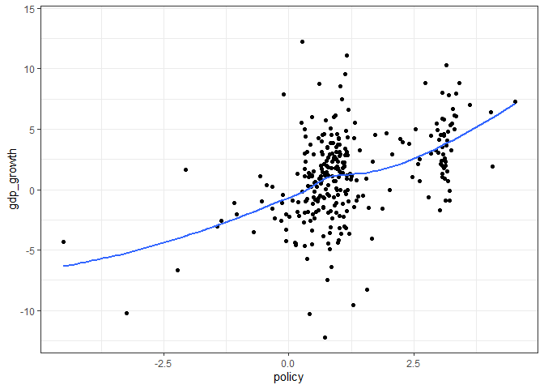
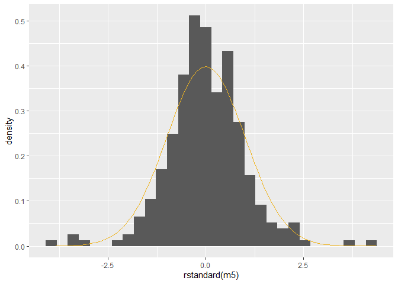
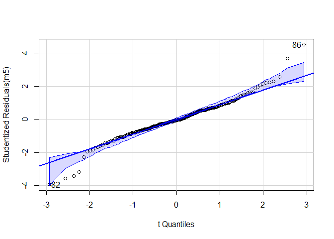
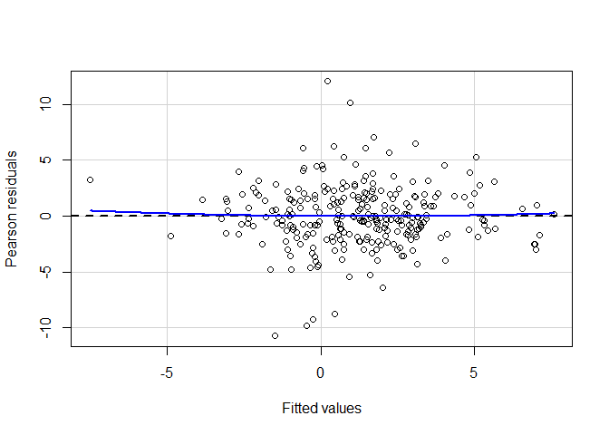
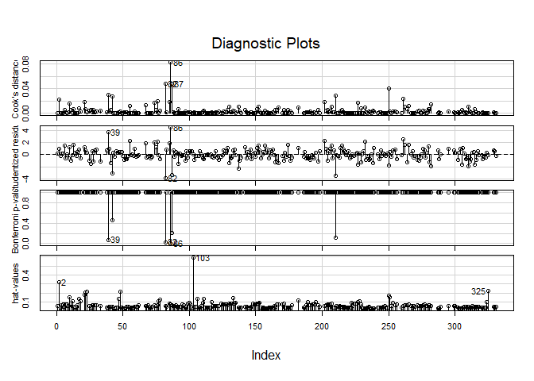

Fordypningsseminar 1: Forutsetninger for OLS og logistisk regresjon
================

## Forutsetninger for OLS regresjon

Dere vil se forutsetningene for OLS formulert på litt forskjellige måter
i ulike metodetekster. Det er blant annet forskjell på forutsetninger
for at OLS skal være forventningsrett og konsistent, og at OLS skal være
BLUE. Det er også mulig å formulere de samme forutsetningene i ulik
språkdrakt, selv når forutsetningene bygger på de samme matematiske
formuleringene. Noen ganger vil dere også se at forutsetningene om
restledd er utelatt, andre ganger vil dere kunne se en antagelse om at
kurtosen ikke er uendelig stor. Noen vil kategorisere ingen
innflytelsesrike observasjoner og ikke perfekt multikolinearitet som
antagelser, mens andre vil kategorisere det som problemer/trusler. Dere
forholder dere til pensum, jeg følger Cristophersens forelesning her.
Det bør forøvrig nevnes at **Lær deg R** gir en ypperlig gjennomgang av
regresjonsdiagnostikk.

**Kritiske aspekter i modellvurdering - OLS:**

1.  Ingen utelatt variabelskjevhet
2.  Lineær sammenheng mellom variablene
3.  Ingen autokorrelasjon/Uavhengige observasjoner
4.  Normalfordelte residualer
5.  Homoskedastiske residualer
6.  Ingen perfekt multikollinearitet
7.  Manglende opplysninger(missing values)

Vi skal nå sjekke om forutsetningene for OLS og logistisk regresjonen
holder. Først henter vi inn data, gjør de samme omkodingene og kjører
modellen.

``` r
library(tidyverse)
```

    ## -- Attaching packages --------------------------------------- tidyverse 1.3.1 --

    ## v ggplot2 3.3.3     v purrr   0.3.4
    ## v tibble  3.1.2     v dplyr   1.0.6
    ## v tidyr   1.1.3     v stringr 1.4.0
    ## v readr   1.4.0     v forcats 0.5.1

    ## -- Conflicts ------------------------------------------ tidyverse_conflicts() --
    ## x dplyr::filter() masks stats::filter()
    ## x dplyr::lag()    masks stats::lag()

``` r
load("./aid.RData")

aid <- aid %>% 
  mutate(log_gdp_pr_capita = log(gdp_pr_capita),
         period_fac = as.factor(period),
         region = ifelse(fast_growing_east_asia == 1, "East Asia",
                         ifelse(sub_saharan_africa == 1, "Sub-Saharan Africa", "Other")),
         region = factor(region, levels = c("Other", "Sub-Saharan Africa", "East Asia")))

m5 <- lm(data = aid, 
         gdp_growth ~ log_gdp_pr_capita + ethnic_frac*assasinations + 
           institutional_quality + m2_gdp_lagged + region + policy*aid +
           period_fac, 
         na.action = "na.exclude")
```

## Regresjonsdiagnostikk i R

Jeg anbefaler `car` pakken til John Fox til regresjonsdiagnostikk. Den
gir ikke like vakre figurer som `ggplot`, men er veldig lett å bruke for
nybegynnere, og inneholder alle slags funksjoner man trenger for
regresjonsdiagnostikk. På sikt kan dere lære dere å konstruere disse
plottene selv med `ggplot`. Pass imidlertid på at dere forstår hva
plotet dere bruker faktisk innebærer (det er lov å spørre om hjelp). I
kapittel 6 av boken *An R Companion to Applied Regression* (Fox og
Weisberg), gjennomgås diagnostikk med `car` i detalj. En annen pakke som
er god, er `lmtest`. Til testing av autokorrelasjon på paneldata er det
lettest å bruke pakken `plm`.

I tillegg til diagnostikken som vi gjør i seminaret, er det fint å se på
deskriptiv statistikk, effektplot, samt diskusjon av data. I tillegg til
å teste antagelsene over (med unntak av antagelse 1), skal vi også se på
innflytelsesrike observasjoner og multikolinearitet.

### Ingen utelatt variabelskjevhet

Hva innebærer denne antagelsen?

-   Dersom vi vil tolke alle variablene i modellen vår substansielt, må
    alle variabler som påvirker vår avhengige variabel, og som er
    korrelert med en uavhengig variabel inkluderes i modellen.
-   Dersom vi vil tolke en uavhengig variabel, kan vi tenke på de
    resterende variablene som kontrollvariabler, som er korrelert med
    uavhengig variabel og påvirker avhengig variabel.

**Merk:** korrelasjon er lineær sammenheng mellom to variabler, ikke et
årsaksforhold. Så lenge to variabler påvirker den avhengige variabelen,
og de er korrelert (selv om de ikke påvirker hverandre på noe vis), får
vi utelatt variabelskjevhet dersom vi ikke kontrollerer for den andre
variabelen.

Denne antagelsen kan vi ikke teste, dersom vi ikke har data for alle
variabler. Det betyr at dette først og fremst må begrunnes teoretisk.
Det finnes imidlertid metoder for å estimere effekten av utelatte
variabler med ulike egenskaper. Denne formen for robusthetstesting
kalles *sensivity analysis*, men det er ikke noe vi kommer til å gå inn
på her.

### Lineær sammenheng mellom variablene

Metoden vi bruker for å regne ut lineær regresjon tar blant annet
utgangspunkt i kovarians mellom uavhengige variabler og avhengige
variabler. I likhet med korrelasjon, er kovarians et mål på lineær
sammenheng mellom to variabler. Derfor forutsetter lineær regresjon en
lineær sammenheng mellom uavhengig av avhengig variabel. Brudd på denne
forutsetningen kan potensielt gi svært missvisende resultater, f.eks.
ved å gjøre en U-formet sammenheng om til *ingen lineær sammenheng*.

**Huskregel:** Hver gang vi opphøyer en uavhengig variabel, tillater vi
en ekstra *sving* i sammenhengen mellom den avhengige og uavhengige
variabelen.

Dersom hypotesen vår er at det er en positiv sammenheng mellom to
variabler, står vi fritt til å legge til andregradsledd og
tredjegradsledd, osv, fordi vi ikke påstår at sammenhengen er perfekt
lineær, bare at den er positiv. Dette er det vanligste. Vi står dermed
fritt til å slenge inn andregrads og tredjegradsledd. Vær imidlertid
forsiktig med å opphøye en uavhengig variabel for mye. Da står man i
fare for **overfitting**, dvs. å finne en svært spesifikk sammenheng i
datasettet ditt, som du ikke finner dersom du samler inn samme type data
på nytt.

I noen tilfeller er hypotesen vår mer spesifikk, for eksempel at en
sammenheng er U-formet (konveks), da må vi teste om:

1.  Vi får en U-formet sammenheng når vi legger inn et annengradsledd.
2.  Om regresjonen med et andregradsledd passer til data.

**Viktig:** Dersom dere legger inn andregradsledd eller andre polynomer,
husk på å tolke alle leddene for den variabelen sammen. Det er lettest å
gjøre dette ved hjelp av plot.

#### Sjekke linearitet i R

Det finnes flere måter å teste linearitetsantagelsen på. Man kan gjøre
en grafisk test, ved å plotte residualene til den avhengige variabelen
mot residualene til den uavhengige variabelen vi er interessert i. Jeg
viser en annen test som gjør samme nytten, men som har noen fordeler.

Vi kan bruke `ggplot()` til å undersøke om sammenhengen mellom en
avhengig og en uavhengig variabel er lineær. Ved å lage en
spredningsdiagram kan vi undersøke formen på sammenhengen (Introduksjon
til statistisk analyse, Christophersen (2013)). Dette kan vi gjøre før
vi kjører modellen.

``` r
library(ggplot2)

ggplot(aid) + 
  geom_point(aes(y = gdp_growth, x = policy)) +
  geom_smooth(aes(y = gdp_growth, x = policy), 
              se = FALSE) +
  theme_bw()
```

    ## `geom_smooth()` using method = 'loess' and formula 'y ~ x'

    ## Warning: Removed 47 rows containing non-finite values (stat_smooth).

    ## Warning: Removed 47 rows containing missing values (geom_point).

<!-- -->

Vi kan også bruke funksjonen `ceresPlot()` fra pakken `car` til å teste
om sammenhengen mellom en uavhengig og en avhengig variabel er lineær,
men da må vi kjøre modellen først. Denne funksjonen fungerer både for
lineær regresjon, og for logistisk regresjon (`glm`). Denne funksjonen
fungerer imidlertid ikke for regresjon med samspill.

Det denne funksjonen gjør, er å legge sammen residualene fra en
regresjon med parameterestimatet til en variabel (på y-aksen), og plotte
mot variabelens verdi. Deretter tegnes det en rosa linje som passer
data.

Dersom sammenhengen ikke er lineær, kan man prøve en transformasjon
eller et polynom.

### Uavhengighet/Ingen autokorrelasjon

Denne antagelsen holder dersom vi har et tilfeldig utvalg fra en
populasjon, på et tidspunkt. Da vil observasjonene være statistisk
uavhengige (alle observasjonene er trukket tilfeldig), og likt
distribuert (alle observasjonene er trukket fra samme populasjon).
Dersom vi ikke har et slikt utvalg, vil det kunne være sammenhenger
mellom observasjoner. Dersom vi f.eks. har data for statsbudsjettet over
tid, vil vi trolig se **autokorrelasjon** fra ett år til det neste fordi
budsjettet endres inkrementelt. Andre typer avhengighet enn
autokorrelasjon er også mulig, som geografisk avhengighet eller
tidsperioder.

#### Sjekke uavhengighet i R

Man kan teste for autkorrelasjon med Durbin-Watson testen. En funksjon
for dette er `pdwtest()` fra pakken `plm` - denne fungerer både på
tidsserier og paneldata, men krever at du bruker funksjonen `plm()` til
å kjøre OLS-modellen din (bruk `?plm` for å se hvordan du kan gjøre
dette eller kom på fordypningsseminarene neste uke).`durbinWatsonTest()`
fra `car` virker bare på tidsserier, men her kan du bruke
`lm()`-objekter.

``` r
#install.packages("plm")
# library(plm)

# Kjører modellen på ny uten å bevare missingverdier
m5b <- lm(gdp_growth ~ log_gdp_pr_capita + ethnic_frac * assasinations + 
               institutional_quality + m2_gdp_lagged + region + policy * aid +
               period_fac,
             data = aid, na.action = "na.omit")
# Her blir det problemer om vi bevarer na med na.exclude. 

car::durbinWatsonTest(m5b)
```

    ##  lag Autocorrelation D-W Statistic p-value
    ##    1      0.02981496      1.939984   0.418
    ##  Alternative hypothesis: rho != 0

I utgangspunktet burde vi her kjørt Durbin-Watson-testen fra plm fordi
aid-datasettet har paneldata-struktur så dette er bare et eksempel for å
vise hvordan dere kan kjøre funksjonen .

### Normalfordelte residualer:

Residualene fra modellen er normalfordelt og har gjennomsnitt tilnærmet
lik 0.

### Sjekke normalfordelte residualer i R:

Det er flere måter å gjøre dette på. Først kan vi plotte fordelingene
til residualene våre og sammenligne med en normalfordeling ved hjelp av
`ggplot()`.

``` r
ggplot() +
  geom_histogram(aes(x = rstandard(m5),
                     y = ..density..)) + 
  stat_function(fun = dnorm, 
                color = "goldenrod2") # Plotter inn en normalfordeling
```

    ## `stat_bin()` using `bins = 30`. Pick better value with `binwidth`.

    ## Warning: Removed 61 rows containing non-finite values (stat_bin).

<!-- -->

Vi kan teste for normalfordelte residualer ved å plotte studentiserte
residualer fra regresjonen vår mot kvantiler fra den kummulative
normalfordelingen. Dette kalles qq-plot, og kan kjøres i R med
`qqPlot()`.

**Studentiserte residualer:** Alternativ måte å standardisere på, i
beregning av varians for hver enkelt observasjon, fjerner man
observasjonen. Formålet med dette er at vi får statistisk uavhengihet
mellom teller og nevner, noe som lar oss bruke residualene til
statistiske tester.

``` r
car::qqPlot(m5)
```

<!-- -->

    ## [1] 82 86

Vi kan også sjekke skjevhet og kurtose til standardavvikene ved hjelp av
funksjonene`kurtosis()` og `skewness()` i pakken moments.

``` r
#install.packages("moments")
library(moments)
kurtosis(rstandard(m5), na.rm = TRUE)
```

    ## [1] 5.74082

``` r
skewness(rstandard(m5), na.rm = TRUE)
```

    ## [1] 0.04282164

### Homoskedastiske residualer:

Variansen til residualene skal være konstant for ulike nivå av uavhengig
variabel.

### Sjekke om vi har homoskedastiske residualer i R:

Vi kan teste for heteroskedastisitet ved hjelp av plot av studentiserte
residualer mot standardiserte predikerte verdier fra modellen. Dette kan
gjøres med `residualPlot()` i car. Dere kan også lage deres egen versjon
med `ggplot()` i stedet.

``` r
car::residualPlot(m5)
```

<!-- -->

### Ingen perfekt multikolinearitet:

Det skal ikke være en perfekt lineær sammenheng mellom et sett av de
uavhengige variablene. Dette fører til at regresjonen ikke lar seg
estimere, og skyldes som regel at man har lagt inn dummyvariabler for
alle kategorier av en variabel, som en dummy for mann og en for kvinne.
Høy multikolinearitet kan også være problematisk, men er ikke en
forutsetning for at regresjon ikke skal fungere.

### Sjekke om vi har multikolinearitet i R:

Vi kan teste for multikolinearitet ved hjelp av en vif-test. Funksjonen
for dette er `vif()`. Med vif tester vi om det er en sterk lineær
sammenheng mellom uavhengige variabler, dersom dette er tilfellet er det
gjerne nødvendig med store mengder data for å skille effektene av ulike
variabler fra hverandre/få presise estimater (små standardfeil), men
bortsett fra å samle mer data er det ikke så mye vi gjøre dersom vi
mener begge variablene må være med i modellen.

``` r
car::vif(m5)
```

    ##                               GVIF Df GVIF^(1/(2*Df))
    ## log_gdp_pr_capita         2.487685  1        1.577240
    ## ethnic_frac               1.944429  1        1.394428
    ## assasinations             4.588600  1        2.142102
    ## institutional_quality     1.509069  1        1.228442
    ## m2_gdp_lagged             1.345847  1        1.160107
    ## region                    5.006125  2        1.495807
    ## policy                    2.712507  1        1.646969
    ## aid                       3.169260  1        1.780241
    ## period_fac                1.514257  5        1.042365
    ## ethnic_frac:assasinations 4.663442  1        2.159500
    ## policy:aid                2.633899  1        1.622929

Du kan lese mer om hvilke verdier som er problematiske i kapittel 7 i
**Introduksjon til statistisk analyse** eller kapittel 9 i **Lær deg
R**.

### Outliers, leverage og innflytelsesrike observasjoner

Observasjoner med uvanlige/ekstreme verdier på de uvahengige variablene
(når man tar høyde for korrelasjonsmønstre), har høy leverage (Vi bruker
gjerne hatte-verdier som mål på leverage observasjoner i lineær
regresjon). Observasjoner med høy leverage vil ha stor innflytelse på
regresjonslinjen, hvis modellen predikerer slike observasjoner dårlig.
Observasjoner som blir predikert dårlig av en modell får store
residualer. Vi kaller gjerne slike observasjoner “regression outliers”
(Studentiserte residualer brukes ofte som mål på “regression outliers”).
Innflytelsesrike observasjoner har dermed høy leverage/er dårlig
predikert av modellen, og “trekker” regresjonslinjen mot seg med stor
kraft.

Det er ofte lurt å se nærmere på innflytelsesrike enheter og uteliggere,
vi kan bruke `influenceIndexPlot()` til å identifisere slike
observasjoner. Spesifiser hvor mange observasjoner du vil ha nummerert
med argumentet `id = list(n="antall")`. Deretter kan vi se nærmere på
disse observasjonene ved hjelp av indeksering. En form for
robusthetstesting er å kjøre regresjonen på nytt uten uteliggere og
innflytelsesrike observasjoner, for å sjekke om man får samme resultat.
Dersom man ikke gjør det, er ikke resultatene dine særlig robuste.

Vi kan også se på Cook’s distance, som kombinerer informasjon om
uteliggere, leverage og innflytelsesrike observasjoner.
`influenceIndexPlot()` gir oss alle disse målene. Disse målene er godt
beskrevet i kapittel 9 i **Lær deg R**.

Dersom du kun er interessert i observasjoners innflytelse på en
enkeltvariabel, kan du bruke funksjonen `dfbetas()`, som gir deg hver
observasjons innflytelse på koeffisientene til alle variablene i en
modell.

``` r
car::influenceIndexPlot(m5,
                   id = list(n=3))
```

<!-- -->

``` r
# Bruker indeksering til å se nærmere på noen av observasjonene
aid[c(39,86), ]
```

    ## # A tibble: 2 x 22
    ##   country period periodstart periodend code  gdp_growth gdp_pr_capita
    ##   <chr>    <dbl>       <dbl>     <dbl> <chr>      <dbl>         <dbl>
    ## 1 CMR          4        1978      1981 CMR4        11.1           972
    ## 2 GAB          3        1974      1977 GAB3        12.3          5030
    ## # ... with 15 more variables: economic_open <dbl>, budget_balance <dbl>,
    ## #   inflation <dbl>, ethnic_frac <dbl>, assasinations <dbl>, aid <dbl>,
    ## #   fast_growing_east_asia <dbl>, sub_saharan_africa <dbl>,
    ## #   central_america <dbl>, policy <dbl>, m2_gdp_lagged <dbl>,
    ## #   institutional_quality <dbl>, log_gdp_pr_capita <dbl>, period_fac <fct>,
    ## #   region <fct>

### Observasjoner med manglende informasjon (Missing)

Mye kan sies om manglende informasjon (missing) - her viser jeg måter du
kan bruke R til å identifisere missing. Jeg viser også noen enkle måter
du kan bruke R til å få et inntrykk av konsekvensene av missing på.

I R kan missing være kodet på flere måter. Dersom missing er eksplisitt
definert i R, vil vi se missing som `NA` når vi ser på datasettet. Noen
ganger leses ikke missing inn som `NA`. Missing på variabler i datasett
fra andre statistikkprogramm kan f.eks. leses som `character` med verdi
`" "`, eller som `numeric` med verdi `-99`. For å sjekke dette, bør du
lese kodebok. Det er ikke sikkert at `" "` bør omkodes til missing. Du
kan også se på en tabell, for å identifisere suspekte verdier:

``` r
table(aid$country) # ingen suspekte verdier
```

    ## 
    ## ARG BOL BRA BWA CHL CIV CMR COL CRI DOM DZA ECU EGY ETH GAB GHA GMB GTM GUY HND 
    ##   6   6   6   6   6   6   6   6   6   6   6   6   6   6   6   6   4   6   5   6 
    ## HTI IDN IND JAM KEN KOR LKA MAR MDG MEX MLI MWI MYS NER NGA NIC PAK PER PHL PRY 
    ##   6   6   6   6   6   6   6   6   6   6   6   6   6   6   6   4   6   6   6   6 
    ## SEN SLE SLV SOM SYR TGO THA TTO TUN TUR TZA URY VEN ZAR ZMB ZWE 
    ##   6   6   6   6   6   6   6   6   6   6   6   6   6   6   6   6

Moral: **alltid sjekk kodeboken**, og se på verdiene til data med tabell
for å identifisere missing.

Når du kjører en lineær regresjonsanalyse i R, kastes observasjoner som
har manglende informasjon (missing, angitt som `NA` i R) på en eller
flere av variablene du legger inn i modellen din ut. Men dersom missing
er kodet som f.eks.`999` så vil ikke R automatisk oppdage at dette er en
missing verdi. Derfor er det viktig å sjekke hvilke observasjoner som
faktisk blir kastet ut av analysen din pga. missing, og hva slags
informasjon du faktisk sitter igjen med i analysen din.

Her er noen nyttige funksjoner for å jobbe missing:

``` r
aid$reg_miss <- aid %>%
  select(gdp_growth, aid, policy) %>%
  complete.cases()

# Lager variabel som viser hvilke observasjoner som forsvinner i regresjon med de sentrale variablene
# gdp_growth, aid og policy - fin å bruke i plot for å få et inntrykk av hva slags informasjon du mister ved å legge til flere kontrollvariabler.
table(aid$reg_miss) # 47 observasjoner har missing på en eller flere av de tre variablene
```

    ## 
    ## FALSE  TRUE 
    ##    47   284

Vi kan bruke variabelen `reg_miss` til plot. Både spredningsplot og
boxplot kan gi god innsikt i hvordan observasjoner med missing skiller
seg fra andre. Et annet alternativ, er å se på en logistisk regresjon,
med den nye dummyen som avhengig variabel. Her fjerner jeg de variablene
som fører til flest missing:

Dersom det er mange observasjoner som kastes ut pga missing, som i
eksempelet over, er det lurt å danne seg et inntrykk av konsekvense
dette får for analysen din. Under skisserer jeg noen måter dere kan
bruke R på for å lære mer om missingstruktur:

**Metode 1: korrelasjonsmatriser**

Korrelasjonsmatriser viser korrelasjoner mellom variabler av klassene
`numeric` og `integer`. Dersom vi vil få et raskt inntrykk av
konsekvensene av missing i en modell, kan vi lage en korrelasjonsmatrise
med variablene som inngår i modellen, og varierer hvordan vi håndterer
missing i korrelasjonsmatrisen. Her er et eksempel:

``` r
# Kjører en modell med litt færre variabler
m1 <- lm(gdp_growth ~ aid*policy + as.factor(period) + ethnic_frac*assasinations, data = aid )
summary(m1) # output viser at 48 observasjoner fjernes pga. missing
```

    ## 
    ## Call:
    ## lm(formula = gdp_growth ~ aid * policy + as.factor(period) + 
    ##     ethnic_frac * assasinations, data = aid)
    ## 
    ## Residuals:
    ##      Min       1Q   Median       3Q      Max 
    ## -10.9551  -1.6037   0.0254   1.7550  10.8668 
    ## 
    ## Coefficients:
    ##                           Estimate Std. Error t value Pr(>|t|)    
    ## (Intercept)                1.73042    0.59379   2.914 0.003864 ** 
    ## aid                       -0.09609    0.14747  -0.652 0.515205    
    ## policy                     1.33907    0.20270   6.606 2.08e-10 ***
    ## as.factor(period)3         0.25055    0.62976   0.398 0.691053    
    ## as.factor(period)4        -1.17377    0.63080  -1.861 0.063861 .  
    ## as.factor(period)5        -2.99437    0.63576  -4.710 3.96e-06 ***
    ## as.factor(period)6        -1.68657    0.63950  -2.637 0.008839 ** 
    ## as.factor(period)7        -2.55448    0.66951  -3.815 0.000168 ***
    ## ethnic_frac               -1.18048    0.66609  -1.772 0.077474 .  
    ## assasinations             -0.71171    0.30425  -2.339 0.020050 *  
    ## aid:policy                 0.04253    0.09587   0.444 0.657643    
    ## ethnic_frac:assasinations  1.21982    0.62998   1.936 0.053874 .  
    ## ---
    ## Signif. codes:  0 '***' 0.001 '**' 0.01 '*' 0.05 '.' 0.1 ' ' 1
    ## 
    ## Residual standard error: 3 on 271 degrees of freedom
    ##   (48 observations deleted due to missingness)
    ## Multiple R-squared:  0.343,  Adjusted R-squared:  0.3164 
    ## F-statistic: 12.86 on 11 and 271 DF,  p-value: < 2.2e-16

Lager korrelasjonsmatrise med variablene som inngår:

``` r
# Siden as.factor(period) lager en dummvariabel for alle perioder unntatt periode 1, må vi gjøre dette for å inkludere denne variabelen i korrelasjonsmatrisen (inkluder gjerne også periode 1 i matrise):

aid$period2 <- ifelse(aid$period==2, 1, 0)
aid$period3 <- ifelse(aid$period==3, 1, 0)
aid$period4 <- ifelse(aid$period==4, 1, 0)
aid$period5 <- ifelse(aid$period==5, 1, 0)
aid$period6 <- ifelse(aid$period==6, 1, 0)
aid$period7 <- ifelse(aid$period==7, 1, 0)
aid$period8 <- ifelse(aid$period==8, 1, 0)

aid %>% 
  select(gdp_growth,aid,policy, ethnic_frac,assasinations,period2,period3,period4,period5,period6,period7) %>%
  cor(, use = "pairwise.complete.obs")
```

    ##                 gdp_growth         aid      policy   ethnic_frac assasinations
    ## gdp_growth     1.000000000 -0.15872840  0.45346637 -0.1246418798   -0.06381011
    ## aid           -0.158728399  1.00000000 -0.14758229  0.2857390539   -0.15372098
    ## policy         0.453466367 -0.14758229  1.00000000 -0.0537569244   -0.01143047
    ## ethnic_frac   -0.124641880  0.28573905 -0.05375692  1.0000000000   -0.08658713
    ## assasinations -0.063810109 -0.15372098 -0.01143047 -0.0865871299    1.00000000
    ## period2        0.212474829 -0.08413737  0.02233928  0.0001371324   -0.06405721
    ## period3        0.186924657 -0.07696828 -0.06220243  0.0001371324   -0.01306690
    ## period4        0.006079669 -0.01445413 -0.06367073  0.0001371324    0.05931683
    ## period5       -0.279642298  0.02653048 -0.16002539  0.0001371324   -0.04193407
    ## period6       -0.022571291  0.07886175  0.03692845  0.0011598015   -0.04754414
    ## period7       -0.099934000  0.07290130  0.24028406 -0.0017293741    0.10841360
    ##                     period2       period3       period4       period5
    ## gdp_growth     0.2124748287  0.1869246573  0.0060796687 -0.2796422980
    ## aid           -0.0841373735 -0.0769682790 -0.0144541308  0.0265304812
    ## policy         0.0223392800 -0.0622024310 -0.0636707325 -0.1600253868
    ## ethnic_frac    0.0001371324  0.0001371324  0.0001371324  0.0001371324
    ## assasinations -0.0640572060 -0.0130669004  0.0593168341 -0.0419340675
    ## period2        1.0000000000 -0.2036363636 -0.2036363636 -0.2036363636
    ## period3       -0.2036363636  1.0000000000 -0.2036363636 -0.2036363636
    ## period4       -0.2036363636 -0.2036363636  1.0000000000 -0.2036363636
    ## period5       -0.2036363636 -0.2036363636 -0.2036363636  1.0000000000
    ## period6       -0.1992437293 -0.1992437293 -0.1992437293 -0.1992437293
    ## period7       -0.1970349207 -0.1970349207 -0.1970349207 -0.1970349207
    ##                    period6      period7
    ## gdp_growth    -0.022571291 -0.099934000
    ## aid            0.078861754  0.072901299
    ## policy         0.036928446  0.240284058
    ## ethnic_frac    0.001159801 -0.001729374
    ## assasinations -0.047544141  0.108413597
    ## period2       -0.199243729 -0.197034921
    ## period3       -0.199243729 -0.197034921
    ## period4       -0.199243729 -0.197034921
    ## period5       -0.199243729 -0.197034921
    ## period6        1.000000000 -0.192784686
    ## period7       -0.192784686  1.000000000

``` r
# Alternativet "pairwise.complete.obs" fjerner bare missing for de enkelte bivariate korrelasjonene
aid %>% 
  select(gdp_growth,aid,policy, ethnic_frac,assasinations,period2,period3,period4,period5,period6,period7) %>%
  cor(, use = "complete.obs")
```

    ##                 gdp_growth          aid      policy  ethnic_frac assasinations
    ## gdp_growth     1.000000000 -0.163268793  0.45356785 -0.098074858   -0.07791173
    ## aid           -0.163268793  1.000000000 -0.14342838  0.266263842   -0.13871882
    ## policy         0.453567853 -0.143428382  1.00000000 -0.049420321   -0.01217812
    ## ethnic_frac   -0.098074858  0.266263842 -0.04942032  1.000000000   -0.08864022
    ## assasinations -0.077911729 -0.138718823 -0.01217812 -0.088640216    1.00000000
    ## period2        0.184487425 -0.149985596  0.02060803 -0.027435361   -0.05245223
    ## period3        0.178520491 -0.067445477 -0.06208268 -0.021115228   -0.03014763
    ## period4       -0.007052255  0.007802611 -0.05839454  0.012015522    0.05882137
    ## period5       -0.275963915  0.048299871 -0.16229948  0.023063278   -0.04151071
    ## period6       -0.020471898  0.093558859  0.03511158  0.018297092   -0.04992095
    ## period7       -0.052385079  0.063462589  0.23898094 -0.006452538    0.11657710
    ##                   period2     period3      period4     period5     period6
    ## gdp_growth     0.18448743  0.17852049 -0.007052255 -0.27596391 -0.02047190
    ## aid           -0.14998560 -0.06744548  0.007802611  0.04829987  0.09355886
    ## policy         0.02060803 -0.06208268 -0.058394538 -0.16229948  0.03511158
    ## ethnic_frac   -0.02743536 -0.02111523  0.012015522  0.02306328  0.01829709
    ## assasinations -0.05245223 -0.03014763  0.058821372 -0.04151071 -0.04992095
    ## period2        1.00000000 -0.19369514 -0.196081061 -0.19369514 -0.19130014
    ## period3       -0.19369514  1.00000000 -0.211981106 -0.20940171 -0.20681251
    ## period4       -0.19608106 -0.21198111  1.000000000 -0.21198111 -0.20936001
    ## period5       -0.19369514 -0.20940171 -0.211981106  1.00000000 -0.20681251
    ## period6       -0.19130014 -0.20681251 -0.209360009 -0.20681251  1.00000000
    ## period7       -0.18161679 -0.19634394 -0.198762490 -0.19634394 -0.19391619
    ##                    period7
    ## gdp_growth    -0.052385079
    ## aid            0.063462589
    ## policy         0.238980938
    ## ethnic_frac   -0.006452538
    ## assasinations  0.116577101
    ## period2       -0.181616790
    ## period3       -0.196343939
    ## period4       -0.198762490
    ## period5       -0.196343939
    ## period6       -0.193916193
    ## period7        1.000000000

``` r
# Alternativet "complete.obs" fjerner alle observasjoner som har missing på en av variablene som inngår, mao. det samme som regresjonsanalysen.
```

Ved å sammenligne disse korrelasjonsmatrisene, kan vi få et inntrykk av
konsekvensene av å fjerne missing med listwise deletion.

**Metode 2: Analyse av dummy-variabler for missing**

En alternativ metode å utforske missing i en analyse på, er med
funksjonen `complete.cases()`, som gjør en logisk test av om en
observasjon har missing. Det var denne vi brukte til å lage variabelen
`reg_miss` i stad og kjøre en binomisk logistisk modell. Vi skal snakke
mer om logistisk regresjon i morgen så jeg går ikke nærmere inn på dette
i dag.

``` r
miss_mod <- glm(reg_miss ~ aid*policy + as.factor(period), data = aid)
summary(miss_mod) # ingen store forskjeller
```

    ## 
    ## Call:
    ## glm(formula = reg_miss ~ aid * policy + as.factor(period), data = aid)
    ## 
    ## Deviance Residuals: 
    ##      Min        1Q    Median        3Q       Max  
    ## -0.96138  -0.00554  -0.00174   0.01552   0.07640  
    ## 
    ## Coefficients:
    ##                     Estimate Std. Error t value Pr(>|t|)    
    ## (Intercept)         1.009066   0.014559  69.309   <2e-16 ***
    ## aid                -0.008781   0.003778  -2.324   0.0208 *  
    ## policy             -0.003314   0.005516  -0.601   0.5485    
    ## as.factor(period)3  0.002482   0.017192   0.144   0.8853    
    ## as.factor(period)4 -0.033326   0.017139  -1.944   0.0529 .  
    ## as.factor(period)5  0.005212   0.017457   0.299   0.7655    
    ## as.factor(period)6  0.005038   0.017557   0.287   0.7744    
    ## as.factor(period)7  0.005878   0.018121   0.324   0.7459    
    ## aid:policy          0.002875   0.002604   1.104   0.2706    
    ## ---
    ## Signif. codes:  0 '***' 0.001 '**' 0.01 '*' 0.05 '.' 0.1 ' ' 1
    ## 
    ## (Dispersion parameter for gaussian family taken to be 0.006795418)
    ## 
    ##     Null deviance: 1.9860  on 285  degrees of freedom
    ## Residual deviance: 1.8823  on 277  degrees of freedom
    ##   (45 observations deleted due to missingness)
    ## AIC: -605.08
    ## 
    ## Number of Fisher Scoring iterations: 2

``` r
# I denne modellen ønsker du ikke signifikante uavhengige variabler
```

Koeffisienten til bistand er negativ og signifikant på 5 %
signifikansnivå.Dette indikerer at land som fjernes pga missing, får
mindre bistand enn land som ikke fjernes.

Vi kunne også definert dummy-variabler for missing på de
enkeltvariablene vi er mest interessert i (her: `gdp_growth`, `aid` og
`policy`), og gjennomført tilsvarende analyser, ved hjelp av funksjonen
`is.na()`.

I de fleste tilfeller er `ifelse()` en fin funksjon til å definere
missing. Statistiske R-funksjoner har stort sett et eller flere
argumenter der du kan velge hvordan missing skal håndteres (se for
eksempel `?cor`, og argumentene `use` og `na.rm`). Husk på det dere har
lært på forelesning, og ta aktive valg om hvordan missing bør håndteres.

Vi skal ikke bruke modellelementene mer så derfor fjerner vi de fra
environment

``` r
rm(m1, m5, m5b, miss_mod, model5_usam)
```

    ## Warning in rm(m1, m5, m5b, miss_mod, model5_usam): object 'model5_usam' not
    ## found

## Forutsetninger for logistisk regresjon

### Kontroll av forutsetninger

Mange av metodene for diagnostikk for OLS fungerer også for logistisk
regresjon. Funksjonene `ceresplot()`, `dfbetas()`,
`influenceIndexPlot()`, `vif()` m.m. fungerer også for logistisk
regresjon. Husk forøvrig på at forutsetninger om homoskedastiske,
normalfordelte restledd ikke gjelder logistisk regresjon. I tillegg
viser jeg hvordan du kan lage ROC-kurver
[her](https://github.com/martigso/stv4020aR/blob/master/Gruppe%201/docs/Introduksjon_seminar4.md).

Tomme celler vil føre til at modellen ikke lar seg estimere, eller at du
ikke får estimert standardfeil/ekstremt høye standardfeil, og er således
greit å oppdage. Spredningsplot mellom variabler fra regresjonen kan
brukes til å undersøke dette nærmere. En kan forsøke å løse det ved å
forenkle modellen (f.eks. slå sammen kategorier) eller samle inn mer
data.

-   Vi kan gjøre nøstede likelihood-ratio tester med `anova()`.

``` r
# Lager dikotom variabel
aid <- aid %>% 
  mutate(gdp_growth_d = ifelse(gdp_growth <= 0, 0, 1))

# Lager et datasett med variablene vi trenger og uten NA
aid.complete <- aid %>% 
  select(gdp_growth_d, aid, policy, period) %>%  # Velger variablene vi skal bruker
  na.omit()                                      # Beholder bare observasjoner uten NA 

# Lager en nullmodel
gm0 <- glm(gdp_growth_d ~ aid, data = aid.complete, 
           family = binomial(link = "logit"))

# Lager en modell med avhengige variabler
gm1 <- glm(gdp_growth_d ~ aid + policy + as.factor(period), data = aid.complete, 
           family = binomial(link = "logit"))
anova(gm0, gm1, test = "LRT") # Sjekk de forskjellige alternativene til test med ?anova.glm
```

    ## Analysis of Deviance Table
    ## 
    ## Model 1: gdp_growth_d ~ aid
    ## Model 2: gdp_growth_d ~ aid + policy + as.factor(period)
    ##   Resid. Df Resid. Dev Df Deviance  Pr(>Chi)    
    ## 1       282     356.85                          
    ## 2       276     286.56  6   70.292 3.561e-13 ***
    ## ---
    ## Signif. codes:  0 '***' 0.001 '**' 0.01 '*' 0.05 '.' 0.1 ' ' 1

*Hva forteller likelihood-ratio testen oss?*

Likelihood-ratio testen går ut på å signifikansteste forskjellen i -2LL
for den fullstendige modellen og en redusert modell. For å kunne gjøre
en LR-test så må modellene være nøstede. Positiv og signifikant LR-test
betyr at den fullstendige modellen er signifikant bedre tilpasset
datamateriale enn den reduserte.

-   Vi kan gjøre hosmer-lemeshow med `hoslem.test()` fra pakken
    `ResourceSelection`

``` r
#install.packages("ResourceSelection")
library(ResourceSelection)
```

    ## ResourceSelection 0.3-5   2019-07-22

``` r
# Sjekker nullmodellen
hoslem.test(gm0$y, gm0$fitted.values)
```

    ## 
    ##  Hosmer and Lemeshow goodness of fit (GOF) test
    ## 
    ## data:  gm0$y, gm0$fitted.values
    ## X-squared = 21.635, df = 8, p-value = 0.005639

``` r
# Sjekker den alternative modellen vår
hoslem.test(gm1$y, gm1$fitted.values)
```

    ## 
    ##  Hosmer and Lemeshow goodness of fit (GOF) test
    ## 
    ## data:  gm1$y, gm1$fitted.values
    ## X-squared = 11.709, df = 8, p-value = 0.1647

*Hva forteller Hosmer-lemeshow-testen oss?*

I modeller med en uavhengig variabel så tester Hosmer Lemeshow-testen
(HL-testen) sammenhengens form. Dersom testen ikke er signifikant har
kurven riktig form (logistisk). Hvis testen er signifikant bør en prøve
ulike tilpasninger av modellen som f.eks. annengradsledd,
dummy-variabler eller omkoding.

I modeller med flere uavhengige variabler så tester HL-testen modellens
generelle tilpasning til datamaterialet ved å sammenlikne observerte og
predikerte verdier for ulike verdikombinasjoner på de uavhengige
variablene. Dersom HL-testen ikke er signifikant har vi en
tilfredsstillende tilpasning. Dersom den er signifikant har vi avvik fra
den logistiske kurver eller umodellerte samspill.

-   Vi kan regne ut McFadden’s pseudo *R*<sup>2</sup> med `pR2`
    funksjonen fra pakken `pscl`:

``` r
# install.packages("pscl")
library(pscl)
```

    ## Classes and Methods for R developed in the
    ## Political Science Computational Laboratory
    ## Department of Political Science
    ## Stanford University
    ## Simon Jackman
    ## hurdle and zeroinfl functions by Achim Zeileis

``` r
pR2(gm0)
```

    ## fitting null model for pseudo-r2

    ##           llh       llhNull            G2      McFadden          r2ML 
    ## -178.42422429 -186.55979697   16.27114536    0.04360839    0.05568243 
    ##          r2CU 
    ##    0.07615174

``` r
pR2(gm1)
```

    ## fitting null model for pseudo-r2

    ##          llh      llhNull           G2     McFadden         r2ML         r2CU 
    ## -143.2780270 -186.5597970   86.5635399    0.2319994    0.2627301    0.3593117

Husk at Pseudo *R*<sup>2</sup> aldri kan tolkes som andel forklart
varians.

**Husk:** I tillegg til formell diagnostikk, må du aldri glemme
generelle validitets/metode-vurderinger.
