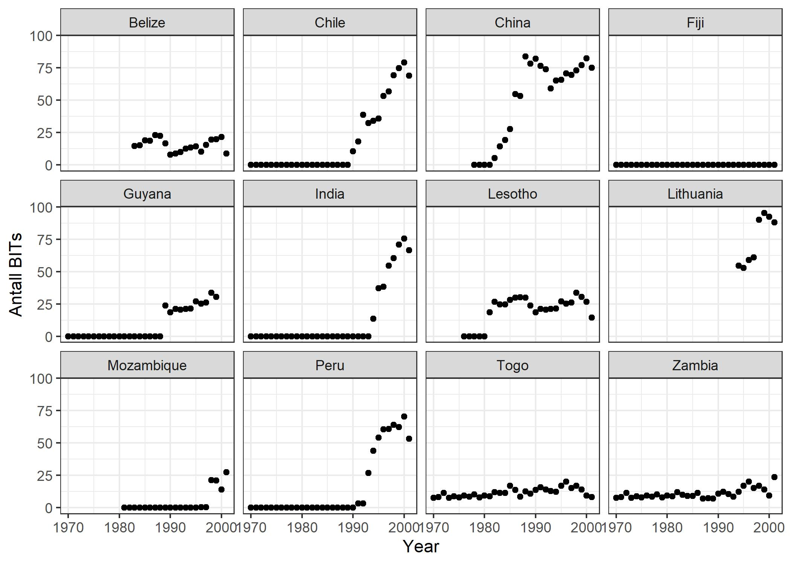
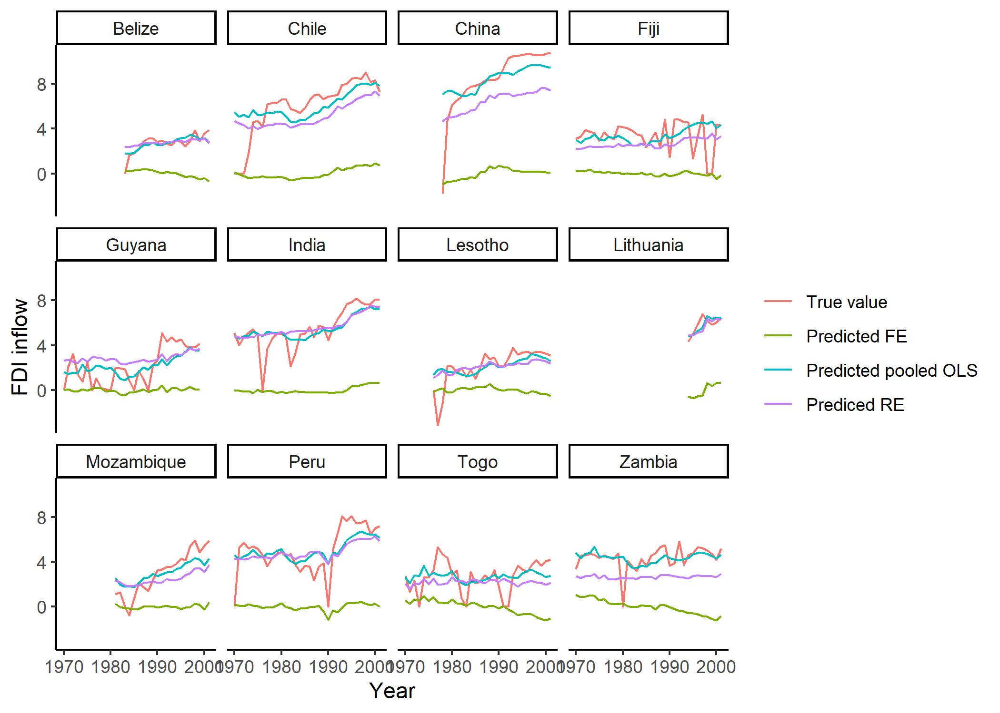

I dette seminaret skal vi jobbe med en artikkel fra 2005 skrevet av Neumayer og spess. Artikkelen heter *Do bilateral investment treaties increase foreign direct investment to developing countries?* og bruker paneldata til å undersøke effekten av bilaterale investeringsavtaler på hvor mye utenlandsinvesteringer utviklingsland mottar. Datasettet har jeg lastet ned fra [Harvard Dataverse](https://dataverse.harvard.edu/dataset.xhtml?persistentId=doi:10.7910/DVN/HQJN8G). Jeg har bearbeidet datasettet litt før dette seminaret for at variablene skal ha litt mer intuitive navn. Du kan laste det bearbeidede datasettet ned fra [github](https://github.com/martigso/stv4020aR21/tree/main/fordypningsseminar2). 

```{r}
# Laster inn nødvendige pakker
# Husk å kjør install.packages("pakkenavn") først om det er første gang du bruker pakken
library(haven) # For å kunne lese inn .dta-filer
library(tidyverse) # For å kunne bruke ggplot, dplyr og liknende
library(stargazer) # For å kunne lage pene tabeller


# Laster inn data
data <- read_dta("neumayer_spess_2005.dta")
```


Datasettet inneholder følgende variabler: 

* `country`: land
* `year`: år
* `fdi_inflow`: hvor mye investeringer et land får
* `bits`: hvor mange investeringsavtaler et land har
* `ln_gdp_pr_cap`: logaritmen til BNP per cap 
* `ln_population`: logaritmen til populasjonen
* `economic_growth`: økonomisk vekst
* `inflation`: inflasjon
* `resource_rent`: ressursrente (her brukt som mål på hvor mye naturressurser et land har)
* `bilateral_trade_agreements`: antall bilaterale handelsavtaler et land har
* `wto_member`: om et land er medlem i WTO (verdens handelsorganisasjon) 
* `polcon3`: et mål på troverdigheten til politiske institusjoner når de forplikter seg til politiske tiltak 

Disse er litt forenklet forklart. Neumayer og Spess har blant annet vektet variabelen `bits` som måler antall investeringsavtaler et land har. Om du er interessert så kan du lese mer i [artikkelen deres i World Development](https://www-sciencedirect-com.ezproxy.uio.no/science/article/pii/S0305750X05001233). 

R har en pakke som heter `plm` og som er nyttig når en skal jobbe med paneldata. Først må du installere og laste inn pakken: 
```{r}
#install.packages("plm") # Fjern # foran om ikke du har installert pakken før
library(plm)

```

Når vi skal bruke `plm`-pakken så må vi først lage et `plm`-objekt som inneholder informasjon om strukturen på datasettet. I funksjonen under forteller jeg R at enhetene i datasettet er landene i variabelen `country` og at tidsperiode er registrert i variabelen `year`. Alternativt kan en spesifisere index hver gang en estimerer en modell ved hjelp av `plm()`. 

```{r}
data.plm <- pdata.frame(data, index = c("country", "year"))

class(data.plm)

head(attr(data.plm, "index"))

```
Noe av det første det er lurt å gjøre er å sjekke om et panel er balansert eller ikke. Et balansert panel inneholder like mange observasjoner av hver enhet i datasettet. Dette sjekker vi ved hjelp av `is.pbalanced()` funksjonen i `plm`-pakken. 

```{r}
is.pbalanced(data.plm)
```
"TRUE" betyr at panelet er balansert. Denne testen tar imidlertid ikke innover seg eventuelle missing-verdier. Om vi lager et nytt datasett som bare innholder observasjonene som ikke har missing på noen variabler finner vi fort ut at panelet ikke er balansert likevel. 

```{r}
# Lager et datasett uten missingverdier: 
data.complete <- data.plm %>% 
  na.omit() %>% 
  mutate(year = droplevels(year), 
         country = droplevels(country)) # Her fjerner jeg faktornivåene (levels) til de årene og landene som ikke lengre er med i datasettet

# Sjekker om det nye datasettet som blir lagt til grunn for analysen er balansert
is.pbalanced(data.complete)
```
Ved hjelp av `make.pbalanced()` kan vi gjøre panelet balansert, men da mister vi data. Vi må velge om vi vil beholde alle enheter, men avgrense dataene til de tidsperiodene vi har data for alle, eller om vi vil beholde alle tidsperioder og avgrense data til de enhetene der vi har data for alle tidsperioder.

```{r}
data.balanced.time <- make.pbalanced(data.complete, balance.type = "shared.times") # Beholder bare de enhetene vi har data for alle tidsperiode for
# Dette datasettet inneholder 0 observasjoner fordi vi ikke har data for alle tidsperioder for noen enheter

data.balanced.ind <- make.pbalanced(data.complete, balance.type = "shared.individuals") %>%  # Beholder bare de tidsperiodene vi har data for alle enhetene for
  mutate(year = droplevels(year),                               
         country = droplevels(country)) # Her fjerner jeg faktornivåene (levels) til de årene og landene som ikke lengre er med i datasettet
```  
I eksempelet har vi ingen enheter med observasjoner for alle år. Vi kan også sjekke hvor mange enheter eller tidsperioder som forsvinner ut av analysen ved hjelp av `length` og `unique`. Kombinasjonen av `length` og `unique` forteller oss hvor mange unike verdier en variabel har (uten å si noe om hvor mange observasjoner som har denne verdien). 

```{r} 
# Finner antall tidsperioder i opprinnelig datasett uten missing
length(unique(data.complete$country))
length(unique(data.balanced.ind$country))
# I det nye datasettet har vi data for 45 unike land sammenlignet med 120 land opprinelig

length(unique(data.complete$year))
length(unique(data.balanced.ind$year))
# Vi har fortsatt data for 32 år
# Dette gir mening fordi vi valgte å beholde de enhetene vi hadde observasjoner for alle år for. 

```
Dette illustrerer at du fort mister veldig mye data om du skal anvende et balansert panel. Men, dersom du har et ubalansert panel, vil du ha implisitt missing - det vil si at R ikke forteller deg at du mangler informasjon om observasjoner du egentlig burde ha hatt informasjon om. I det følgende vil vi uansett gå videre med det ubalanserte panelet. 

## Paneldataanalyse med plm
Med `plm` må vi spesifisere noen flere elementer enn med `lm()`. Vi må bestemme `effect` og `model`.  Gjennom `model` forteller vi `plm` om vi ønsker OLS uten faste effekter (`model = "pooling"`), fixed effects (`model = "within"`) eller random effects (`model = "random"`). Gjennom `effect` forteller vi `plm` om vi ønsker å se på enheter (`effect = "individual"`), tid (`effect = "time"`) eller begge deler (`effect = "twoways"`).  En kan også velge andre spesifikasjoner, men de går vi ikke gjennom i dag. 

### Pooled OLS med PCSE 
Et første alternativ med paneldata er å kjøre en **pooled ols** regresjon. Det er som å kjøre en vanlig OLS uten å ta med faste effekter for enhet eller år. 

```{r}
# I plm får vi en vanlig OLS-modell om vi velger model = "pooling". 
mod1ols <- plm(data = data.complete, 
              fdi_inflow ~ bits + ln_gdp_pr_cap + ln_population +
                economic_growth + inflation + resource_rent + 
                bilateral_trade_agreements + wto_member + polcon3,
              na.action = "na.exclude", model = "pooling")
```

Vi skal bruke denne modellen for å se på noen av utfordringene knyttet til paneldata, men først skal vi legge til panelkorrigerte standardfeil (PCSE). `plm` inneholder funksjonen `vcovBK` som kan brukes til å beregne panel-korrigerte standardfeil. Jeg kommer ikke til å gå i detalj om hva funksjonen gjør, men dersom du skal gjøre dette i hjemmeoppgaven så kan du bytte ut `mod1osl` med ditt eget plm-modellobjekt. Denne formelen kan også brukes på fixed effects og random effects modeller. 

```{r}
# Beregner PCSE:
bkse <- round(sqrt(diag(vcovBK(mod1ols, cluster = "group"))), digits = 4)

# Printer resultatene i en tabell
stargazer(mod1ols, mod1ols, type = "text",
          column.labels = c("Med PCSE", "Med vanlige SE"),
          se = list(bkse))
# Med argumentet se = list(bkse) forteller jeg stargazer at jeg i den første kolonnen
# vil erstatte de opprinnelige standardfeilene med de panelkorrigerte standardfeilene
# jeg regnet ut over. 

```

### Restleddsutfordringer og paneldata 
I det følgende tar vi utgangspunkt i OLS-modellen for å vurdere noen av utfordringene knyttet til paneldata. PCSE tar hånd om samtidig korrelasjon og heteroskedastisitet, men hjelper ikke mot autokorrelasjon. For å håndtere autokorrelasjon kan vi inkludere en lagget avhengig variabel eller en trendvariabel som uavhengig variabel. PCSE hjelper heller ikke mot utelatt variabel skjevhet som vil bli diskutert nærmere under fixed effects. 

#### Autokorrelasjon
Durbin-Watson testen sjekker for AR(1) seriekorrelasjon. 
```{r}
# Kjører durbin watson test på modellobjektet
pdwtest(mod1ols)
```
I følge Christophersen så indikerer verdier i nærheten av 2 ingen autokorrelasjon og verdier i nærheten av 0 positiv autokorrelasjon.  En løsning er å inkludere en lagget avhengig variabel som uavhengigvariabel.

```{r}
# Kjører modellen med lagget avhengig variabel som uavhengig variabel 
mod1ols_lag <- plm(data = data.complete, 
              fdi_inflow ~ lag(fdi_inflow, 1) +  # Bytt ut "1" med ønsket antall lags dersom du vil ha mer enn 1
                bits + ln_gdp_pr_cap + ln_population +
                economic_growth + inflation + resource_rent + 
                bilateral_trade_agreements + wto_member + polcon3,
              na.action = "na.exclude", model = "pooling")


# Vi kan også differensiere
# Her lager jeg først en variabel som er lik Yt - Yt-1
data.complete$y.lag <- lag(data.complete$fdi_inflow, 1)
data.complete$y_diff <- data.complete$fdi_inflow - data.complete$y.lag

# Kjører modellen med differensiert avhengig variabel for å illustrere hvordan det kan gjøres
mod1ols_diff <- plm(data = data.complete, 
               y_diff ~ bits + ln_gdp_pr_cap + ln_population +
                economic_growth + inflation + resource_rent + 
                bilateral_trade_agreements + wto_member + polcon3,
              na.action = "na.exclude", model = "pooling")

summary(mod1ols_diff)

stargazer(mod1ols, mod1ols_lag, mod1ols_diff, 
          type = "text",
          column.labels = c("Pooles OLS", "Lagget AVAR som UVAR", "Differensiert AVAR som AVAR"))

# Vi bruke durbin watson testen til å sjekke om dette har hjulpet mot autokorrelasjon:
pdwtest(mod1ols_lag)
pdwtest(mod1ols_diff)
```
Ved å inkludere en lagget variabel så kontrollerer vi for alle relevante variabler til og med tidspunktet t-antall lags (i vårt tilfelle t-1). Koeffisienten til den laggede avhengige variabelen er sjeldent av stor substansiell interesse. 

#### Panel-spesifikk heteroskedastisitet
OLS forutsetter at residualenes varians er konstant på tvers av enheter. Med paneldata er det risiko for at restleddene har ulik varians for ulike tversnittsenheter. En måte å undersøke heterskedastisitet på er å plotte residualene mot predikerte verdier og spesifisere `aes(col = country)` i `geom_point()`. 

```{r}
# Legger predikerte verdier og residualer inn i datasettet
data.complete <- data.complete %>% 
  mutate(resid = resid(mod1ols),
         fdi_inflow_pred = predict(mod1ols))

# Eye ball test av heteroskedastisitet
ggplot(data.complete %>% 
         filter(country %in% c("Norway", "Ethiopia", "Chile", "Estonia",
                               "Chad", "Switzerland", "Spain")) %>%      # Velger noen land som jeg plotter for å ikke få et helt uoversiktelig plot
         data.frame(),                                                   # Gjør om til en data.frame objekt for å plotte
       aes(x = fdi_inflow_pred, y = resid)) +         
  geom_point(aes(col = country)) +
  geom_smooth(method = "lm")


```

#### Samtidig korrelasjon
Om en hendelse har preget samtlige enheter på et bestemt tidspunkt så har vi samtidig korrelasjon. Da vil restleddene være korrelert på tvers av paneler innenfor samme tidsperiode. PCSE hjelper mot dette. 

### Modeller med fixed effects
Panelkorrigerte standardfeil tar imidlertid ikke hensyn til utelatt variabelskjevhet (OVB). Vi har OVB dersom det finnes variabler som påvirker både den avhengige variabelen og minst en uavhengig variabel, men som vi ikke har med i modellen vår. Christoffersen nevner observasjonenes historie idet tidsserien starter som et eksempel på noe som gjør det urealistisk å legge til grunn en modell med felles konstantledd (som vi gjør i OLS). Dersom disse karakteristika er konstante over tid så kan de fanges opp ved hjelp av tverssnittsfaste effekter, også kalt enhetsspesifikke konstantledd. 

Med paneldata så kan en velge å ha tversnittsfaste effekter, tidsfasteeffekter eller både tversnitts- og tidsfaste effekter. Under viser jeg hvordan du kan estimere ulike modeller ved hjelp av `plm()`. Når vi spesifiser `model = "within"` forteller vi plm at vi ønsker å kjøre fixed effects.  


```{r}
# Med tversnittsfaste effekter (i dette tilfellet land)
plm.fe.ind <- plm(data = data.complete, 
              fdi_inflow ~ bits + ln_gdp_pr_cap + ln_population +
                economic_growth + inflation + resource_rent + 
                bilateral_trade_agreements + wto_member + polcon3,
              na.action = "na.exclude", model = "within", effect = "individual")


# Med tidsfaste effekter (i dette tilfellet år)
plm.fe.time <- plm(data = data.complete, 
              fdi_inflow ~ bits + ln_gdp_pr_cap + ln_population +
                economic_growth + inflation + resource_rent + 
                bilateral_trade_agreements + wto_member + polcon3,
              na.action = "na.exclude",model = "within", effect = "time")

# Med tversnitts- og tidsfaste effekter (i dette tilfellet år og land)
plm.fe.two <- plm(data = data.complete, 
              fdi_inflow ~ bits + ln_gdp_pr_cap + ln_population +
                economic_growth + inflation + resource_rent + 
                bilateral_trade_agreements + wto_member + polcon3,
              na.action = "na.exclude", model = "within", effect = "twoways")

# Viser resultatene i en tabell uten koeffisientene til de faste effektene

stargazer(plm.fe.ind, plm.fe.time, plm.fe.two, type = "text",
          column.labels = c("Tversnitts FE", "Tids FE", "Tversnitts og tids FE"),
          omit = c("country", "year"))


```
`plm()` rapporterer ikke koeffisientene for enheter eller tidsperioder automatisk, og du får heller ikke oppgitt noe konstantledd. For å få oppgitt de faste effektene bruker vi funksjonen `fixef`.

```{r}
fixef(plm.fe.ind)[1:5] # Henter ut de fem første tversnittsfaste effektene
fixef(plm.fe.time)[1:5] # Henter ut de fem første tidsfaste effektene
# I modeller med både tversnitts- og tidsfaste effekter må du spesifiser effect = "time" 
# om du vil ha de tidsfaste effektene
fixef(plm.fe.two)[1:5] # Henter ut de fem første tversnittssfaste effektene
fixef(plm.fe.two, effect = "time")[1:5] # Henter ut de fem første tidsfaste effektene

```

En kan kombinere `fixef()` med `summary()` for å få informasjon om de faste effektene er signifikante eller ikke. I kodesnutten under bruker jeg kombinasjonen på modellen med enhetsfasteeffekter. Dersom vi ønsker de tidsfaste effektene må vi igjen huske å spesifisere `effect`. 

```{r}
summary(fixef(plm.fe.ind))
summary(fixef(plm.fe.two, effect = "time"))
```


Et alternativ til `plm` for å estimere en modell med fixed effects er å bruke `lm()` funksjonen. I dette eksempelet så vil det innebære å inkludere variablene `country` og/eller `year`som uavhengige variabler i regresjonslikningen. Dersom `year` er en numerisk variabel må vi bruke `as.factor(year)` for at den skal operere som faste effekter. Prøv gjerne dette selv og se om resultatet blir det samme.   


Et alternativ til faste effekter på land- og årnivå er å lage regions- eller periodevariabler. Du kan bruke funksjonene `cut` eller `ifelse` til å lage nye variabler som sier noe om hvilken region og tidsperiode en observasjon tilhører. Deretter kan du estimere en OLS-modell uten variablene `country` og `year`, men med de nye periode- og regionvariablene.  

**OBS! ved fixed effects:** Dersom du inkluderer uavhengige variabler med lite variasjon over tid så vil tverssnitsfaste effekter øke risikoen for multikolinaritet. Om en uavhengig variabel er konstant over tid så vil den være perfekt kolinær med de tverrsnittsfaste effektene. Det samme gjelder dersom en vil estimere effekten av en hendelse som skjedde på akkurat samme tidspunkt i alle land. Da vil denne være perfekt kolineær med tidsdummyen for dette året. Om en variabel endrer seg sakte så er dette også en risiko. 

For å undersøke dette kan vi bruke elementet `facet_wrap(~country)` i `ggplot`. Under er to plot som viser utviklingen over tid for en variabel i hvert land. I plottene under har jeg valgt et utvalg av land ved hjelp av `filter()` og `%in%` for å få et litt mer lesbart plot. Prøv gjerne å fjerne ulike elementer i plottet for å se hva de gjør. 

```{r, include = FALSE}
ggplot(data.complete %>% 
         filter(country %in% c("Bagladesh", "Lesotho", "India", "Chile",
                               "China", "Lithuania", "Mozambique", "Togo", 
                               "Zambia", "Fiji", "Belize", "Peru", "Guyana"))) +
  geom_point(aes(x = as.numeric(as.character(year)), y = ln_population)) +
  facet_wrap(~country) +
  theme_bw() +
  xlab("Year") + ylab("ln population")
  

ggsave("bilder/paneldata_lnpop_land.jpg")


table(data.complete$year)
```

```{r, eval = FALSE}
ggplot(data.complete%>% 
         filter(country %in% c("Bagladesh", "Lesotho", "India", "Chile",
                               "China", "Lithuania", "Mozambique", "Togo", 
                               "Zambia", "Fiji", "Belize", "Peru", "Guyana"))) + # Velger ut utvalg av land
  geom_point(aes(x = as.numeric(as.character(year)), y = ln_population)) + # Bruker as.numeric(as.character(year)) fordi year er en faktor
  facet_wrap(~country) + 
  theme_bw() +
  xlab("Year") + ylab("ln population") # Legger til aksetitler
```


```{r, include = FALSE}
ggplot(data.complete%>% 
         filter(country %in% c("Bagladesh", "Lesotho", "India", "Chile",
                               "China", "Lithuania", "Mozambique", "Togo", 
                               "Zambia", "Fiji", "Belize", "Peru", "Guyana"))) + 
  geom_point(aes(x = as.numeric(as.character(year)), y = bits)) +
  facet_wrap(~country) +
  theme_bw() +
  xlab("Year") + ylab("Antall BITs")

ggsave("bilder/paneldata_bits_land.jpg")
```


```{r, eval = FALSE}
ggplot(data.complete%>% 
         filter(country %in% c("Bagladesh", "Lesotho", "India", "Chile",
                               "China", "Lithuania", "Mozambique", "Togo", 
                               "Zambia", "Fiji", "Belize", "Peru", "Guyana"))) +
  geom_point(aes(x = as.numeric(as.character(year)), y = bits)) +
  facet_wrap(~country) +
  theme_bw() +
  xlab("Year") + ylab("Antall BITs")
```




Samme typen plot kan brukes for å vurdere om avhengig variabel varierer over tid. 

`plm`-modellobjektene skiller seg litt fra `lm`-modellobjektene og ikke alle funksjoner vil fungere. For å sjekke multikolinearitet med funksjonen `vif()` fra pakken `car` så kan man kjøre en pooled ols der man legger til country og year som uavhengige variabler for å få en modell med tids- og enhetsfaste effekter. Deretter kan du bruke `vif()` på dette objektet. 

```{r}
ols.fe.pooled <- mod1ols <- plm(data = data.complete, 
              fdi_inflow ~ bits + ln_gdp_pr_cap + ln_population +
                economic_growth + inflation + resource_rent + 
                bilateral_trade_agreements + wto_member + polcon3 + 
                country + year,
              na.action = "na.exclude", model = "pooling")

car::vif(ols.fe.pooled)
```


### Modeller med random effects

Random effects bygger på en antakelse om at enhetsspesifikke konstantledd er tilfeldig trukket fra en felles fordeling. Random effects er biased dersom de enhetsspesifikke konstantleddene/restleddene er korrelert med minst en av uavhengige variablene. 
```{r}
plm.re.ind <- plm(data = data.complete, 
              fdi_inflow ~ bits + ln_gdp_pr_cap + ln_population +
                economic_growth + inflation + resource_rent + 
                bilateral_trade_agreements + wto_member + polcon3,
              na.action = "na.exclude", model = "random", effect = "individual")

plm.re.time <- plm(data = data.complete, 
              fdi_inflow ~ bits + ln_gdp_pr_cap + ln_population +
                economic_growth + inflation + resource_rent + 
                bilateral_trade_agreements + wto_member + polcon3,
              na.action = "na.exclude", model = "random", effect = "time")

plm.re.two <- plm(data = data.complete, 
              fdi_inflow ~ bits + ln_gdp_pr_cap + ln_population +
                economic_growth + inflation + resource_rent + 
                bilateral_trade_agreements + wto_member + polcon3,
              na.action = "na.exclude", model = "random", effect = "twoways")

stargazer::stargazer(plm.re.ind, plm.re.time, plm.re.two, type = "text",
                     column.labels = c("Tversnitts RE", "Tids RE", "Tversnitts og tids RE"))

```


## Tolke effekter
Koeffisientene fra modellene du kjører i plm kan tolkes som OLS koeffisienter, men kontrollert for enhets- eller landfaste effekter ved bruk av fixed effects. Pakken `sjPlot`inneholder flere fine plot-funksjoner. 

```{r}
# Laster inn pakken 
# husk å installere ved hjelp av install.packages("sjPlot") om ikke du har brukt den før
library(sjPlot)

# Plotter koeffisientene og 95 % KI fra modellen med enhetsfaste effekter 
plot_model(plm.fe.ind, sort.est = TRUE)


```


```{r, include = FALSE, eval = FALSE}
plotdata <- data.frame(bits = seq(min(data$bits, na.rm = TRUE),
                                   max(data$bits, na.rm = TRUE), 2),
                        ln_gdp_pr_cap = mean(data$ln_gdp_pr_cap, na.rm = TRUE),
                        ln_population = mean(data$ln_population, na.rm = TRUE),
                        economic_growth = mean(data$economic_growth, na.rm = TRUE),
                        inflation = mean(data$inflation, na.rm = TRUE), 
                        resource_rent = mean(data$resource_rent, na.rm = TRUE),
                        bilateral_trade_agreements = mean(data$bilateral_trade_agreements, na.rm = TRUE),
                        wto_member = 1,
                        polcon3 = mean(data$polcon3, na.rm = TRUE),
                       country = "Colombia",
                       year = 1975)


```

## Plotte faktisk verdi opp mot predikert verdi
```{r, eval = FALSE, include=FALSE}
library(prediction)

data.complete$pred_fdi_inflow_ols <- predict(mod1ols)

ggplot(data.complete%>% 
         filter(country %in% c("Bagladesh", "Lesotho", "India", "Chile",
                               "China", "Lithuania", "Mozambique", "Togo", 
                               "Zambia", "Fiji", "Belize", "Peru", "Guyana"))) +
  geom_line(aes(x =  as.numeric(year), y = pred_fdi_inflow_ols)) + 
  geom_line(aes(x = as.numeric(year), y = fdi_inflow), linetype = "dotted") +
  facet_wrap(~country) + 
  theme_classic()

```


```{r, eval = FALSE, include = FALSE}
data.complete$pred_fdi_inflow_fe <- predict(plm.fe.two)

ggplot(data.complete%>% 
         filter(country %in% c("Bagladesh", "Lesotho", "India", "Chile",
                               "China", "Lithuania", "Mozambique", "Togo", 
                               "Zambia", "Fiji", "Belize", "Peru", "Guyana"))) +
  geom_line(aes(x =  as.numeric(year), y = pred_fdi_inflow_fe)) + 
  geom_line(aes(x = as.numeric(year), y = fdi_inflow), linetype = "dotted") +
  facet_wrap(~country) + 
  theme_classic()

```


```{r, include=FALSE}
# I dette eksempelet tar jeg utgangspunkt i både tids- og enhetseffekter
# Legger til predikerte verdier på avhengig variabel for random effects i datasett
data.complete$pred_fdi_inflow_re <- predict(plm.re.two)
# Legger til predikerte verdier for pooled OLS i datasett 
data.complete$pred_fdi_inflow_ols <- predict(mod1ols)
# Legger til predikerte verdier for fixed effects i datasett
data.complete$pred_fdi_inflow_fe <- predict(plm.fe.two)


# Jeg gjør om en dataframe fra wide til long for å kunne få ulik farge på de predikerte verdiene i plottet
plot_data <- data.complete %>%
  data.frame() %>% # Gjør om fra plm-objekt til data.frame
  select(country, year, fdi_inflow, pred_fdi_inflow_fe, pred_fdi_inflow_ols, pred_fdi_inflow_re) %>%  # Velger ut de aktuelle variablene
  pivot_longer(cols = contains("fdi_inflow"), names_to = "model", "values_to" = "FDI_inflow")  # omformer datasettet 
# Argumentet cols = sier hvilke kolonner(variabler) som skal slås sammen til en kolonne
# contains("fdi_inflow") betyr at jeg vil ha med alle variablene som inneholder fdi_inflow


ggplot(plot_data %>% 
         filter(country %in% c("Bagladesh", "Lesotho", "India", "Chile",
                               "China", "Lithuania", "Mozambique", "Togo", 
                               "Zambia", "Fiji", "Belize", "Peru", "Guyana"))) +    # Tar med et utvalg av land
  geom_line(aes(x = as.numeric(as.character(year)), y = FDI_inflow, col = model)) + # Plotter linjen
  facet_wrap(~country) +                                                            # Lager et plot per land  
  theme_classic() +
  scale_color_discrete(labels = c("True value", "Predicted FE", "Predicted pooled OLS", "Prediced RE")) + # Setter inn labels på fargeoversikt
  xlab("Year") + ylab("FDI inflow") +
  theme(legend.position = "right", legend.title = element_blank())

ggsave("bilder/paneldata_pred_faktisk.jpg")

```


```{r, eval=FALSE}
# I dette eksempelet tar jeg utgangspunkt i både tids- og enhetseffekter
# Legger til predikerte verdier på avhengig variabel for random effects i datasett
data.complete$pred_fdi_inflow_re <- predict(plm.re.two)
# Legger til predikerte verdier for pooled OLS i datasett 
data.complete$pred_fdi_inflow_ols <- predict(mod1ols)
# Legger til predikerte verdier for fixed effects i datasett
data.complete$pred_fdi_inflow_fe <- predict(plm.fe.two)


# Jeg gjør om en dataframe fra wide til long for å kunne få ulik farge på de predikerte verdiene i plottet
plot_data <- data.complete %>%
  data.frame() %>% # Gjør om fra plm-objekt til data.frame
  select(country, year, fdi_inflow, pred_fdi_inflow_fe, pred_fdi_inflow_ols, pred_fdi_inflow_re) %>%  # Velger ut de aktuelle variablene
  pivot_longer(cols = contains("fdi_inflow"), names_to = "model", "values_to" = "FDI_inflow")  # omformer datasettet 
# Argumentet cols = sier hvilke kolonner(variabler) som skal slås sammen til en kolonne
# contains("fdi_inflow") betyr at jeg vil ha med alle variablene som inneholder fdi_inflow
```

```{r}
head(plot_data, 10)
```

```{r, eval = FALSE}
ggplot(plot_data %>% 
         filter(country %in% c("Bagladesh", "Lesotho", "India", "Chile",
                               "China", "Lithuania", "Mozambique", "Togo", 
                               "Zambia", "Fiji", "Belize", "Peru", "Guyana"))) +    # Tar med et utvalg av land
  geom_line(aes(x = as.numeric(as.character(year)), y = FDI_inflow, col = model)) + # Plotter linjen
  facet_wrap(~country) +                                                            # Lager et plot per land  
  theme_classic() +
  scale_color_discrete(labels = c("True value", "Predicted FE", "Predicted pooled OLS", "Prediced RE")) + # Setter inn labels på fargeoversikt
  xlab("Year") + ylab("FDI inflow") +
  theme(legend.position = "right", legend.title = element_blank())

```




Som vi ser av plottet så ligger de predikerte verdiene for OLS og random effects ganske nærme hverandre, mens estimatene med faste effekter skiller seg betydelig fra disse. 

## Hvilken modell skal vi bruke?

### Random eller fixed effects: Hausman-testen
Funksjonen `phtest` i plm lar deg kjøre en Hausman-test. Random effects er en mer effisient metode fordi du ikke begrenser deg til "within" informasjon. Men, random effects er «biased» dersom enhets-konstantleddene/restleddene er korrelert med minst en av de uavhengige variablene. Hausman-testen tester om koeffisientene fra random effects og fixed effects er signifikant forskjellige. Dersom de er signifikant forskjellige bør en bruke den forventningsrette fixed effects modellen, om ikke bør en bruke den effisiente random effects modellen.  

```{r}
# Gjennom PLM kan vi kjøre en hausman test
# Modellene med både tverrsnitts- og tidsfaste effekter
phtest(plm.fe.two, plm.re.two)

# Modellene med tverssnitssfaste effekter
phtest(plm.fe.ind, plm.re.ind)

# Modellene med tidsfaste effekter
phtest(plm.fe.time, plm.re.time)

```
*Hvordan tolker vi hausman-testen?* 

## Andre tester
I [denne introduksjonen til plm](https://cran.r-project.org/web/packages/plm/vignettes/A_plmPackage.html) kan du lese om andre tester du kan gjøre for å sjekke forutsetninger og modelltilpasning.  

## Paneldata og ikke-lineære modeller
Det er relativt greit å kjøre ikke-lineære modeller med fixed effects. Du legger bare til variabelene som angir enheter og/eller tid som uavhengige variabler i f.eks. `glm()`. Skal du kjøre en logistisk modell med random effects så kan du se nærmere på pakken `glmer`, men merk at dette ligger utenfor pensum i 4020A. 


```{r generere_script, eval=FALSE, echo=FALSE}
# knitr::purl("./Fordypningsseminar 2 Paneldata.Rmd", output = "./Fordypningsseminar 2 Paneldata.R", documentation = 0)
```

