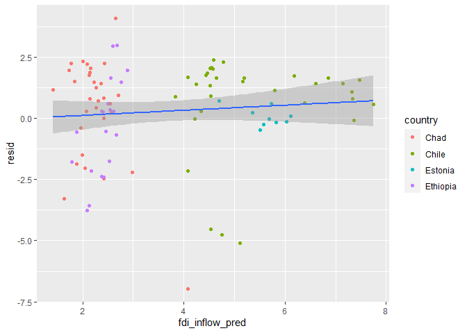
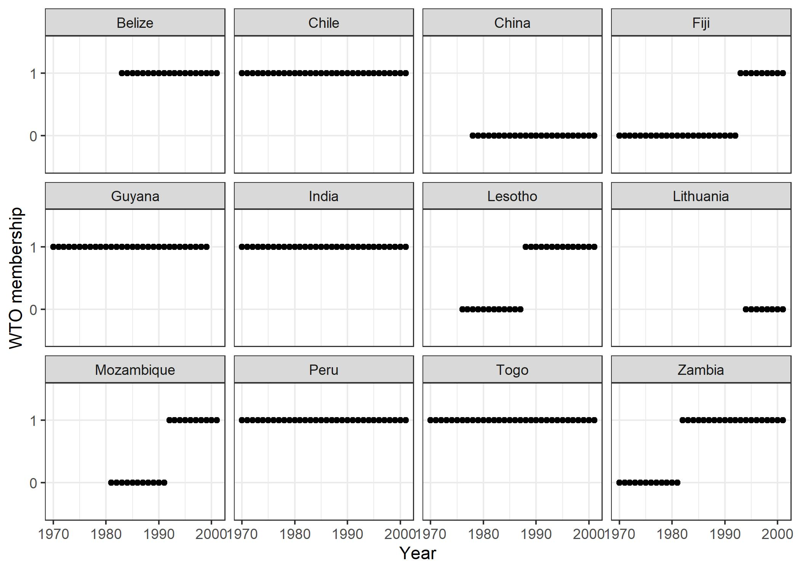
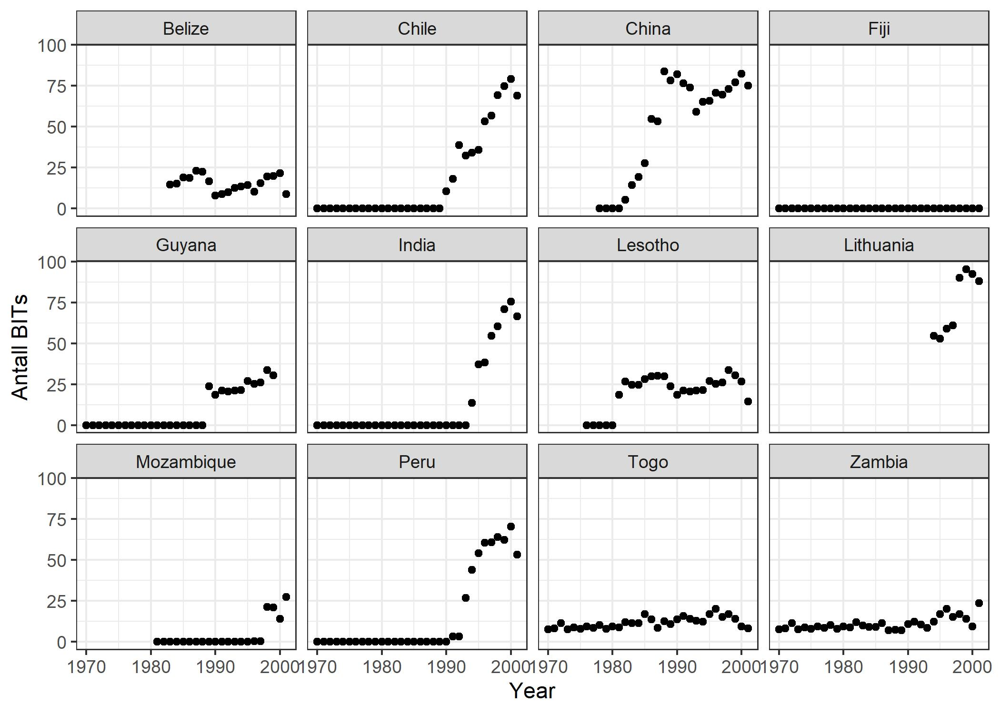
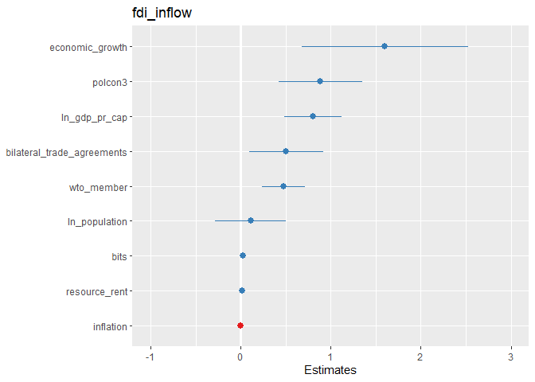
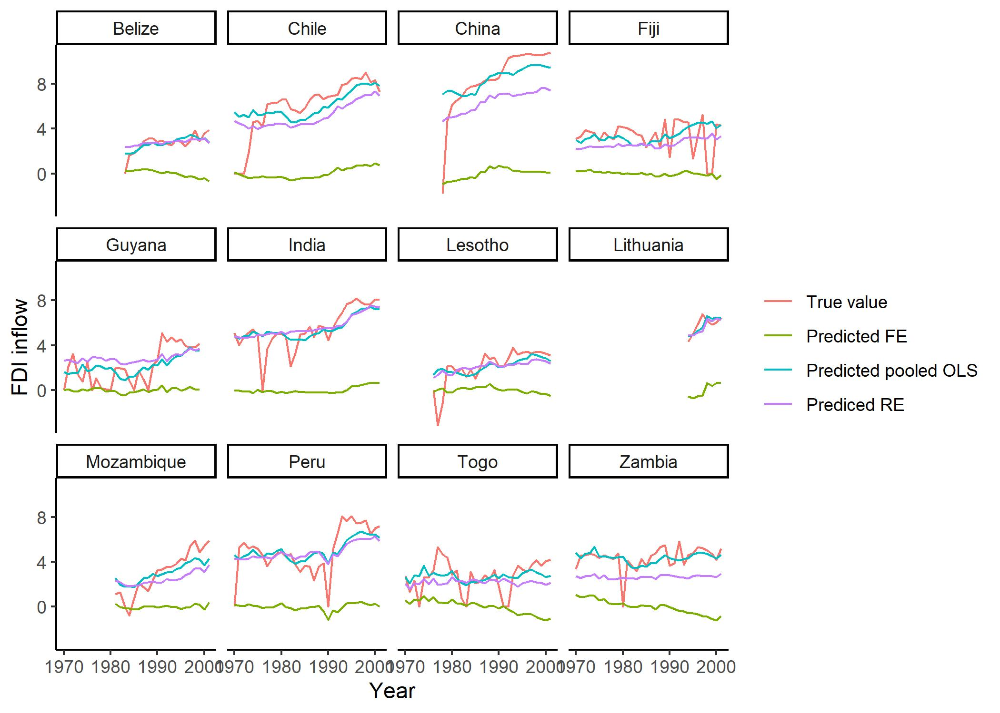

Fordypningsseminar 1: Tidsserie- og paneldata
================
Lise Rødland
03-09-2020

I dette seminaret skal vi jobbe med en artikkel fra 2005 skrevet av
Neumayer og spess. Artikkelen heter *Do bilateral investment treaties
increase foreign direct investment to developing countries?* og bruker
paneldata til å undersøke effekten av bilaterale investeringsavtaler på
hvor mye utenlandsinvesteringer utviklingsland mottar. Datasettet har
jeg lastet ned fra [Harvard
Dataverse](https://dataverse.harvard.edu/dataset.xhtml?persistentId=doi:10.7910/DVN/HQJN8G).
Jeg har bearbeidet datasettet litt før dette seminaret for at variablene
skal ha litt mer intuitive navn. Du kan laste det bearbeidede datasettet
ned fra
[github](https://github.com/liserodland/stv4020aR/tree/master/H20-seminarer/Fordypningsseminarer/data/Paneldata).

``` r
# Laster inn nødvendige pakker
# Husk å kjør install.packages("pakkenavn") først om det er første gang du bruker pakken
library(haven) # For å kunne lese inn .dta-filer
library(tidyverse) # For å kunne bruke ggplot, dplyr og liknende
```

    ## -- Attaching packages --------------------------------------- tidyverse 1.3.1 --

    ## v ggplot2 3.3.5     v purrr   0.3.4
    ## v tibble  3.1.3     v dplyr   1.0.7
    ## v tidyr   1.1.3     v stringr 1.4.0
    ## v readr   2.0.0     v forcats 0.5.1

    ## -- Conflicts ------------------------------------------ tidyverse_conflicts() --
    ## x dplyr::filter() masks stats::filter()
    ## x dplyr::lag()    masks stats::lag()

``` r
library(stargazer) # For å kunne lage pene tabeller
```

    ## 
    ## Please cite as:

    ##  Hlavac, Marek (2018). stargazer: Well-Formatted Regression and Summary Statistics Tables.

    ##  R package version 5.2.2. https://CRAN.R-project.org/package=stargazer

``` r
# Laster inn data
data <- read_dta("neumayer_spess_2005.dta")
```

Datasettet inneholder følgende variabler:

-   `country`: land
-   `year`: år
-   `fdi_inflow`: hvor mye investeringer et land får
-   `bits`: hvor mange investeringsavtaler et land har
-   `ln_gdp_pr_cap`: logaritmen til BNP per cap
-   `ln_population`: logaritmen til populasjonen
-   `economic_growth`: økonomisk vekst
-   `inflation`: inflasjon
-   `resource_rent`: ressursrente (her brukt som mål på hvor mye
    naturressurser et land har)
-   `bilateral_trade_agreements`: antall bilaterale handelsavtaler et
    land har
-   `wto_member`: om et land er medlem i WTO (verdens
    handelsorganisasjon)
-   `polcon3`: et mål på troverdigheten til politiske institusjoner når
    de forplikter seg til politiske tiltak

Disse er litt forenklet forklart. Neumayer og Spess har blant annet
vektet variabelen `bits` som måler antall investeringsavtaler et land
har. Om du er interessert så kan du lese mer i [artikkelen deres i World
Development](https://www-sciencedirect-com.ezproxy.uio.no/science/article/pii/S0305750X05001233).

R har en pakke som heter `plm` og som er nyttig når en skal jobbe med
paneldata. Først må du installere og laste inn pakken:

``` r
#install.packages("plm") # Fjern # foran om ikke du har installert pakken før
library(plm)
```

    ## 
    ## Attaching package: 'plm'

    ## The following objects are masked from 'package:dplyr':
    ## 
    ##     between, lag, lead

Når vi skal bruke `plm`-pakken så må vi først lage et `plm`-objekt som
inneholder informasjon om strukturen på datasettet. I funksjonen under
forteller jeg R at enhetene i datasettet er landene i variabelen
`country` og at tidsperiode er registrert i variabelen `year`.
Alternativt kan en spesifisere index hver gang en estimerer en modell
ved hjelp av `plm()`.

``` r
data.plm <- pdata.frame(data, index = c("country", "year"))

class(data.plm)
```

    ## [1] "pdata.frame" "data.frame"

``` r
head(attr(data.plm, "index"))
```

    ##       country year
    ## 1 Afghanistan 1960
    ## 2 Afghanistan 1961
    ## 3 Afghanistan 1962
    ## 4 Afghanistan 1963
    ## 5 Afghanistan 1964
    ## 6 Afghanistan 1965

Noe av det første det er lurt å gjøre er å sjekke om et panel er
balansert eller ikke. Et balansert panel inneholder like mange
observasjoner av hver enhet i datasettet. Dette sjekker vi ved hjelp av
`is.pbalanced()` funksjonen i `plm`-pakken.

``` r
is.pbalanced(data.plm)
```

    ## [1] TRUE

“TRUE” betyr at panelet er balansert. Denne testen tar imidlertid ikke
innover seg eventuelle missing-verdier. Om vi lager et nytt datasett som
bare innholder observasjonene som ikke har missing på noen variabler
finner vi fort ut at panelet ikke er balansert likevel.

``` r
# Lager et datasett uten missingverdier: 
data.complete <- data.plm %>% 
  na.omit() %>% 
  mutate(year = droplevels(year), 
         country = droplevels(country)) # Her fjerner jeg faktornivåene (levels) til de årene og landene som ikke lengre er med i datasettet

# Sjekker om det nye datasettet som blir lagt til grunn for analysen er balansert
is.pbalanced(data.complete)
```

    ## [1] FALSE

Ved hjelp av `make.pbalanced()` kan vi gjøre panelet balansert, men da
mister vi data. Vi må velge om vi vil beholde alle enheter, men avgrense
dataene til de tidsperiodene vi har data for alle, eller om vi vil
beholde alle tidsperioder og avgrense data til de enhetene der vi har
data for alle tidsperioder.

``` r
data.balanced.time <- make.pbalanced(data.complete, balance.type = "shared.times") # Beholder bare de enhetene vi har data for alle tidsperiode for
# Dette datasettet inneholder 0 observasjoner fordi vi ikke har data for alle tidsperioder for noen enheter

data.balanced.ind <- make.pbalanced(data.complete, balance.type = "shared.individuals") %>%  # Beholder bare de tidsperiodene vi har data for alle enhetene for
  mutate(year = droplevels(year),                               
         country = droplevels(country)) # Her fjerner jeg faktornivåene (levels) til de årene og landene som ikke lengre er med i datasettet
```

I eksempelet har vi ingen enheter med observasjoner for alle år. Vi kan
også sjekke hvor mange enheter eller tidsperioder som forsvinner ut av
analysen ved hjelp av `length` og `unique`. Kombinasjonen av `length` og
`unique` forteller oss hvor mange unike verdier en variabel har (uten å
si noe om hvor mange observasjoner som har denne verdien).

``` r
# Finner antall tidsperioder i opprinnelig datasett uten missing
length(unique(data.complete$country))
```

    ## [1] 120

``` r
length(unique(data.balanced.ind$country))
```

    ## [1] 45

``` r
# I det nye datasettet har vi data for 45 unike land sammenlignet med 120 land opprinelig

length(unique(data.complete$year))
```

    ## [1] 32

``` r
length(unique(data.balanced.ind$year))
```

    ## [1] 32

``` r
# Vi har fortsatt data for 32 år
# Dette gir mening fordi vi valgte å beholde de enhetene vi hadde observasjoner for alle år for. 
```

Dette illustrerer at du fort mister veldig mye data om du skal anvende
et balansert panel. Men, dersom du har et ubalansert panel, vil du ha
implisitt missing - det vil si at R ikke forteller deg at du mangler
informasjon om observasjoner du egentlig burde ha hatt informasjon om. I
det følgende vil vi uansett gå videre med det ubalanserte panelet.

## Paneldataanalyse med plm

Med `plm` må vi spesifisere noen flere elementer enn med `lm()`. Vi må
bestemme `effect` og `model`. Gjennom `model` forteller vi `plm` om vi
ønsker OLS uten faste effekter (`model = "pooling"`), fixed effects
(`model = "within"`) eller random effects (`model = "random"`). Gjennom
`effect` forteller vi `plm` om vi ønsker å se på enheter
(`effect = "individual"`), tid (`effect = "time"`) eller begge deler
(`effect = "twoways"`). En kan også velge andre spesifikasjoner, men de
går vi ikke gjennom i dag.

### Pooled OLS med PCSE

Et første alternativ med paneldata er å kjøre en **pooled ols**
regresjon. Det er som å kjøre en vanlig OLS uten å ta med faste effekter
for enhet eller år.

``` r
# I plm får vi en vanlig OLS-modell om vi velger model = "pooling". 
mod1ols <- plm(data = data.complete, 
              fdi_inflow ~ bits + ln_gdp_pr_cap + ln_population +
                economic_growth + inflation + resource_rent + 
                bilateral_trade_agreements + wto_member + polcon3,
              na.action = "na.exclude", model = "pooling")
```

Vi skal bruke denne modellen for å se på noen av utfordringene knyttet
til paneldata, men først skal vi legge til panelkorrigerte standardfeil
(PCSE). `plm` inneholder funksjonen `vcovBK` som kan brukes til å
beregne panel-korrigerte standardfeil. Jeg kommer ikke til å gå i detalj
om hva funksjonen gjør, men dersom du skal gjøre dette i hjemmeoppgaven
så kan du bytte ut `mod1osl` med ditt eget plm-modellobjekt. Denne
formelen kan også brukes på fixed effects og random effects modeller.

``` r
# Beregner PCSE:
bkse <- round(sqrt(diag(vcovBK(mod1ols, cluster = "group"))), digits = 4)

# Printer resultatene i en tabell
stargazer(mod1ols, mod1ols, type = "text",
          column.labels = c("Med PCSE", "Med vanlige SE"),
          se = list(bkse))
```

    ## 
    ## =======================================================
    ##                                Dependent variable:     
    ##                            ----------------------------
    ##                                     fdi_inflow         
    ##                              Med PCSE    Med vanlige SE
    ##                                 (1)           (2)      
    ## -------------------------------------------------------
    ## bits                         0.018***       0.018***   
    ##                               (0.004)       (0.001)    
    ##                                                        
    ## ln_gdp_pr_cap                1.236***       1.236***   
    ##                               (0.138)       (0.051)    
    ##                                                        
    ## ln_population                0.567***       0.567***   
    ##                               (0.059)       (0.021)    
    ##                                                        
    ## economic_growth              2.238***       2.238***   
    ##                               (0.607)       (0.539)    
    ##                                                        
    ## inflation                     -0.0001       -0.0001    
    ##                              (0.0001)       (0.0001)   
    ##                                                        
    ## resource_rent                  0.015        0.015***   
    ##                               (0.010)       (0.004)    
    ##                                                        
    ## bilateral_trade_agreements    -0.244         -0.244    
    ##                               (0.357)       (0.150)    
    ##                                                        
    ## wto_member                     0.179        0.179**    
    ##                               (0.193)       (0.078)    
    ##                                                        
    ## polcon3                      1.359***       1.359***   
    ##                               (0.451)       (0.200)    
    ##                                                        
    ## Constant                    -15.672***     -15.672***  
    ##                               (1.563)       (0.566)    
    ##                                                        
    ## -------------------------------------------------------
    ## Observations                   2,767         2,767     
    ## R2                             0.453         0.453     
    ## Adjusted R2                    0.451         0.451     
    ## F Statistic (df = 9; 2757)  253.958***     253.958***  
    ## =======================================================
    ## Note:                       *p<0.1; **p<0.05; ***p<0.01

``` r
# Med argumentet se = list(bkse) forteller jeg stargazer at jeg i den første kolonnen
# vil erstatte de opprinnelige standardfeilene med de panelkorrigerte standardfeilene
# jeg regnet ut over. 
```

### Restleddsutfordringer og paneldata

I det følgende tar vi utgangspunkt i OLS-modellen for å vurdere noen av
utfordringene knyttet til paneldata. PCSE tar hånd om samtidig
korrelasjon og heteroskedastisitet, men hjelper ikke mot
autokorrelasjon. For å håndtere autokorrelasjon kan vi inkludere en
lagget avhengig variabel eller en trendvariabel som uavhengig variabel.
PCSE hjelper heller ikke mot utelatt variabel skjevhet som vil bli
diskutert nærmere under fixed effects.

#### Autokorrelasjon

Durbin-Watson testen sjekker for AR(1) seriekorrelasjon.

``` r
# Kjører durbin watson test på modellobjektet
pdwtest(mod1ols)
```

    ## 
    ##  Durbin-Watson test for serial correlation in panel models
    ## 
    ## data:  fdi_inflow ~ bits + ln_gdp_pr_cap + ln_population + economic_growth +     inflation + resource_rent + bilateral_trade_agreements +     wto_member + polcon3
    ## DW = 0.74071, p-value < 2.2e-16
    ## alternative hypothesis: serial correlation in idiosyncratic errors

I følge Christophersen så indikerer verdier i nærheten av 2 ingen
autokorrelasjon og verdier i nærheten av 0 positiv autokorrelasjon. En
løsning er å inkludere en lagget avhengig variabel som
uavhengigvariabel.

``` r
# Kjører modellen med lagget avhengig variabel som uavhengig variabel 
mod1ols_lag <- plm(data = data.complete, 
              fdi_inflow ~ lag(fdi_inflow, 1) +  # Bytt ut "1" med ønsket antall lags dersom du vil ha mer enn 1
                bits + ln_gdp_pr_cap + ln_population +
                economic_growth + inflation + resource_rent + 
                bilateral_trade_agreements + wto_member + polcon3,
              na.action = "na.exclude", model = "pooling")


# Vi kan også differensiere
# Her lager jeg først en variabel som er lik Yt - Yt-1
data.complete$y.lag <- lag(data.complete$fdi_inflow, 1)
data.complete$y_diff <- data.complete$fdi_inflow - data.complete$y.lag

# Kjører modellen med differensiert avhengig variabel for å illustrere hvordan det kan gjøres
mod1ols_diff <- plm(data = data.complete, 
              fdi_inflow ~ y_diff + # Bytt ut "1" med ønsker antall lags dersom du vil ha mer enn 1
                bits + ln_gdp_pr_cap + ln_population +
                economic_growth + inflation + resource_rent + 
                bilateral_trade_agreements + wto_member + polcon3,
              na.action = "na.exclude", model = "pooling")

summary(mod1ols_diff)
```

    ## Pooling Model
    ## 
    ## Call:
    ## plm(formula = fdi_inflow ~ y_diff + bits + ln_gdp_pr_cap + ln_population + 
    ##     economic_growth + inflation + resource_rent + bilateral_trade_agreements + 
    ##     wto_member + polcon3, data = data.complete, na.action = "na.exclude", 
    ##     model = "pooling")
    ## 
    ## Unbalanced Panel: n = 120, T = 1-31, N = 2617
    ## 
    ## Residuals:
    ##     Min.  1st Qu.   Median  3rd Qu.     Max. 
    ## -9.22566 -0.91577  0.29858  1.12945  5.10545 
    ## 
    ## Coefficients:
    ##                               Estimate  Std. Error  t-value  Pr(>|t|)    
    ## (Intercept)                -1.5872e+01  5.3256e-01 -29.8024 < 2.2e-16 ***
    ## y_diff                      4.9022e-01  2.2001e-02  22.2818 < 2.2e-16 ***
    ## bits                        1.7146e-02  1.3834e-03  12.3937 < 2.2e-16 ***
    ## ln_gdp_pr_cap               1.2554e+00  4.7899e-02  26.2091 < 2.2e-16 ***
    ## ln_population               5.7055e-01  1.9506e-02  29.2495 < 2.2e-16 ***
    ## economic_growth             1.9579e+00  5.1107e-01   3.8309 0.0001307 ***
    ## inflation                  -9.0667e-05  4.7601e-05  -1.9047 0.0569265 .  
    ## resource_rent               1.4359e-02  3.5647e-03   4.0282 5.782e-05 ***
    ## bilateral_trade_agreements -2.5085e-01  1.3770e-01  -1.8218 0.0686068 .  
    ## wto_member                  1.9287e-01  7.3690e-02   2.6173 0.0089153 ** 
    ## polcon3                     1.2516e+00  1.8618e-01   6.7224 2.188e-11 ***
    ## ---
    ## Signif. codes:  0 '***' 0.001 '**' 0.01 '*' 0.05 '.' 0.1 ' ' 1
    ## 
    ## Total Sum of Squares:    16417
    ## Residual Sum of Squares: 7501
    ## R-Squared:      0.54311
    ## Adj. R-Squared: 0.54136
    ## F-statistic: 309.778 on 10 and 2606 DF, p-value: < 2.22e-16

``` r
stargazer(mod1ols, mod1ols_lag, mod1ols_diff, 
          type = "text",
          column.labels = c("Pooles OLS", "Lagget AVAR som UVAR", "Differensiert AVAR som UVAR"))
```

    ## 
    ## ===========================================================================================================
    ##                                                          Dependent variable:                               
    ##                            --------------------------------------------------------------------------------
    ##                                                               fdi_inflow                                   
    ##                                   Pooles OLS            Lagget AVAR som UVAR    Differensiert AVAR som UVAR
    ##                                       (1)                       (2)                         (3)            
    ## -----------------------------------------------------------------------------------------------------------
    ## lag(fdi_inflow, 1)                                            0.665***                                     
    ##                                                               (0.014)                                      
    ##                                                                                                            
    ## y_diff                                                                                   0.490***          
    ##                                                                                           (0.022)          
    ##                                                                                                            
    ## bits                               0.018***                   0.005***                   0.017***          
    ##                                     (0.001)                   (0.001)                     (0.001)          
    ##                                                                                                            
    ## ln_gdp_pr_cap                      1.236***                   0.405***                   1.255***          
    ##                                     (0.051)                   (0.043)                     (0.048)          
    ##                                                                                                            
    ## ln_population                      0.567***                   0.202***                   0.571***          
    ##                                     (0.021)                   (0.018)                     (0.020)          
    ##                                                                                                            
    ## economic_growth                    2.238***                   1.125***                   1.958***          
    ##                                     (0.539)                   (0.415)                     (0.511)          
    ##                                                                                                            
    ## inflation                           -0.0001                   -0.00002                   -0.0001*          
    ##                                    (0.0001)                  (0.00004)                   (0.00005)         
    ##                                                                                                            
    ## resource_rent                      0.015***                    0.006*                    0.014***          
    ##                                     (0.004)                   (0.003)                     (0.004)          
    ##                                                                                                            
    ## bilateral_trade_agreements          -0.244                     -0.081                     -0.251*          
    ##                                     (0.150)                   (0.112)                     (0.138)          
    ##                                                                                                            
    ## wto_member                          0.179**                    0.008                     0.193***          
    ##                                     (0.078)                   (0.060)                     (0.074)          
    ##                                                                                                            
    ## polcon3                            1.359***                   0.549***                   1.252***          
    ##                                     (0.200)                   (0.152)                     (0.186)          
    ##                                                                                                            
    ## Constant                          -15.672***                 -5.290***                  -15.872***         
    ##                                     (0.566)                   (0.489)                     (0.533)          
    ##                                                                                                            
    ## -----------------------------------------------------------------------------------------------------------
    ## Observations                         2,767                     2,617                       2,617           
    ## R2                                   0.453                     0.700                       0.543           
    ## Adjusted R2                          0.451                     0.699                       0.541           
    ## F Statistic                253.958*** (df = 9; 2757) 607.110*** (df = 10; 2606) 309.778*** (df = 10; 2606) 
    ## ===========================================================================================================
    ## Note:                                                                           *p<0.1; **p<0.05; ***p<0.01

Ved å inkludere en lagget variabel så kontrollerer vi for alle relevante
variabler til og med tidspunktet t-antall lags (i vårt tilfelle t-1).
Koeffisienten til den laggede avhengige variabelen er sjeldent av stor
substansiell interesse.

#### Panel-spesifikk heteroskedastisitet

OLS forutsetter at residualenes varians er konstant på tvers av enheter.
Med paneldata er det risiko for at restleddene har ulik varians for
ulike tversnittsenheter. En måte å undersøke heterskedastisitet på er å
plotte residualene mot predikerte verdier og bruke
`facet_wrap(~country)`.

``` r
# Henter ut predikerte verdier
ols.predict <- predict(mod1ols)

# Legger predikerte verdier og residualer inn i datasettet
data.complete <- data.complete %>% 
  mutate(resid = resid(mod1ols),
         resid_lag = lag(resid),
         fdi_inflow_pred = ols.predict)

# Eye ball test av heteroskedastisitet
ggplot(data.complete %>% 
         filter(country %in% c("Norway", "Ethiopia", "Chile", "Estonia",
                               "Chad", "Switzerland", "Spain")) %>%      # Velger noen land som jeg plotter for å ikke få et helt uoversiktelig plot
         data.frame(),                                                   # Gjør om til en data.frame objekt for å plotte
       aes(x = fdi_inflow_pred, y = resid)) +         
  geom_point(aes(col = country)) +
  geom_smooth(method = "lm")
```

    ## `geom_smooth()` using formula 'y ~ x'

<!-- -->

#### Samtidig korrelasjon

Om en hendelse har prefet samtlige enheter på et bestemt tidspunkt så
har vi samtidig korrelasjon. Da vil restleddene være korrelert på tvers
av paneler innenfor samme tidsperiode. PCSE hjelper mot dette.

### Modeller med fixed effects

Panelkorrigerte standardfeil tar imidlertid ikke hensyn til utelatt
variabelskjevhet (OVB). Vi har OVB dersom det finnes variabler som
påvirker både den avhengige variabelen og minst en uavhengig variabel,
men som vi ikke har med i modellen vår. Christoffersen nevner
observasjonenes historie idet tidsserien starter som et eksempel på noe
som gjør det urealistisk å legge til grunn en modell med felles
konstantledd (som vi gjør i OLS). Dersom disse karakteristika er
konstante over tid så kan de fanges opp ved hjelp av tverssnittsfaste
effekter, også kalt enhetsspesifikke konstantledd.

Med paneldata så kan en velge å ha tversnittsfaste effekter,
tidsfasteeffekter eller både tversnitts- og tidsfaste effekter. Under
viser jeg hvordan du kan estimere ulike modeller ved hjelp av `plm()`.
Når vi spesifiser `model = "within"` forteller vi plm at vi ønsker å
kjøre fixed effects.

``` r
# Med tversnittsfaste effekter (i dette tilfellet land)
plm.fe.ind <- plm(data = data.complete, 
              fdi_inflow ~ bits + ln_gdp_pr_cap + ln_population +
                economic_growth + inflation + resource_rent + 
                bilateral_trade_agreements + wto_member + polcon3,
              na.action = "na.exclude", model = "within", effect = "individual")


# Med tidsfaste effekter (i dette tilfellet år)
plm.fe.time <- plm(data = data.complete, 
              fdi_inflow ~ bits + ln_gdp_pr_cap + ln_population +
                economic_growth + inflation + resource_rent + 
                bilateral_trade_agreements + wto_member + polcon3,
              na.action = "na.exclude",model = "within", effect = "time")

# Med tversnitts- og tidsfaste effekter (i dette tilfellet år og land)
plm.fe.two <- plm(data = data.complete, 
              fdi_inflow ~ bits + ln_gdp_pr_cap + ln_population +
                economic_growth + inflation + resource_rent + 
                bilateral_trade_agreements + wto_member + polcon3,
              na.action = "na.exclude", model = "within", effect = "twoways")

# Viser resultatene i en tabell

stargazer(plm.fe.ind, plm.fe.time, plm.fe.two, type = "text",
          column.labels = c("Tversnitts FE", "Tids FE", "Tversnitts og tids FE"),
          omit = c("country", "year"))
```

    ## 
    ## ======================================================================================================
    ##                                                        Dependent variable:                            
    ##                            ---------------------------------------------------------------------------
    ##                                                            fdi_inflow                                 
    ##                                 Tversnitts FE                Tids FE           Tversnitts og tids FE  
    ##                                      (1)                       (2)                      (3)           
    ## ------------------------------------------------------------------------------------------------------
    ## bits                               0.025***                 0.014***                  0.019***        
    ##                                    (0.002)                   (0.002)                  (0.002)         
    ##                                                                                                       
    ## ln_gdp_pr_cap                      0.803***                 1.263***                  0.570***        
    ##                                    (0.162)                   (0.051)                  (0.171)         
    ##                                                                                                       
    ## ln_population                       0.113                   0.577***                 -1.474***        
    ##                                    (0.201)                   (0.021)                  (0.477)         
    ##                                                                                                       
    ## economic_growth                    1.603***                 1.858***                  1.143**         
    ##                                    (0.473)                   (0.544)                  (0.474)         
    ##                                                                                                       
    ## inflation                         -0.0001**                  -0.0001                 -0.0001**        
    ##                                   (0.00005)                 (0.0001)                 (0.00005)        
    ##                                                                                                       
    ## resource_rent                      0.020***                 0.016***                  0.029***        
    ##                                    (0.006)                   (0.004)                  (0.007)         
    ##                                                                                                       
    ## bilateral_trade_agreements         0.506**                  -0.298**                  0.533**         
    ##                                    (0.211)                   (0.148)                  (0.209)         
    ##                                                                                                       
    ## wto_member                         0.476***                  0.137*                    0.216*         
    ##                                    (0.122)                   (0.077)                  (0.124)         
    ##                                                                                                       
    ## polcon3                            0.886***                 1.080***                  0.546**         
    ##                                    (0.236)                   (0.206)                  (0.237)         
    ##                                                                                                       
    ## ------------------------------------------------------------------------------------------------------
    ## Observations                        2,767                     2,767                    2,767          
    ## R2                                  0.177                     0.422                    0.067          
    ## Adjusted R2                         0.137                     0.414                    0.010          
    ## F Statistic                63.171*** (df = 9; 2638) 221.257*** (df = 9; 2726) 20.713*** (df = 9; 2607)
    ## ======================================================================================================
    ## Note:                                                                      *p<0.1; **p<0.05; ***p<0.01

`plm()` rapporterer ikke koeffisientene for enheter eller tidsperioder
automatisk, og du får heller ikke oppgitt noe konstantledd. For å få
oppgitt de faste effektene bruker vi funksjonen `fixed`.

``` r
fixef(plm.fe.ind)[1:5] # Henter ut de fem første tversnittsfaste effektene
```

    ##             Albania             Algeria              Angola Antigua and Barbuda 
    ##           -6.033565           -6.649452           -3.233274           -6.408387 
    ##           Argentina 
    ##           -3.973221

``` r
fixef(plm.fe.time)[1:5] # Henter ut de fem første tidsfaste effektene
```

    ##      1993      1994      1995      1996      1997 
    ## -15.85832 -15.66020 -15.50446 -15.34385 -15.30234

``` r
# I modeller med både tversnitts- og tidsfaste effekter må du spesifiser effect = "time" 
# om du vil ha de tidsfaste effektene
fixef(plm.fe.two)[1:5] # Henter ut de fem første tversnittssfaste effektene
```

    ##             Albania             Algeria              Angola Antigua and Barbuda 
    ##            20.87123            21.31038            23.11889            12.98824 
    ##           Argentina 
    ##            25.39257

``` r
fixef(plm.fe.two, effect = "time")[1:5] # Henter ut de fem første tidsfaste effektene
```

    ##     1970     1971     1972     1973     1974 
    ## 19.80885 20.03946 20.21046 20.38592 20.52256

En kan kombinere `fixef()` med `summary()` for å få informasjon om de
faste effektene er signifikante eller ikke. I kodesnutten under bruker
jeg kombinasjonen på modellen med enhetsfasteeffekter. Dersom vi ønsker
de tidsfaste effektene må vi igjen huske å spesifisere `effect`.

``` r
summary(fixef(plm.fe.ind))
```

    ##                                Estimate Std. Error t-value Pr(>|t|)   
    ## Albania                         -6.0336     3.1692 -1.9038 0.057047 . 
    ## Algeria                         -6.6495     3.5901 -1.8522 0.064114 . 
    ## Angola                          -3.2333     3.4018 -0.9505 0.341968   
    ## Antigua and Barbuda             -6.4084     2.6176 -2.4482 0.014423 * 
    ## Argentina                       -3.9732     3.6338 -1.0934 0.274317   
    ## Armenia                         -5.4789     3.2275 -1.6976 0.089708 . 
    ## Azerbaijan                      -3.7538     3.3693 -1.1141 0.265323   
    ## Bangladesh                      -7.4589     3.7518 -1.9881 0.046908 * 
    ## Barbados                        -7.4328     2.8234 -2.6326 0.008523 **
    ## Belarus                         -6.1273     3.4495 -1.7763 0.075804 . 
    ## Belize                          -6.7597     2.7316 -2.4747 0.013399 * 
    ## Benin                           -6.6376     3.1847 -2.0842 0.037235 * 
    ## Bolivia                         -5.3369     3.2816 -1.6263 0.104009   
    ## Botswana                        -5.6092     3.0445 -1.8424 0.065526 . 
    ## Brazil                          -1.8206     3.9081 -0.4658 0.641372   
    ## Bulgaria                        -6.1989     3.3499 -1.8504 0.064362 . 
    ## Burkina Faso                    -6.4854     3.3330 -1.9458 0.051783 . 
    ## Burundi                         -7.6420     3.1912 -2.3947 0.016704 * 
    ## Cambodia                        -2.9313     3.4394 -0.8523 0.394148   
    ## Cameroon                        -6.3710     3.3453 -1.9045 0.056955 . 
    ## Cape Verde                      -7.1005     2.8378 -2.5021 0.012406 * 
    ## Central African Republic        -7.2904     3.1008 -2.3512 0.018787 * 
    ## Chad                            -5.7355     3.2113 -1.7860 0.074211 . 
    ## Chile                           -4.2037     3.4532 -1.2173 0.223582   
    ## China                           -1.6097     4.2612 -0.3777 0.705647   
    ## Colombia                        -3.3175     3.6346 -0.9128 0.361449   
    ## Comoros                         -7.9889     2.8657 -2.7877 0.005346 **
    ## Congo, Dem. Rep.                -5.8577     3.5110 -1.6684 0.095361 . 
    ## Congo, Rep.                     -5.9524     3.0256 -1.9674 0.049247 * 
    ## Costa Rica                      -4.4543     3.1770 -1.4021 0.161017   
    ## Cote d'Ivoire                   -4.6437     3.3621 -1.3812 0.167340   
    ## Croatia                         -4.7741     3.2916 -1.4504 0.147069   
    ## Czech Republic                  -5.3649     3.4020 -1.5770 0.114920   
    ## Dominica                        -6.8342     2.5833 -2.6455 0.008205 **
    ## Dominican Republic              -4.1247     3.3145 -1.2444 0.213450   
    ## Ecuador                         -4.3803     3.3847 -1.2941 0.195733   
    ## Egypt, Arab Rep.                -5.2970     3.6220 -1.4625 0.143736   
    ## El Salvador                     -6.1506     3.2868 -1.8713 0.061417 . 
    ## Equatorial Guinea               -4.2014     2.8178 -1.4910 0.136073   
    ## Estonia                         -6.2953     3.0670 -2.0526 0.040213 * 
    ## Ethiopia                        -5.3085     3.6709 -1.4461 0.148268   
    ## Fiji                            -5.3372     2.9594 -1.8035 0.071428 . 
    ## Gabon                           -7.2612     2.9896 -2.4288 0.015216 * 
    ## Gambia, The                     -6.2250     2.8845 -2.1581 0.031012 * 
    ## Georgia                         -6.2168     3.3246 -1.8700 0.061600 . 
    ## Ghana                           -5.0442     3.3986 -1.4842 0.137871   
    ## Grenada                         -6.3355     2.5986 -2.4380 0.014834 * 
    ## Guatemala                       -3.9888     3.3853 -1.1783 0.238795   
    ## Guinea                          -6.7834     3.3232 -2.0412 0.041328 * 
    ## Guinea-Bissau                   -6.9213     2.9166 -2.3730 0.017714 * 
    ## Guyana                          -6.9801     2.9109 -2.3979 0.016559 * 
    ## Haiti                           -6.6419     3.2196 -2.0630 0.039214 * 
    ## Honduras                        -5.0161     3.2304 -1.5528 0.120594   
    ## Hungary                         -5.8600     3.4181 -1.7144 0.086578 . 
    ## India                           -3.9836     4.1667 -0.9561 0.339128   
    ## Indonesia                       -4.9577     3.8655 -1.2826 0.199762   
    ## Iran, Islamic Rep.              -6.8815     3.7413 -1.8393 0.065977 . 
    ## Jamaica                         -6.1384     3.1125 -1.9721 0.048698 * 
    ## Jordan                          -5.8902     3.1977 -1.8420 0.065585 . 
    ## Kazakhstan                      -4.0450     3.5172 -1.1501 0.250221   
    ## Kenya                           -4.9903     3.4762 -1.4356 0.151248   
    ## Korea, Rep.                     -4.6236     3.6599 -1.2633 0.206578   
    ## Kyrgyz Republic                 -7.2519     3.2661 -2.2203 0.026480 * 
    ## Latvia                          -5.7604     3.1611 -1.8223 0.068524 . 
    ## Lebanon                         -5.9370     3.3006 -1.7988 0.072172 . 
    ## Lesotho                         -6.0720     3.0303 -2.0038 0.045196 * 
    ## Lithuania                       -5.5463     3.2422 -1.7107 0.087261 . 
    ## Macedonia, FYR                  -5.7460     3.1599 -1.8184 0.069113 . 
    ## Madagascar                      -6.4463     3.3496 -1.9245 0.054403 . 
    ## Malawi                          -5.9937     3.2723 -1.8316 0.067119 . 
    ## Malaysia                        -3.4503     3.4703 -0.9942 0.320198   
    ## Mali                            -5.6860     3.3049 -1.7205 0.085465 . 
    ## Mauritania                      -7.0639     3.0398 -2.3238 0.020211 * 
    ## Mauritius                       -7.5037     3.0383 -2.4697 0.013586 * 
    ## Mexico                          -1.8723     3.8256 -0.4894 0.624585   
    ## Moldova                         -5.8366     3.2173 -1.8141 0.069772 . 
    ## Morocco                         -5.6026     3.5126 -1.5950 0.110831   
    ## Mozambique                      -4.7578     3.4395 -1.3833 0.166698   
    ## Namibia                         -4.7241     3.0938 -1.5270 0.126892   
    ## Nepal                           -7.2955     3.4727 -2.1008 0.035755 * 
    ## Nicaragua                       -5.9846     3.1882 -1.8771 0.060615 . 
    ## Niger                           -5.8582     3.2670 -1.7932 0.073060 . 
    ## Nigeria                         -2.6881     3.7353 -0.7197 0.471802   
    ## Pakistan                        -4.4797     3.7613 -1.1910 0.233762   
    ## Panama                          -4.9314     3.1431 -1.5690 0.116772   
    ## Papua New Guinea                -4.8936     3.2070 -1.5259 0.127151   
    ## Paraguay                        -5.7826     3.2359 -1.7870 0.074051 . 
    ## Peru                            -4.8182     3.5258 -1.3665 0.171885   
    ## Philippines                     -4.0943     3.6978 -1.1072 0.268296   
    ## Poland                          -4.5112     3.6204 -1.2461 0.212852   
    ## Romania                         -5.8600     3.4921 -1.6781 0.093449 . 
    ## Russian Federation              -4.4333     3.9063 -1.1349 0.256515   
    ## Rwanda                          -5.9726     3.2372 -1.8450 0.065148 . 
    ## Sao Tome and Principe           -8.6416     2.6420 -3.2709 0.001086 **
    ## Senegal                         -6.6853     3.2335 -2.0675 0.038783 * 
    ## Seychelles                      -5.3227     2.6428 -2.0140 0.044108 * 
    ## Sierra Leone                    -6.4719     3.1443 -2.0583 0.039660 * 
    ## Slovak Republic                 -4.3070     3.3795 -1.2745 0.202613   
    ## South Africa                    -6.1712     3.6425 -1.6942 0.090347 . 
    ## Sri Lanka                       -6.7726     3.4074 -1.9876 0.046958 * 
    ## St. Kitts and Nevis             -6.1233     2.5341 -2.4164 0.015744 * 
    ## St. Lucia                       -5.7080     2.6659 -2.1411 0.032359 * 
    ## St. Vincent and the Grenadines  -6.0640     2.6546 -2.2844 0.022430 * 
    ## Swaziland                       -5.2019     3.0691 -1.6949 0.090205 . 
    ## Syrian Arab Republic            -7.7080     3.4315 -2.2463 0.024769 * 
    ## Tanzania                        -3.4787     3.5142 -0.9899 0.322315   
    ## Thailand                        -3.4564     3.6830 -0.9385 0.348089   
    ## Togo                            -5.4379     3.1281 -1.7384 0.082256 . 
    ## Trinidad and Tobago             -5.3273     3.0488 -1.7474 0.080690 . 
    ## Tunisia                         -4.7422     3.3372 -1.4210 0.155428   
    ## Turkey                          -5.1035     3.6793 -1.3871 0.165535   
    ## Uganda                          -5.1282     3.4372 -1.4920 0.135829   
    ## Ukraine                         -4.8416     3.7066 -1.3062 0.191601   
    ## Uruguay                         -6.6639     3.2112 -2.0752 0.038067 * 
    ## Uzbekistan                      -5.7722     3.6693 -1.5731 0.115813   
    ## Venezuela, RB                   -5.2002     3.5440 -1.4673 0.142403   
    ## Vietnam                         -1.7010     3.7701 -0.4512 0.651897   
    ## Yemen, Rep.                     -6.6040     3.4322 -1.9242 0.054442 . 
    ## Zambia                          -3.8950     3.2777 -1.1883 0.234807   
    ## Zimbabwe                        -6.9533     3.3835 -2.0551 0.039972 * 
    ## ---
    ## Signif. codes:  0 '***' 0.001 '**' 0.01 '*' 0.05 '.' 0.1 ' ' 1

``` r
summary(fixef(plm.fe.two, effect = "time"))
```

    ##      Estimate
    ## 1970 19.80885
    ## 1971 20.03946
    ## 1972 20.21046
    ## 1973 20.38592
    ## 1974 20.52256
    ## 1975 20.44605
    ## 1976 20.31931
    ## 1977 20.19635
    ## 1978 20.27060
    ## 1979 19.60158
    ## 1980 19.42387
    ## 1981 19.74607
    ## 1982 19.80396
    ## 1983 20.21515
    ## 1984 19.84710
    ## 1985 19.72274
    ## 1986 20.07575
    ## 1987 20.02438
    ## 1988 20.05734
    ## 1989 20.05707
    ## 1990 19.73978
    ## 1991 19.42844
    ## 1992 19.43052
    ## 1993 19.50315
    ## 1994 19.50252
    ## 1995 19.85425
    ## 1996 20.11442
    ## 1997 20.14030
    ## 1998 20.46280
    ## 1999 20.31627
    ## 2000 20.45995
    ## 2001 20.52203

Et alternativ til `plm` for å estimere en modell med fixed effects er å
bruke `lm()` funksjonen. I dette eksempelet så vil det innebære å
inkludere variablene `country` og/eller `year`som uavhengige variabler i
regresjonslikningen. Dersom `year` er en numerisk variabel må vi bruke
`as.factor(year)` for at den skal operere som faste effekter. Prøv
gjerne dette selv og se om resultatet blir det samme.

Et alternativ til faste effekter på land- og årnivå er å lage regions-
eller periodevariabler. Du kan bruke funksjonene `cut` eller `ifelse`
til å lage nye variabler som sier noe om hvilken region og tidsperiode
en observasjon tilhører. Deretter kan du estimere en OLS-modell uten
variablene `country` og `year`, men med de nye periode- og
regionvariablene.

**OBS! ved fixed effects:** Dersom du inkluderer uavhengige variabler
med lite variasjon over tid så vil tverssnitsfaste effekter øke risikoen
for multikolinaritet. Om en uavhengig variabel er konstant over tid så
vil den være perfekt kolinær med de tverrsnittsfaste effektene. Det
samme gjelder dersom en vil estimere effekten av en hendelse som skjedde
på akkurat samme tidspunkt i alle land. Da vil denne være perfekt
kolineær med tidsdummyen for dette året. Om en variabel endrer seg sakte
så er dette også en risiko.

For å undersøke dette kan vi bruke elementet `facet_wrap(~country)` i
`ggplot`. Under er to plot som viser utviklingen over tid for en
variabel i hvert land. I plottene under har jeg valgt et utvalg av land
ved hjelp av `filter()` og `%in%` for å få et litt mer lesbart plot.
Prøv gjerne å fjerne ulike elementer i plottet for å se hva de gjør.

``` r
ggplot(data.complete%>% 
         filter(country %in% c("Bagladesh", "Lesotho", "India", "Chile",
                               "China", "Lithuania", "Mozambique", "Togo", 
                               "Zambia", "Fiji", "Belize", "Peru", "Guyana"))) + # Velger ut utvalg av land
  geom_point(aes(x = as.numeric(as.character(year)), y = as.factor(wto_member))) + # Bruker as.numeric(as.character(year)) fordi year er en faktor
  facet_wrap(~country) + 
  theme_bw() +
  xlab("Year") + ylab("WTO membership") # Legger til aksetitler
```



``` r
ggplot(data.complete%>% 
         filter(country %in% c("Bagladesh", "Lesotho", "India", "Chile",
                               "China", "Lithuania", "Mozambique", "Togo", 
                               "Zambia", "Fiji", "Belize", "Peru", "Guyana"))) +
  geom_point(aes(x = as.numeric(as.character(year)), y = bits)) +
  facet_wrap(~country) +
  theme_bw() +
  xlab("Year") + ylab("Antall BITs")
```



### Modeller med random effects

Random effects bygger på en antakelse om at enhetsspesifikke
konstantledd er tilfeldig trukket fra en felles fordeling. Random
effects er biased dersom de enhetsspesifikke konstantleddene/restleddene
er korrelert med minst en av uavhengige variablene.

``` r
plm.re.ind <- plm(data = data.complete, 
              fdi_inflow ~ bits + ln_gdp_pr_cap + ln_population +
                economic_growth + inflation + resource_rent + 
                bilateral_trade_agreements + wto_member + polcon3,
              na.action = "na.exclude", model = "random", effect = "individual")

plm.re.time <- plm(data = data.complete, 
              fdi_inflow ~ bits + ln_gdp_pr_cap + ln_population +
                economic_growth + inflation + resource_rent + 
                bilateral_trade_agreements + wto_member + polcon3,
              na.action = "na.exclude", model = "random", effect = "time")

plm.re.two <- plm(data = data.complete, 
              fdi_inflow ~ bits + ln_gdp_pr_cap + ln_population +
                economic_growth + inflation + resource_rent + 
                bilateral_trade_agreements + wto_member + polcon3,
              na.action = "na.exclude", model = "random", effect = "twoways")

stargazer::stargazer(plm.re.ind, plm.re.time, plm.re.two, type = "text",
                     column.labels = c("Tversnitts RE", "Tids RE", "Tversnitts og tids RE"))
```

    ## 
    ## ===========================================================================
    ##                                          Dependent variable:               
    ##                            ------------------------------------------------
    ##                                               fdi_inflow                   
    ##                            Tversnitts RE   Tids RE    Tversnitts og tids RE
    ##                                 (1)          (2)               (3)         
    ## ---------------------------------------------------------------------------
    ## bits                         0.022***      0.016***         0.021***       
    ##                               (0.002)      (0.002)           (0.001)       
    ##                                                                            
    ## ln_gdp_pr_cap                1.028***      1.245***         1.029***       
    ##                               (0.104)      (0.051)           (0.067)       
    ##                                                                            
    ## ln_population                0.492***      0.570***         0.493***       
    ##                               (0.054)      (0.021)           (0.035)       
    ##                                                                            
    ## economic_growth              1.710***      2.091***         1.413***       
    ##                               (0.469)      (0.539)           (0.303)       
    ##                                                                            
    ## inflation                    -0.0001**     -0.0001         -0.0001***      
    ##                              (0.00005)     (0.0001)         (0.00003)      
    ##                                                                            
    ## resource_rent                0.019***      0.016***         0.022***       
    ##                               (0.006)      (0.004)           (0.004)       
    ##                                                                            
    ## bilateral_trade_agreements    0.375**      -0.262*          0.385***       
    ##                               (0.191)      (0.149)           (0.123)       
    ##                                                                            
    ## wto_member                   0.352***      0.165**          0.290***       
    ##                               (0.106)      (0.078)           (0.069)       
    ##                                                                            
    ## polcon3                      0.916***      1.266***         0.802***       
    ##                               (0.222)      (0.201)           (0.144)       
    ##                                                                            
    ## Constant                    -13.028***    -15.743***       -12.998***      
    ##                               (1.269)      (0.565)           (0.826)       
    ##                                                                            
    ## ---------------------------------------------------------------------------
    ## Observations                   2,767        2,767             2,767        
    ## R2                             0.250        0.432             0.442        
    ## Adjusted R2                    0.247        0.431             0.440        
    ## F Statistic                 813.469***   2,168.272***     1,392.212***     
    ## ===========================================================================
    ## Note:                                           *p<0.1; **p<0.05; ***p<0.01

## Tolke effekter

Koeffisientene fra modellene du kjører i plm kan tolkes som OLS
koeffisienter, men kontrollert for enhets- eller landfaste effekter ved
bruk av fixed effects. Pakken `sjPlot`inneholder flere fine
plot-funksjoner.

``` r
# Laster inn pakken 
# husk å installere ved hjelp av install.packages("sjPlot") om ikke du har brukt den før
library(sjPlot)
```

    ## Registered S3 methods overwritten by 'parameters':
    ##   method                           from      
    ##   as.double.parameters_kurtosis    datawizard
    ##   as.double.parameters_skewness    datawizard
    ##   as.double.parameters_smoothness  datawizard
    ##   as.numeric.parameters_kurtosis   datawizard
    ##   as.numeric.parameters_skewness   datawizard
    ##   as.numeric.parameters_smoothness datawizard
    ##   print.parameters_distribution    datawizard
    ##   print.parameters_kurtosis        datawizard
    ##   print.parameters_skewness        datawizard
    ##   summary.parameters_kurtosis      datawizard
    ##   summary.parameters_skewness      datawizard

``` r
# Plotter koeffisientene og 95 % KI fra modellen med enhetsfaste effekter 
plot_model(plm.fe.ind, sort.est = TRUE)
```

<!-- -->

## Plotte faktisk verdi opp mot predikert verdi

``` r
# I dette eksempelet tar jeg utgangspunkt i både tids- og enhetseffekter
# Legger til predikerte verdier på avhengig variabel for random effects i datasett
data.complete$pred_fdi_inflow_re <- predict(plm.re.two)
# Legger til predikerte verdier for pooled OLS i datasett 
data.complete$pred_fdi_inflow_ols <- predict(mod1ols)
# Legger til predikerte verdier for fixed effects i datasett
data.complete$pred_fdi_inflow_fe <- predict(plm.fe.two)


# Jeg gjør om en dataframe fra wide til long for å kunne få ulik farge på de predikerte verdiene i plottet
plot_data <- data.complete %>%
  data.frame() %>% # Gjør om fra plm-objekt til data.frame
  select(country, year, fdi_inflow, pred_fdi_inflow_fe, pred_fdi_inflow_ols, pred_fdi_inflow_re) %>%  # Velger ut de aktuelle variablene
  pivot_longer(cols = contains("fdi_inflow"), names_to = "model", "values_to" = "FDI_inflow")  # omformer datasettet 
# Argumentet cols = sier hvilke kolonner(variabler) som skal slås sammen til en kolonne
# contains("fdi_inflow") betyr at jeg vil ha med alle variablene som inneholder fdi_inflow
```

``` r
head(plot_data, 10)
```

    ## # A tibble: 10 x 4
    ##    country year  model               FDI_inflow
    ##    <fct>   <fct> <chr>               <pseries> 
    ##  1 Albania 1993  fdi_inflow           4.0123649
    ##  2 Albania 1993  pred_fdi_inflow_fe  -0.8140128
    ##  3 Albania 1993  pred_fdi_inflow_ols  3.4457156
    ##  4 Albania 1993  pred_fdi_inflow_re   3.2392312
    ##  5 Albania 1994  fdi_inflow           4.2700253
    ##  6 Albania 1994  pred_fdi_inflow_fe  -0.4873869
    ##  7 Albania 1994  pred_fdi_inflow_ols  3.8844340
    ##  8 Albania 1994  pred_fdi_inflow_re   3.7014500
    ##  9 Albania 1995  fdi_inflow           4.5009203
    ## 10 Albania 1995  pred_fdi_inflow_fe   0.2083384

``` r
ggplot(plot_data %>% 
         filter(country %in% c("Bagladesh", "Lesotho", "India", "Chile",
                               "China", "Lithuania", "Mozambique", "Togo", 
                               "Zambia", "Fiji", "Belize", "Peru", "Guyana"))) +    # Tar med et utvalg av land
  geom_line(aes(x = as.numeric(as.character(year)), y = FDI_inflow, col = model)) + # Plotter linjen
  facet_wrap(~country) +                                                            # Lager et plot per land  
  theme_classic() +
  scale_color_discrete(labels = c("True value", "Predicted FE", "Predicted pooled OLS", "Prediced RE")) + # Setter inn labels på fargeoversikt
  xlab("Year") + ylab("FDI inflow") +
  theme(legend.position = "right", legend.title = element_blank())
```



Som vi ser av plottet så ligger de predikerte verdiene for OLS og random
effects ganske nærme hverandre, mens estimatene med faste effekter
skiller seg betydelig fra disse.

## Hvilken modell skal vi bruke?

### Er de faste effektene signifikante?

Pakken plm tilbyr flere funksjoner for å sjekke om de faste
koeffisientene er signifikante. Det modellen gjør er å sammenligne en
model med faste effekter med en pooled OLS-modell.

``` r
plmtest(mod1ols, effect = "twoways")
```

    ## 
    ##  Lagrange Multiplier Test - two-ways effects (Honda) for unbalanced
    ##  panels
    ## 
    ## data:  fdi_inflow ~ bits + ln_gdp_pr_cap + ln_population + economic_growth +  ...
    ## normal = 42.453, p-value < 2.2e-16
    ## alternative hypothesis: significant effects

``` r
plmtest(mod1ols, effect = "time")
```

    ## 
    ##  Lagrange Multiplier Test - time effects (Honda) for unbalanced panels
    ## 
    ## data:  fdi_inflow ~ bits + ln_gdp_pr_cap + ln_population + economic_growth +  ...
    ## normal = 7.0443, p-value = 9.319e-13
    ## alternative hypothesis: significant effects

``` r
plmtest(mod1ols, effect = "individual")
```

    ## 
    ##  Lagrange Multiplier Test - (Honda) for unbalanced panels
    ## 
    ## data:  fdi_inflow ~ bits + ln_gdp_pr_cap + ln_population + economic_growth +  ...
    ## normal = 52.994, p-value < 2.2e-16
    ## alternative hypothesis: significant effects

``` r
pFtest(plm.fe.ind, mod1ols)
```

    ## 
    ##  F test for individual effects
    ## 
    ## data:  fdi_inflow ~ bits + ln_gdp_pr_cap + ln_population + economic_growth +  ...
    ## F = 10.848, df1 = 119, df2 = 2638, p-value < 2.2e-16
    ## alternative hypothesis: significant effects

``` r
pFtest(plm.fe.two, mod1ols)
```

    ## 
    ##  F test for twoways effects
    ## 
    ## data:  fdi_inflow ~ bits + ln_gdp_pr_cap + ln_population + economic_growth +  ...
    ## F = 9.8231, df1 = 150, df2 = 2607, p-value < 2.2e-16
    ## alternative hypothesis: significant effects

``` r
pdwtest(plm.fe.ind)
```

    ## 
    ##  Durbin-Watson test for serial correlation in panel models
    ## 
    ## data:  fdi_inflow ~ bits + ln_gdp_pr_cap + ln_population + economic_growth +     inflation + resource_rent + bilateral_trade_agreements +     wto_member + polcon3
    ## DW = 1.0479, p-value < 2.2e-16
    ## alternative hypothesis: serial correlation in idiosyncratic errors

``` r
pdwtest(plm.fe.two)
```

    ## 
    ##  Durbin-Watson test for serial correlation in panel models
    ## 
    ## data:  fdi_inflow ~ bits + ln_gdp_pr_cap + ln_population + economic_growth +     inflation + resource_rent + bilateral_trade_agreements +     wto_member + polcon3
    ## DW = 1.079, p-value < 2.2e-16
    ## alternative hypothesis: serial correlation in idiosyncratic errors

``` r
pdwtest(plm.fe.time)
```

    ## 
    ##  Durbin-Watson test for serial correlation in panel models
    ## 
    ## data:  fdi_inflow ~ bits + ln_gdp_pr_cap + ln_population + economic_growth +     inflation + resource_rent + bilateral_trade_agreements +     wto_member + polcon3
    ## DW = 0.75204, p-value < 2.2e-16
    ## alternative hypothesis: serial correlation in idiosyncratic errors

### Random eller fixed effects: Hausman-testen

Funksjonen `phtest` i plm lar deg kjøre en Hausman-test. Random effects
er en mer effisient metode fordi du ikke begrenser deg til “within”
informasjon. Men, random effects er «biased» dersom
enhets-konstantleddene/restleddene er korrelert med minst en av de
uavhengige variablene. Hausman-testen tester om koeffisientene fra
random effects og fixed effects er signifikant forskjellige. Dersom de
er signifikant forskjellige bør en bruke den forventningsrette fixed
effects modellen, om ikke bør en bruke den effisiente random effects
modellen.

``` r
# Gjennom PLM kan vi kjøre en hausman test
# Modellene med både tverrsnitts- og tidsfaste effekter
phtest(plm.fe.two, plm.re.two)
```

    ## 
    ##  Hausman Test
    ## 
    ## data:  fdi_inflow ~ bits + ln_gdp_pr_cap + ln_population + economic_growth +  ...
    ## chisq = 24.036, df = 9, p-value = 0.004244
    ## alternative hypothesis: one model is inconsistent

``` r
# Modellene med tverssnitssfaste effekter
phtest(plm.fe.ind, plm.re.ind)
```

    ## 
    ##  Hausman Test
    ## 
    ## data:  fdi_inflow ~ bits + ln_gdp_pr_cap + ln_population + economic_growth +  ...
    ## chisq = 68.364, df = 9, p-value = 3.184e-11
    ## alternative hypothesis: one model is inconsistent

``` r
# Modellene med tidsfaste effekter
phtest(plm.fe.time, plm.re.time)
```

    ## 
    ##  Hausman Test
    ## 
    ## data:  fdi_inflow ~ bits + ln_gdp_pr_cap + ln_population + economic_growth +  ...
    ## chisq = 28.566, df = 9, p-value = 0.0007668
    ## alternative hypothesis: one model is inconsistent

*Hvordan tolker vi hausman-testen?*

## Andre tester

I [vignetten til
plm](https://cran.r-project.org/web/packages/plm/vignettes/plmPackage.html)
kan du lese om andre tester du kan gjøre for å sjekke forutsetninger og
modelltilpasning.

## Paneldata og ikke-lineære modeller

Det er relativt greit å kjøre ikke-lineære modeller med fixed effects.
Du legger bare til variabelene som angir enheter og/eller tid som
uavhengige variabler i f.eks. `glm()`. Skal du kjøre en logistisk modell
med random effects så kan du se nærmere på pakken `glmer`, men merk at
dette ligger utenfor pensum i 4020A.
