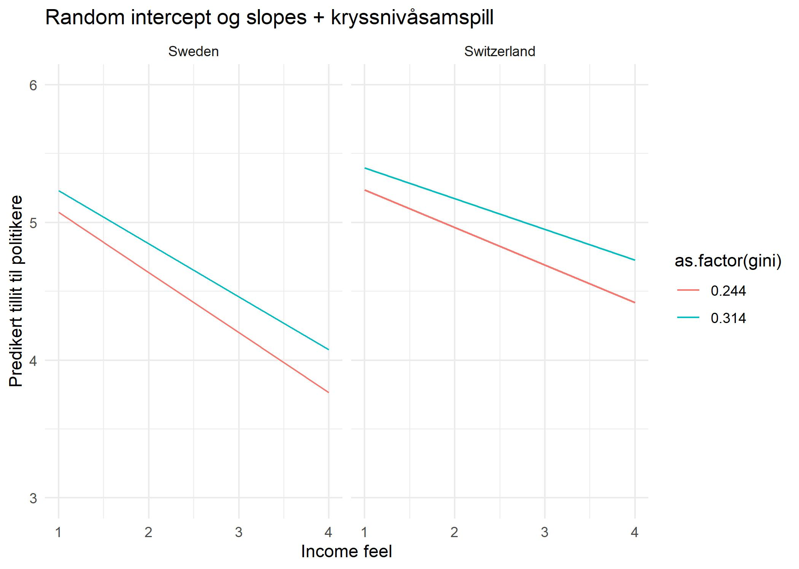

## Flernivåanalyse

Den statistiske motivasjonen bak flernivåanalyse er å ta hensyn til
avhengighet mellom observasjoner i en hierarkisk struktur. *I R:* Som de
andre regresjonsformene vi har sett på, ligner syntaksen for
flernivåanalyse på syntaksen for ols. Den største forskjellen ligger i
spesifisering av nivå for variabler. Hensikten med dette dokumentet er å
hjelpe deg til å forstå hvordan du kan oversette teorien fra
forelesning/pensum om variabler på ulike nivå til R-syntaks i `lmer()`
funksjonen fra pakken `lme4`. Dersom du ikke helt forstår hva som skjer
i flernivå-scriptet, vil forhåpentligvis dette dokumentet være til
hjelp, og vice versa. Installer og last inn `lme4` med koden under.


```r
# Laster inn nødvendige pakker
# Husk å kjøre install.packages("pakkenavn") om det er første gang du
# bruker pakken
# install.packages("lme4")
library(lme4) # For å kjøre flernivåmodeller
```

```
## Loading required package: Matrix
```

```r
library(tidyverse) # Bl.a. for å preppe data
```

```
## -- Attaching packages --------------------------------------- tidyverse 1.3.1 --
```

```
## v ggplot2 3.3.5     v purrr   0.3.4
## v tibble  3.1.3     v dplyr   1.0.7
## v tidyr   1.1.3     v stringr 1.4.0
## v readr   2.0.0     v forcats 0.5.1
```

```
## -- Conflicts ------------------------------------------ tidyverse_conflicts() --
## x tidyr::expand() masks Matrix::expand()
## x dplyr::filter() masks stats::filter()
## x dplyr::lag()    masks stats::lag()
## x tidyr::pack()   masks Matrix::pack()
## x tidyr::unpack() masks Matrix::unpack()
```

```r
library(stargazer) # For pene tabeller
```

```
## 
## Please cite as:
```

```
##  Hlavac, Marek (2018). stargazer: Well-Formatted Regression and Summary Statistics Tables.
```

```
##  R package version 5.2.2. https://CRAN.R-project.org/package=stargazer
```

```r
# install.packages("sjlabelled")
library(sjlabelled) # For å hente ut informasjon om labels e.l.
```

```
## 
## Attaching package: 'sjlabelled'
```

```
## The following object is masked from 'package:forcats':
## 
##     as_factor
```

```
## The following object is masked from 'package:dplyr':
## 
##     as_label
```

```
## The following object is masked from 'package:ggplot2':
## 
##     as_label
```

```r
library(lmtest) # For å kjøre likelihood ratio test
```

```
## Loading required package: zoo
```

```
## 
## Attaching package: 'zoo'
```

```
## The following objects are masked from 'package:base':
## 
##     as.Date, as.Date.numeric
```

```r
library(countrycode) # For å endre landkoder
```

I dag og på torsdag/fredag skal vi bruke et datasett fra European Social Survey. Observasjonene i datasettet er individer og disse er nøstet innad i land. Nivå 1-enhetene vår er altså individer, mens nivå 2-enhetene er land i Europa. Datasettet ligger på github. Last ned datasettet og last det inn i Rstudio. 


```r
# Laster inn Rdata
load("ess.rda") # Her må du bytte ut mappestien "../data/" med stien til mappen du lagret data i

str(ess)
```

```
## 'data.frame':	28221 obs. of  14 variables:
##  $ idno               : num  1 2 3 4 5 6 7 13 14 21 ...
##   ..- attr(*, "label")= chr "ID number"
##  $ cntry              : chr  "AT" "AT" "AT" "AT" ...
##  $ country            : chr  "Austria" "Austria" "Austria" "Austria" ...
##  $ gender             : chr  "male" "male" "female" "male" ...
##   ..- attr(*, "label")= chr "Gender"
##  $ age                : num  50 66 88 31 55 66 65 66 33 65 ...
##   ..- attr(*, "label")= chr "Age"
##  $ income_feel        : num  2 3 2 2 2 2 2 1 2 2 ...
##   ..- attr(*, "label")= chr "Feeling about household's income nowadays"
##  $ income_decile      : num  3 3 2 4 8 5 4 3 3 2 ...
##   ..- attr(*, "label")= chr "Household's total net income, all sources"
##  $ trust_parl         : 'labelled' num  3 7 2 1 0 1 3 4 7 2 ...
##   ..- attr(*, "labels")= Named num [1:11] 0 1 2 3 4 5 6 7 8 9 ...
##   .. ..- attr(*, "names")= chr [1:11] "No trust at all" "1" "2" "3" ...
##   ..- attr(*, "label")= chr "Trust in country's parliament"
##  $ trust_legalsys     : 'labelled' num  7 4 8 8 2 2 6 1 8 5 ...
##   ..- attr(*, "labels")= Named num [1:11] 0 1 2 3 4 5 6 7 8 9 ...
##   .. ..- attr(*, "names")= chr [1:11] "No trust at all" "1" "2" "3" ...
##   ..- attr(*, "label")= chr "Trust in the legal system "
##  $ trust_police       : 'labelled' num  4 5 8 8 5 8 7 8 7 5 ...
##   ..- attr(*, "labels")= Named num [1:11] 0 1 2 3 4 5 6 7 8 9 ...
##   .. ..- attr(*, "names")= chr [1:11] "No trust at all" "1" "2" "3" ...
##   ..- attr(*, "label")= chr "Trust in the police"
##  $ trust_politicians  : 'labelled' num  3 3 3 0 0 0 0 4 3 2 ...
##   ..- attr(*, "labels")= Named num [1:11] 0 1 2 3 4 5 6 7 8 9 ...
##   .. ..- attr(*, "names")= chr [1:11] "No trust at all" "1" "2" "3" ...
##   ..- attr(*, "label")= chr "Trust in politicians"
##  $ trust_polparties   : 'labelled' num  3 5 3 1 1 0 0 4 3 2 ...
##   ..- attr(*, "labels")= Named num [1:11] 0 1 2 3 4 5 6 7 8 9 ...
##   .. ..- attr(*, "names")= chr [1:11] "No trust at all" "1" "2" "3" ...
##   ..- attr(*, "label")= chr "Trust in political parties"
##  $ trust_eurparl      : 'labelled' num  0 0 2 0 0 2 0 1 6 2 ...
##   ..- attr(*, "labels")= Named num [1:11] 0 1 2 3 4 5 6 7 8 9 ...
##   .. ..- attr(*, "names")= chr [1:11] "No trust at all" "1" "2" "3" ...
##   ..- attr(*, "label")= chr "Trust in the European Parliament"
##  $ trust_unitednations: 'labelled' num  5 3 5 0 2 3 3 7 5 2 ...
##   ..- attr(*, "labels")= Named num [1:11] 0 1 2 3 4 5 6 7 8 9 ...
##   .. ..- attr(*, "names")= chr [1:11] "No trust at all" "1" "2" "3" ...
##   ..- attr(*, "label")= chr "Trust in the United Nations"
```

Datasettet inneholder følgende variabler: 

- `id`: observasjonens id-nummer
- `cntry`: landforkortelse
- `country`: land
- `gender`: kjønn
- `age`: alder
- `income_feel`: "Feeling about household's income nowadays"
- `incomde_decil`: inntektsdesil
- `trust_parl`: "Trust in country's parliament"
- `trust_legalsys`: "Trust in legal system"
- `trust_police`: "Trust in police"
- `trust_polparties`: "Trust in political parties"
- `trust_eurparl`: "Trust in the European Parliament"
- `trust_unitednations`: "Trust in the United Nations" 

ESS dataene i dette formatet kommer med labels. Det kan være et nyttig supplement til kodeboken. En pakke som er fin å installere dersom datasettet du skal bruke har labels er `sjlabelled`. Vi installerer og laster inn pakken før vi ser nærmere på labels ved hjelp av funksjonen `get_label` og `get_labels`: 


```r
get_label(ess$trust_eurparl)
```

```
## [1] "Trust in the European Parliament"
```

```r
summary(ess$trust_eurparl)
```

```
##    Min. 1st Qu.  Median    Mean 3rd Qu.    Max.    NA's 
##   0.000   2.000   5.000   4.287   6.000  10.000    1644
```

```r
get_labels(ess$trust_eurparl)
```

```
##  [1] "No trust at all" "1"               "2"               "3"              
##  [5] "4"               "5"               "6"               "7"              
##  [9] "8"               "9"               "Complete trust"
```

Som vi ser forteller `get_label()` oss hvilket spørsmål som er stilt, mens `get_labels()` forteller oss hva som er laveste og høyeste verdi på variabelen. Her ser vi at variabelen `trust_eurparl` går fra 0-10, og `get_labels()` forteller oss at 0 betyr "No trust at all", mens 10 betyr "Complete trust". Du kan selv sjekke hva som gjelder for noen av de andre variablene. 

Labelled data er i utgangspunktet supert, men klassen "labelled" kan også gi noen utfodringer. Jeg lager derfor et datasett uten labels som jeg skal bruke videre:


```r
ess_nolabel <- remove_all_labels(ess)

# I tillegg fjerner jeg de observasjonene som har missing på noen 
# av variablene vi skal bruke senere sånn at modellene er nøstede
# mtp observasjoner
ess_nolabel <- ess_nolabel %>% 
  filter(!is.na(income_decile) &
         !is.na(trust_politicians))
```


## Flernivåanalyse i R
Under finner dere syntaksen for flernivå med samme notasjon som på
forelesning, oversatt til `lmer`. Jeg bruker `group_var` for å betegne
variabelen som forteller hvilken gruppe observasjoner tilhører (den
hierarkiske strukturen). `x` refererer til variabler på nivå 1, mens `z`
referer til variabler på nivå 2 (skiller mellom z og x for å gjøre det
lettere og oversette til **R**).

Først må vi imidlertid si noe om fixed effects. I flernivåanalyse referer en til en variabel som vi antar at har samme effekt i alle nivå 2-enheter som fixed effects. Dette er noe annet enn å innføre enhetsspesifikke konstantledd eller dummies som vi gjorde i paneldata. 

**Flernivå med kun random intercept:**
\[Y_i = \beta_{0} + u_{0j} + e_{ij}\] 
`lmer(y ~ 1 + (1|group_var), data = data)`

Denne kalles også ofte for en nullmodell. 

**Flernivå med uavh. variabel på nivå 1, fixed effects, random intercept:** 

\[Y_i = \beta_{0} + \beta_{1}X_{1ij} +  u_{0j} + e_{ij}\]

`lmer(y ~ (1|group_var) + x1, data = data)` 

**Flernivå med uavh. variabel på nivå1, random slopes:**

\[Y_i = \beta_{0} + \beta_{1}X_{1ij} + u_{1j}X_{1ij} + u_{0j} +  e_{ij}\]

`lmer(y ~ x1 + (x1|group_var), data=data)`

**Flernivå med uavh. var på mikronivå med random effects, og uavhengig variabel på makronivå:**

\[Y_i = \beta_{0} + \beta_{1}X_{1ij} + \beta_{2j} Z_{2j} + + u_{1j}X_{1ij} + u_{0j} + e_{ij}\]

`lmer(y ~ x1 + (x1|group_var) + z2, data=data)`

**Flernivå med uavh. var på mikronivå med random effects, kryssnivåsamspill, og uavhengig variabel på makronivå:**

\[Y_i = \beta_{0} + \beta_{1}X_{1ij} + \beta_{2j}Z_{2j} + \beta_{3}X_{1ij}Z_{2j} + + u_{1j}X_{1ij} + u_{0j} + e_{ij}\]

`lmer(y ~ x1*z2 + x1 + (x1|group_var) + z2, data=data)`

### Beregne intraklassekorrelasjon
I forelesning kommer dere til å snakke om noe som heter intra-class correlation. Intra-class correlation forteller oss hvor stor andel av total varians som ligger på nivå 2, i vårt tilfelle på landnivå. Resten av variansen skyldes at nivå 1-enhetene, i vårt tilfelle personer, avviker fra nivå 2-gjennomsnittet. Intra-class correlation kan tolkes som graden av avhengighet mellom enhetene. 

For å finne intra-class correlation så kan vi bruke modellen med kun random intercept. Vi kjører først modellen:


```r
m0 <- lmer(data = ess_nolabel, 
           trust_politicians ~ (1|country))
```

Dersom vi har brukt `lmer()` til å kjøre en flernivåmodell med kun
random intercept, får vi outputen vi trenger til å regne ut ICC etter
denne formelen med `summary()`. For å finne intra-class correlation så deler vi
varians på nivå 2 på summen av varians på nivå en og nivå 2:

\[var(u_j)/(var(u_j) + var(e_{ij}))\]

I vårt eksempel blir det: 

```r
summary(m0)
```

```
## Linear mixed model fit by REML ['lmerMod']
## Formula: trust_politicians ~ (1 | country)
##    Data: ess_nolabel
## 
## REML criterion at convergence: 97421.2
## 
## Scaled residuals: 
##     Min      1Q  Median      3Q     Max 
## -2.4382 -0.7317  0.0344  0.7834  3.7710 
## 
## Random effects:
##  Groups   Name        Variance Std.Dev.
##  country  (Intercept) 1.294    1.137   
##  Residual             4.642    2.154   
## Number of obs: 22259, groups:  country, 14
## 
## Fixed effects:
##             Estimate Std. Error t value
## (Intercept)   3.8978     0.3044   12.81
```

```r
# ICC
1.294/(1.294 + 4.642)
```

```
## [1] 0.2179919
```
Denne summary-outputen er litt annerledes enn det vi har sett tidligere. I outputen her kan vi lese varianse på landnivå og residualvarians. Variansen til `Residual` (residualene/restleddene) gir oss variansen i tillit til politikere mellom individer i samme land, mens variansen til `country` gir oss variansen mellom land.   

Vi kan også bruke `VarCorr(model, comp=`Variance`)`. 


```r
# Vi lagrer først et element med de estimerte variansene
m0var <- VarCorr(m0)

# Så bruker vi print() og ber om å få varians
print(m0var, comp = "Variance")
```

```
##  Groups   Name        Variance
##  country  (Intercept) 1.2939  
##  Residual             4.6415
```
I vårt eksempel ligger altså ca. 22 % av variansen på nivå 2 (landnivå). I følge Christophersen er det en veiledende hovedregel at ICC >= 0,05 indikerer at flernivåanalyse bør velges. 

**Flernivå med uavh. variabel på nivå 1, fixed effects, random intercept:** 


```r
m1 <- lmer(data = ess_nolabel, 
           trust_politicians ~ (1|country) + income_decile,
           na.action = "na.exclude")

summary(m1)
```

```
## Linear mixed model fit by REML ['lmerMod']
## Formula: trust_politicians ~ (1 | country) + income_decile
##    Data: ess_nolabel
## 
## REML criterion at convergence: 97122
## 
## Scaled residuals: 
##     Min      1Q  Median      3Q     Max 
## -2.6593 -0.7358  0.0156  0.7379  3.9598 
## 
## Random effects:
##  Groups   Name        Variance Std.Dev.
##  country  (Intercept) 1.223    1.106   
##  Residual             4.578    2.140   
## Number of obs: 22259, groups:  country, 14
## 
## Fixed effects:
##               Estimate Std. Error t value
## (Intercept)   3.395816   0.297276   11.42
## income_decile 0.093619   0.005317   17.61
## 
## Correlation of Fixed Effects:
##             (Intr)
## income_decl -0.096
```

For å illustere forskjellene mellom de ulike modellene kommer jeg til å plotte effekter for hver modell. 


```r
# 1. Esimtere modell (gjort)

# 2. Lage plot data
plot_data_m1 <- data.frame(income_decile = rep(1:10, 2),
                        country = c(rep("Sweden", 10), rep("Switzerland", 10)))

# 3. Henter ut predikerte verdier på avhengig variabel og lagrer i plotdata
plot_data_m1$pred <- predict(m1, plot_data)                        

# 4. Plotter
ggplot(plot_data_m1) +
  geom_line(aes(y = pred, x = income_decile, col = country)) +
  theme_minimal() +
  xlab("Inntektsdesil") + 
  ylab("Predikert tillit til politikere") +
  scale_x_continuous(limits = c(1,10)) +
  scale_y_continuous(limits = c(0,10)) +
  ggtitle("Modell med random intercept") + 
  theme(legend.title = element_blank())
```


Land er våre nivå 2 variabler. Her har de ulikt skjæringspunkt på y-aksen, men linjen har lik helning

**Flernivå med uavh. variabel på nivå 1, random slopes:**
\[Y_i = \beta_{0} + \beta_{1}X_{1ij} + u_{1j}X_{1ij} + u_{0j} +  e_{ij}\]
`lmer(y ~ x1 + (x1|group_var), data=data)`


```r
m2 <- lmer(data = ess_nolabel, 
           trust_politicians ~ (income_decile|country) + income_decile,
           na.action = "na.exclude")

summary(m2)
```

```
## Linear mixed model fit by REML ['lmerMod']
## Formula: trust_politicians ~ (income_decile | country) + income_decile
##    Data: ess_nolabel
## 
## REML criterion at convergence: 97095.4
## 
## Scaled residuals: 
##     Min      1Q  Median      3Q     Max 
## -2.6637 -0.7304  0.0161  0.7414  3.9230 
## 
## Random effects:
##  Groups   Name          Variance Std.Dev. Corr
##  country  (Intercept)   1.115550 1.05620      
##           income_decile 0.001434 0.03787  0.16
##  Residual               4.568823 2.13748      
## Number of obs: 22259, groups:  country, 14
## 
## Fixed effects:
##               Estimate Std. Error t value
## (Intercept)    3.40378    0.28417  11.978
## income_decile  0.09041    0.01151   7.852
## 
## Correlation of Fixed Effects:
##             (Intr)
## income_decl 0.087
```

```r
# Vi skal se mer på hvordan vi kan tolke varians etterpå

stargazer(m0, m1, m2, type = "text")
```

```
## 
## =======================================================
##                             Dependent variable:        
##                     -----------------------------------
##                              trust_politicians         
##                         (1)         (2)         (3)    
## -------------------------------------------------------
## income_decile                    0.094***    0.090***  
##                                   (0.005)     (0.012)  
##                                                        
## Constant             3.898***    3.396***    3.404***  
##                       (0.304)     (0.297)     (0.284)  
##                                                        
## -------------------------------------------------------
## Observations          22,259      22,259      22,259   
## Log Likelihood      -48,710.610 -48,560.990 -48,547.700
## Akaike Inf. Crit.   97,427.230  97,129.980  97,107.400 
## Bayesian Inf. Crit. 97,451.260  97,162.020  97,155.460 
## =======================================================
## Note:                       *p<0.1; **p<0.05; ***p<0.01
```

Vi plotter effekten:


```r
# Plotter effekter
# 1. Kjører modellen

# 2. Lager plotdata
plot_data_m2 <- data.frame(income_decile = rep(1:10, 2),
                        country = c(rep("Sweden", 10), rep("Switzerland", 10)))

# 3. Lagrer predikerte verdier på AVAR i datasettet
plot_data_m2$pred <- predict(m2, plot_data_m2)                        

# 4. Plotter
ggplot(plot_data_m2) +
  geom_line(aes(y = pred, x = income_decile, col = country)) +
  theme_minimal() +
  theme_minimal() +
  xlab("Inntektsdesil") + 
  ylab("Predikert tillit til politikere") +
  scale_x_continuous(limits = c(1,10)) +
  scale_y_continuous(limits = c(0,10)) +
  ggtitle("Modell med random intercept og random slopes") +
  theme(legend.title = element_blank())
```


Her har nivå 2-enhetene, land, både forskjellig intercept og slope


**Kort om å merge datasett** 

Før vi ser nærmere på de andre variablene så skal vi hente inn litt informasjon på landnivå. Jeg har lastet ned informasjon fra OECD om gini-koeffisienten i ulike land i 2016. Gini-koeffisienten er et mål på inntekstulikhet. Jeg laster inn OECD-datasettet og lagrer det som `gini` i Environment.


```r
gini <- read.csv("OECD_gini.csv") 
str(gini)
```

```
## 'data.frame':	35 obs. of  2 variables:
##  $ cntry: chr  "AUS" "AUT" "BEL" "CAN" ...
##  $ gini : num  0.33 0.284 0.266 0.307 0.253 0.261 0.259 0.291 0.294 0.333 ...
```

```r
# cntry i gini-dataene ligner på cntry i ess

str(ess)
```

```
## 'data.frame':	28221 obs. of  14 variables:
##  $ idno               : num  1 2 3 4 5 6 7 13 14 21 ...
##   ..- attr(*, "label")= chr "ID number"
##  $ cntry              : chr  "AT" "AT" "AT" "AT" ...
##  $ country            : chr  "Austria" "Austria" "Austria" "Austria" ...
##  $ gender             : chr  "male" "male" "female" "male" ...
##   ..- attr(*, "label")= chr "Gender"
##  $ age                : num  50 66 88 31 55 66 65 66 33 65 ...
##   ..- attr(*, "label")= chr "Age"
##  $ income_feel        : num  2 3 2 2 2 2 2 1 2 2 ...
##   ..- attr(*, "label")= chr "Feeling about household's income nowadays"
##  $ income_decile      : num  3 3 2 4 8 5 4 3 3 2 ...
##   ..- attr(*, "label")= chr "Household's total net income, all sources"
##  $ trust_parl         : 'labelled' num  3 7 2 1 0 1 3 4 7 2 ...
##   ..- attr(*, "labels")= Named num [1:11] 0 1 2 3 4 5 6 7 8 9 ...
##   .. ..- attr(*, "names")= chr [1:11] "No trust at all" "1" "2" "3" ...
##   ..- attr(*, "label")= chr "Trust in country's parliament"
##  $ trust_legalsys     : 'labelled' num  7 4 8 8 2 2 6 1 8 5 ...
##   ..- attr(*, "labels")= Named num [1:11] 0 1 2 3 4 5 6 7 8 9 ...
##   .. ..- attr(*, "names")= chr [1:11] "No trust at all" "1" "2" "3" ...
##   ..- attr(*, "label")= chr "Trust in the legal system "
##  $ trust_police       : 'labelled' num  4 5 8 8 5 8 7 8 7 5 ...
##   ..- attr(*, "labels")= Named num [1:11] 0 1 2 3 4 5 6 7 8 9 ...
##   .. ..- attr(*, "names")= chr [1:11] "No trust at all" "1" "2" "3" ...
##   ..- attr(*, "label")= chr "Trust in the police"
##  $ trust_politicians  : 'labelled' num  3 3 3 0 0 0 0 4 3 2 ...
##   ..- attr(*, "labels")= Named num [1:11] 0 1 2 3 4 5 6 7 8 9 ...
##   .. ..- attr(*, "names")= chr [1:11] "No trust at all" "1" "2" "3" ...
##   ..- attr(*, "label")= chr "Trust in politicians"
##  $ trust_polparties   : 'labelled' num  3 5 3 1 1 0 0 4 3 2 ...
##   ..- attr(*, "labels")= Named num [1:11] 0 1 2 3 4 5 6 7 8 9 ...
##   .. ..- attr(*, "names")= chr [1:11] "No trust at all" "1" "2" "3" ...
##   ..- attr(*, "label")= chr "Trust in political parties"
##  $ trust_eurparl      : 'labelled' num  0 0 2 0 0 2 0 1 6 2 ...
##   ..- attr(*, "labels")= Named num [1:11] 0 1 2 3 4 5 6 7 8 9 ...
##   .. ..- attr(*, "names")= chr [1:11] "No trust at all" "1" "2" "3" ...
##   ..- attr(*, "label")= chr "Trust in the European Parliament"
##  $ trust_unitednations: 'labelled' num  5 3 5 0 2 3 3 7 5 2 ...
##   ..- attr(*, "labels")= Named num [1:11] 0 1 2 3 4 5 6 7 8 9 ...
##   .. ..- attr(*, "names")= chr [1:11] "No trust at all" "1" "2" "3" ...
##   ..- attr(*, "label")= chr "Trust in the United Nations"
```
For å kombinere `gini`-dataene med `ess`-dataene så må vi ha en felles nøkkelvariabel som knytter observasjonene sammen. `cntry`-variablene i de to datasettene ligner på hverandre, men mens OECD bruker tre bokstaver i landforkortelsen så bruker bare ESS bare to. Dette er ofte tilfellet når en forsøker å slå sammen data fra ulike kilder. Det finnes en pakke i R som heter `countrycode` som kan hjelpe oss med dette. Funksjonen `countrycode()` lar oss omkode landforkortelse fra en type til en annen. Vi skal først laste inn pakken. Hvis ikke du har brukt den før så må du først installere den ved hjelp av `install.packages()`-funksjonen. 


```r
# install.packages("countrycode")
library(countrycode)
```

Om du skriver `?codelist` så får du en oversikt over de ulike landforkortelsene som finnes i pakken. Jeg har kikket gjennom på forhånd og funnet ut at `iso3c` ser ut til å matche godt med forkortelsene i OECD-dataene og `iso2c` ser ut til å passe godt med ESS-dataene. Denne informasjonen bruker jeg til å lage en ny variabel `cntry2` i OECD-dataene (`gini`). Til slutt bruker jeg denne til å slå sammen de to datasettene ved hjelp av `left_join`.  


```r
# Lager ny landkodevariabel
gini$cntry2 <- countrycode(gini$cntry, "iso3c", "iso2c")

# Slår sammen datasettene
ess2 <- ess %>% 
  left_join(gini, by = c("cntry" = "cntry2"))

# Sjekker om alle land har fått en giniverdi ved hjelp av is.na
table(is.na(ess2$gini))
```

```
## 
## FALSE 
## 28221
```

```r
# Ingen har missing så dette ser fint ut
```
Nå som vi har slått sammen datasettene så kan vi også kjøre analyser med variabler på nivå 2 (landnivå her). 


**Flernivå med uavh. var på nivå 1 med random effects, og uavhengig variabel på nivå 2:**


```r
m3 <- lmer(data = ess2, 
           trust_politicians ~  income_decile + (income_decile|country) + gini)
```

Først plotter vi random intercept og random slope: 


```r
plot_data_m3 <- data.frame(income_decile = rep(1:10, 2),
                           country = c(rep("Sweden", 10), rep("Switzerland", 10)),
                           gini = mean(ess2$gini))

plot_data_m3$pred <- predict(m3, plot_data_m3)                        

ggplot(plot_data_m3) +
  geom_line(aes(y = pred, x = income_decile, col = country)) +
  theme_minimal() +
  theme_minimal() +
  xlab("Inntektsdesil") + 
  ylab("Predikert tillit til politikere") +
  scale_x_continuous(limits = c(1,10)) +
  scale_y_continuous(limits = c(0,10)) +
  ggtitle("Random intercept, random slopes") +
  theme(legend.title = element_blank())
# I denne modellen har vi åpnet for random intercept, random slopes (income_decile)
# Men holdt effekten av gini konstant på tvers av land
```


Så plotter vi den "faste" nivå 2-effekten:


```r
plot_data_m3b <- data.frame(income_decile = mean(ess2$income_decile, na.rm = TRUE),
                           country = c(rep("Sweden", 10), rep("Switzerland", 10)),
                           gini = c(rep(seq(min(ess2$gini), 
                                            max(ess2$gini), 0.0075), 2)))
plot_data_m3b$pred <- predict(m3, plot_data_m3b)                        

ggplot(plot_data_m3b) +
  geom_line(aes(y = pred, x = gini, col = country)) +
  theme_minimal() +
  theme_minimal() +
  xlab("Gini") + 
  ylab("Predikert tillit til politikere") +
  scale_x_continuous(limits = c(0.2,0.35)) +
  scale_y_continuous(limits = c(0,10)) +
  ggtitle("Random intercept & slopes, fixed nivå 2 (gini)") +
  theme(legend.title = element_blank())
## OBS!! Dette er bare for å illustrere, men husk at vi bare har observasjoner
# av landfor ett år. Derfor har vi egentlig bare en observasjon av gini per land.
```


**Flernivå med uavh. var på mikronivå med random effects, kryssnivåsamspill, og uavhengig variabel på makronivå:**
\[Y_i = \beta_{0} + \beta_{1}X_{1ij} + \beta_{2j}Z_{2j} + \beta_{3}X_{1ij}Z_{2j} + + u_{1j}X_{1ij} + u_{0j} + e_{ij}\]
`lmer(y ~ x1*z2 + x1 + (x1|group_var) + z2, data=data)`


```r
## Flernivå med uavh. var på mikronivå med random effects, kryssnivåsamspill, 
# og uavhengig variabel på makronivå:
m4 <- lmer(data = ess2, 
           trust_politicians ~ (income_feel|country) + income_feel*gini, 
           na.action = "na.exclude")
```

Plotter samspillsleddet: 


```r
plot_data_m4 <- data.frame(income_feel = rep(1:4, 4),
                            country = c(rep("Sweden", 8), rep("Switzerland", 8)),
                            gini = c(rep(c(min(ess2$gini), 
                                           min(ess2$gini),
                                           min(ess2$gini),
                                           min(ess2$gini),
                                           max(ess2$gini),
                                           max(ess2$gini),
                                           max(ess2$gini),
                                           max(ess2$gini)), 2)))

plot_data_m4$pred <- predict(m4, plot_data_m4)                        

ggplot(plot_data_m4) +
  geom_line(aes(y = pred, x = income_feel, col = as.factor(gini))) +
  facet_wrap(~country)+ 
  theme_minimal() +
  theme_minimal() +
  xlab("Income feel") + 
  ylab("Predikert tillit til politikere") +
  scale_x_continuous(limits = c(1,4)) +
  scale_y_continuous(limits = c(3,6)) +
  ggtitle("Random intercept og slopes + kryssnivåsamspill") 
# OBS! I dette plottet har jeg "juksa" litt med y-aksen for å få frem forskjellene
# OBS! Husk at dette ikke er tidsserie så vi har egentlig bare en gini-verdi per 
# land. Derfor er det et lite egnet plot der vi gjør prediksjoner langt utover 
# datamaterialet vårt. I dette tilfellet har jeg gjort det først og fremst for å
# vise dere hvordan disse slår ut.
```




Med kryssnivåsamspill så lar vi nivå 2 konteksten påvirke effekten av nivå 1 variabelen på avhengig variabel. 


**Hente ut informasjon om koeffisienter og varians fra modell-objektene**
For å vise hvordan dere kan hente ut informasjon om koeffisienten og varians fra modellobjektet så bruker jeg modellen med random intercept og random slope som eksempel (m2).


```r
# Random effects
ranef(m2)
```

```
## $country
##             (Intercept) income_decile
## Austria     -0.19905240  -0.038337420
## Belgium      0.09256293   0.011901997
## Czechia     -0.78945192   0.044850039
## Denmark      0.91685927   0.013958986
## Finland      0.55904365   0.018061250
## France      -0.80457036  -0.051610135
## Germany     -0.15741619   0.014255369
## Ireland     -0.44260256  -0.003070699
## Netherlands  0.57557862   0.054914490
## Norway       1.34531992   0.004035006
## Poland      -1.66564154  -0.028580883
## Slovenia    -1.85929774  -0.020220211
## Sweden       0.80543418   0.028907893
## Switzerland  1.62323414  -0.049065682
## 
## with conditional variances for "country"
```

```r
# Koeffisienter
coef(m2)
```

```
## $country
##             (Intercept) income_decile
## Austria        3.204730    0.05207311
## Belgium        3.496345    0.10231253
## Czechia        2.614330    0.13526057
## Denmark        4.320641    0.10436951
## Finland        3.962826    0.10847178
## France         2.599212    0.03880039
## Germany        3.246366    0.10466590
## Ireland        2.961180    0.08733983
## Netherlands    3.979361    0.14532502
## Norway         4.749102    0.09444553
## Poland         1.738141    0.06182965
## Slovenia       1.544484    0.07019032
## Sweden         4.209216    0.11931842
## Switzerland    5.027016    0.04134485
## 
## attr(,"class")
## [1] "coef.mer"
```

```r
# Random slopes i ranef() tilsvarer differensansen mellom interceptene vi får med coef()
```

For å hente ut informasjon om varians fra modellobjektene så kan vi gjøre som følger:


```r
# Vi lagrer først et element med de estimerte variansene
m2var <- VarCorr(m2)

# Så bruker vi print() og ber om å få varians
print(m2var, comp = "Variance")
```

```
##  Groups   Name          Variance  Corr 
##  country  (Intercept)   1.1155499      
##           income_decile 0.0014344 0.156
##  Residual               4.5688228
```


Vi kan tolke variansen for å vurdere om effekten av en variabel 
varierer mellom klasser. Om den er lik null så betyr  det at 
effekten er lik i alle klasser og vi kan inkludere den som fixed
Dersom den er forskjellig fra null så bruker vi variansens standardavvik
for å vurdere om variansen er signifikant eller ikke. 

I mine notater fra 4020A så står det at variansen er signifikant
forskjellig fra null dersom den er mer enn dobbelt så stor som
standardavviket (ta dette med ei klype salt og hør på forelesning/pensum).

Vi kan også bruker `summary()` funksjonen til å se nærmere på varians: 


```r
# Henter frem summary fra modellen vår med random intercept og random slop
summary(m2)
```

```
## Linear mixed model fit by REML ['lmerMod']
## Formula: trust_politicians ~ (income_decile | country) + income_decile
##    Data: ess_nolabel
## 
## REML criterion at convergence: 97095.4
## 
## Scaled residuals: 
##     Min      1Q  Median      3Q     Max 
## -2.6637 -0.7304  0.0161  0.7414  3.9230 
## 
## Random effects:
##  Groups   Name          Variance Std.Dev. Corr
##  country  (Intercept)   1.115550 1.05620      
##           income_decile 0.001434 0.03787  0.16
##  Residual               4.568823 2.13748      
## Number of obs: 22259, groups:  country, 14
## 
## Fixed effects:
##               Estimate Std. Error t value
## (Intercept)    3.40378    0.28417  11.978
## income_decile  0.09041    0.01151   7.852
## 
## Correlation of Fixed Effects:
##             (Intr)
## income_decl 0.087
```

```r
# Variansen til income_decile er tilnærmet lik null. 
# Vi kan også bruke en logisk test for å sjekke om variansen er minst 
# dobbelt så stor som standardavviket. Det er den ikke. 
0.001434 > 2*0.03787
```

```
## [1] FALSE
```


## Modellevaluering
For modellevaluering så kan vi bruke BIC og/eller AIC. 


```r
AIC(m0,m1,m2,m3)
```

```
##    df      AIC
## m0  3 97427.23
## m1  4 97129.98
## m2  6 97107.40
## m3  7 97101.50
```

```r
BIC(m0,m1,m2,m3)
```

```
##    df      BIC
## m0  3 97451.26
## m1  4 97162.02
## m2  6 97155.46
## m3  7 97157.58
```


## Likelihood-ratio
Vi kan også gjennomføre likelihood-ratio tester i R ved hjelp av funksjonen `lrtest` i lmtest-pakken. 

```r
# Tar en LR-test
lrtest(m1, m2)
```

```
## Likelihood ratio test
## 
## Model 1: trust_politicians ~ (1 | country) + income_decile
## Model 2: trust_politicians ~ (income_decile | country) + income_decile
##   #Df LogLik Df  Chisq Pr(>Chisq)    
## 1   4 -48561                         
## 2   6 -48548  2 26.584  1.688e-06 ***
## ---
## Signif. codes:  0 '***' 0.001 '**' 0.01 '*' 0.05 '.' 0.1 ' ' 1
```

Positiv og signifikant Lr-test betyr at den fullstendige modellen
er signifikant bedre tilpasset datamaterialet enn den reduserte

## Sentrering
I flernivåanalyse er det ganske vanlig å sentrere variabler
Det har vi ikke gjort i dag, men dere kan gjøre det enkelt 
hjemme. I eksempelet under lager jeg en sentrert variabel.
Skal dere gjøre dette hjemme så bytter dere ut uavhengig
variabler med sentrerte varianter.


```r
ess_nolabel$income_decile_sent <- ess_nolabel$income_decile - mean(ess_nolabel$income_decile, na.rm = TRUE)
summary(ess_nolabel$income_decile_sent)
```

```
##    Min. 1st Qu.  Median    Mean 3rd Qu.    Max. 
## -4.3996 -2.3996 -0.3996  0.0000  2.6004  4.6004
```

```r
# Gjennomsnittet er lik null 
```


Dere kan hente ut random slopes/intercepts med
`ranef()`, mens faste effekter kan hentes ut med `coef()`.


```r
# Ser på model 1
ranef(m1)
```

```
## $country
##             (Intercept)
## Austria     -0.38324377
## Belgium      0.15119379
## Czechia     -0.56839244
## Denmark      0.98709834
## Finland      0.65084570
## France      -1.07564661
## Germany     -0.08463074
## Ireland     -0.45991209
## Netherlands  0.88482265
## Norway       1.35804838
## Poland      -1.82581072
## Slovenia    -1.96206366
## Sweden       0.97613504
## Switzerland  1.35155614
## 
## with conditional variances for "country"
```

```r
coef(m1)
```

```
## $country
##             (Intercept) income_decile
## Austria        3.012573    0.09361888
## Belgium        3.547010    0.09361888
## Czechia        2.827424    0.09361888
## Denmark        4.382915    0.09361888
## Finland        4.046662    0.09361888
## France         2.320170    0.09361888
## Germany        3.311186    0.09361888
## Ireland        2.935904    0.09361888
## Netherlands    4.280639    0.09361888
## Norway         4.753865    0.09361888
## Poland         1.570006    0.09361888
## Slovenia       1.433753    0.09361888
## Sweden         4.371951    0.09361888
## Switzerland    4.747373    0.09361888
## 
## attr(,"class")
## [1] "coef.mer"
```

```r
# Random slopes i ranef() tilsvarer differensansen mellom interceptene vi får med coef()
```

## Plotte koeffisienter
Det er også mulig å plotte koeffisienter direkte, bl.a. ved hjelp av `plot_model()` funksjonen i pakken sjPlot. 


```r
# Laster først inn sjPlot-pakken 
library(sjPlot)

plot_model(m2, type = "re")
```


## Tolke resultater
I flernivåmodeller varierer koeffisientene på tvers av klasser. Koeffisientestimatet er derfor bare den forventede verdier på tvers av alle klasser. Følg med på forelesning om hvordan disse skal tolkes. 


## Flernivå i hjemmeoppgaven? 
Her er en mer utdypende [forklaring av lme4 pakken med eksempler](https://cran.r-project.org/web/packages/lme4/vignettes/lmer.pdf).
Mye av teksten er teknisk, men se seksjon 5.2 dersom du tenker å kjøre en flernivåanalyse til hjemmeoppgaven for detaljer om diagnostikk for
`lmer`.


