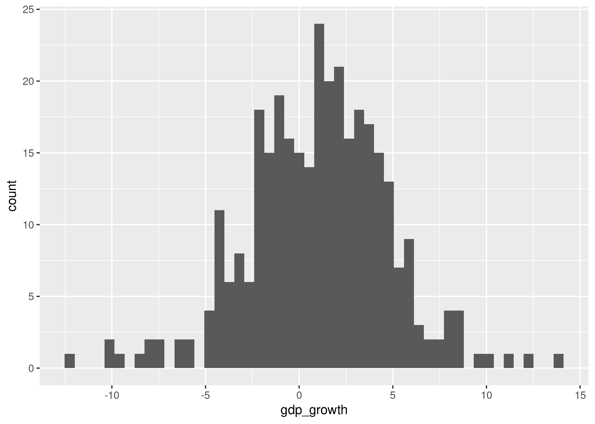
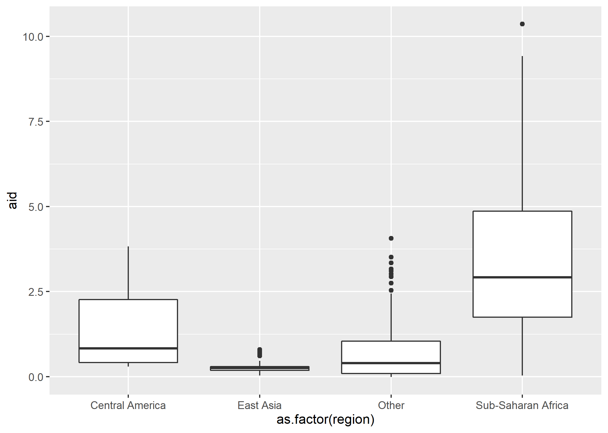
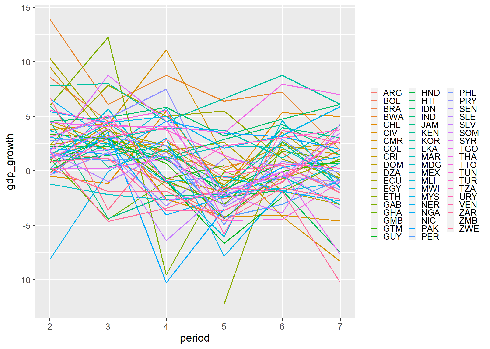
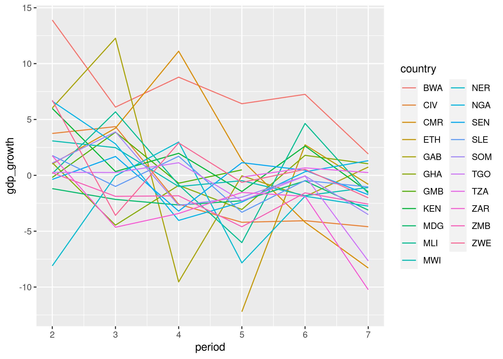
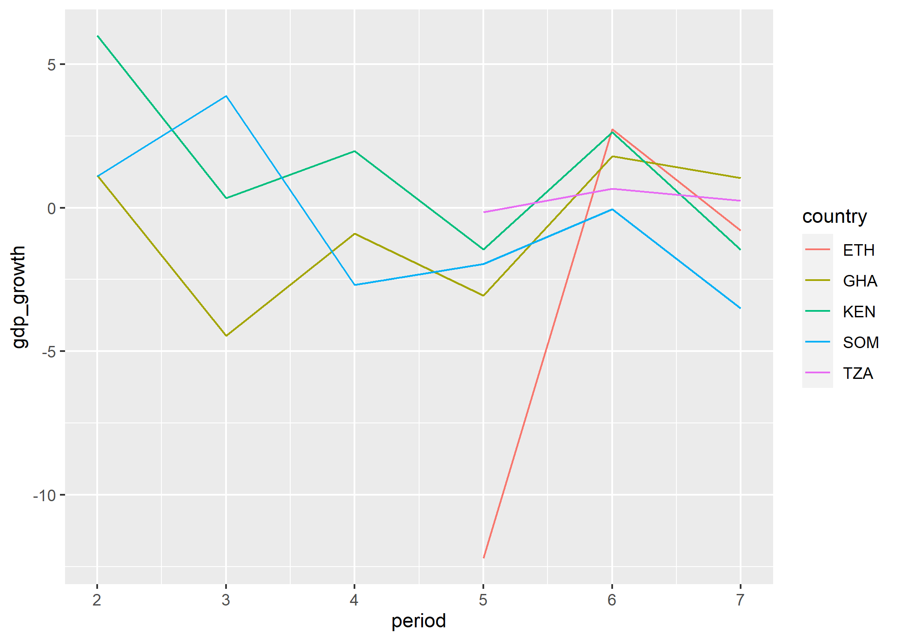
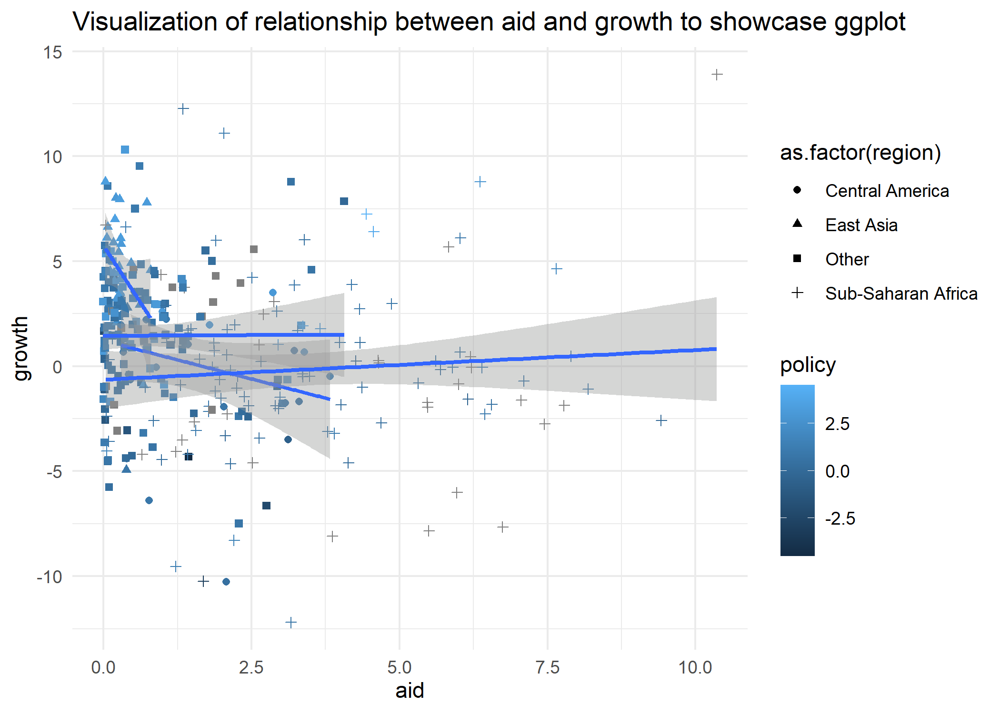

## Dagens seminar: En første dataanalyse med R  
I dagens seminar skal vi øve på å forberede og utforske data. Dette er som regel første del av enhver dataanalyse - også hjemmeoppgaven.
Vi skal også øve på å forstå hjelpefiler til funksjoner og kjøre vår første ols-modell.

Men først, var det noe dere synes var krevende i oppgavene etter seminaret i går? Dersom dere sliter med å forstå indeksering, funksjoner, objekter e.l., kan dere kikke på seminar 1, eller lese i boken til **Lær deg R** eller [**R for Data Science**](https://r4ds.had.co.nz/). Vi kommer til å fortsette med å trene litt på basisferdigheter også i neste seminar.


### Laste inn data - read_funksjoner()

Vi skal starte med å laste inn data som et objekt i R. Funksjoner for å laste inn ulike datatyper har stort sett ganske lik syntaks (det kan være små variasjoner og ulike tilleggalternativ - dette finner du raskt ut av i hjelpefilen!)

```{r, eval = F}
library(tidyverse) # read_funksjoner fra readr i tidyvsere
datasett <- read_filtype("filnavn.filtype")
read_csv("filnavn.csv") # for .csv, sjekk også read.table
load("") # For filer i R-format.

library(haven)
# Fra haven-pakken - dette skal vi se på i senere seminar
read_spss("filnavn.sav")  # for .sav-filer fra spss
read_dta("filnavn.dta") # for .dta-filer fra stata

```

Last ned et av aid-datasettene i [denne mappen](https://github.com/martigso/stv4020aR21/tree/main/seminar2) på github og lagre det i datamappen din, eller les inn data direkte fra denne lenken: https://cdn.jsdelivr.net/gh/martigso/stv4020aR21/seminar2/aid.dta.  

```{r}
library(tidyverse)
library(haven)
aid <-  read_dta("aid.dta")

```

# Forberede og manipulere data
Vi lærer R for å kunne gjøre statistiske analyser. Noen ganger er man så heldig å få et analyserklart datasett som har alle variablene man ønsker, men dette hører til sjeldenhetene. Veldig ofte må man jobbe litt med å forberede og manipulere data, f.eks. ved å omkode variabler, eller hente inn variabler fra andre datakilder. Forberedelse av data er ikke rutinearbeid - det innbefatter svært ofte viktige metodologiske beslutninger, som f.eks. hvordan du ønsker å operasjonalisere når en konflikt ble avsluttet eller hvordan du skal håndtere missing verdier. Forsøk derfor alltid å tenke på metodologiske implikasjoner når du forbereder data. Dersom du lager en klar slagplan for hvordan du ønsker at dataene dine skal se ut på forhånd, blir det lettere å forberede data. 

Datamanipulasjon og dataforberedelser handler derfor om å stille seg selv følgende spørsmål:

1. Hva slags data ønsker jeg?
2. Hva slags data har jeg?
3. Hva må jeg gjøre for å omarbeide de dataene jeg har til dataene jeg ønsker meg?

Når du har svart på disse spørsmålene, har du laget en plan med et sett av oppgaver, datamanipuleringer du vet at du må gjøre - disse skal vi lære å løse i R. Dersom du ikke har en slik plan, blir datamanipulering vanskeligere. Tenk gjennom disse spørsmålene (særlig spm. 1 og 2) allerede før du åpner R, med utgangspunkt i teori, og det du vet om dataene dine fra kodebok eller artikkelen du repliserer. Vi skal imidlertid lære hvordan R også kan være til stor hjelp for å lage arbeidsplanen din - også for å svare på spm. 1 og 2. Dersom du blir flink på koder for å manipulere data, blir denne planleggingsprosessen både lettere og mer kreativ fordi du ser flere muligheter.

I dagens seminar, skal vi jobbe med utgangspunkt i følgende hypotese:  bistand fører til økonomisk vekst, men bare dersom de fører en god makroøkonomisk politikk. Datasettet `aid` som vi lastet inn i stad, ble brukt i en forskningsartikkel - *Aid, policies and growth* (**Burnside og Dollar, 2000**, kan leses på [Jstor](https://www.jstor.org/stable/11731)) - for å teste denne hypotesen. Disse dataene har observasjoner av en rekke land over flere tidsperioder. Dersom dere hadde lest denne artikkelen og kodeboken på nett - slik vi har gjort for dere - ville dere også visst at vi har data som blant annet inneholder:

* `gdp_growth`: økonomisk vekst i prosent av BNP
* `gdp_pr_capita`: BNP per innbygger
* `aid`: økonomisk bistand som prosentandel av landets BNP
* `economic_open`: økonomisk åpenhet
* `budget_balance`: budsjettbalanse
* `inflation`: inflasjon
* `ethnic_frac`: etnisk fraksjonalisering
* `assasinations`: mål på indre uro i landet 
* `policy`: en index basert på økonomisk åpenhet, budsjettbalanse og inflasjon
* `m2_gdp_lagged`: proxyvariabel for hvor velutviklet finanssektoren er 
* `institutional_quality`: kvalitet på institusjoner
* En rekke potensielle kontrollvariabler

Dersom vi har lyst til å kjøre den samme testen av hypotesen som det **Burnside og Dollar** gjorde - dette bør man alltid gjøre som første del av en replikasjon - er vi nødt til å sjekke at vi datasettet inneholder de nødvendige variablene og eventuelt opprette de som mangler.

### Sjekke strukturen til data

Nå som vi har laget en tentativ plan for hva som må gjøre, og lastet inn et datasett, er det tid for å skaffe seg en enda bedre forståelse av hva slags data vi har ved hjelp av R. Husk at du i tillegg til å bruke R, **alltid** bør se på kodeboken/beskrivelsen av data i artikkelen du repliserer i denne fasen av analysen din. R og kodebok komplementerer hverandre.

For å skaffe deg en forståelse av datasettet ditt i R, vil du som regel stille spørsmål av følgende type:

1. Hva er observasjonene i datasettet? Ønsker jeg å omarbeide informasjonen slik at jeg får andre typer enheter?
2. Hva heter variablene mine?
3. Hva slags klasse har variablene mine? Hva slags informasjon inneholder variablene mine?
4. Er det mange observasjoner som har manglende informasjon på noen av variablene jeg er interessert i (missing)?

Spørsmål 1-3. bør du kunne svare på delvis ut fra kodeboken. Spørsmål 4. kan ofte bare besvares ved hjelp av et statistikkprogram som R. Uansett er det nyttig å bruke følgende koder i R for å svare på disse spørsmålene. Under viser jeg hvordan:

1. Hva er enhetene i datasettet? Ønsker jeg å omarbeide informasjonen slik at jeg får andre enheter?

**Klikk** på datasettet i Environment - da åpnes det i et nytt vindu. Legg merke til at koden `View(aid)` blir evaluert i Console. Les informasjonen langs en rad, og forsøk å tenke gjennom hvilke sentrale karakteristikker som skiller en enhet fra en annen - Nordmenn kan f.eks. skilles med utgangspunkt i fødselsnummer, eller med utgangspunkt i navn. Du kan også kjøre følgende koder:

```{r, include = F}
str(aid) # Gir deg infor om variabelnavn, klasse m.m.
aid # Printer samme informasjon som `str()` gjør for en data.frame hvis det er en tibble (dvs. en spesiell type objekt fra tidyverse)
head(aid, 10) # første 10 observasjoner
tail(aid, 10) # siste 10 observasjoner
sample_n(aid, 10) # Velg 10 observasjoner tilfeldig
```

2. Hva heter variablene mine? 
```{r}
names(aid) # Printer variabelnavnene
```
 
3. Hva slags klasse har variablene mine? Hva slags informasjon inneholder variablene mine?

På forrige seminar gikk vi gjennom mange funksjoner som er fine for å få en rask oversikt over data. Disse funksjonene for univariat statistikk er fine for å få en forståelse av fordelingen til kontinuerlige variabler vi er særlige interessert i. Vi kommer ikke til å gjenta disse i dag, men se gjerne over disse igjen og bruk dem aktivt om du skal skrive en kvantitativ hjemmeoppgave. 

4. Er det mange observasjoner som har manglende informasjon på noen av variablene jeg er interessert i?

Manglende informasjon/missing data kan ha store implikasjoner, og kan håndteres på forskjellige måter - mer om dette senere. I første runde konsentrerer vi oss om å avdekke missing. I R er verdier som er missing merket NA. Her er noen funksjoner vi kan bruke for å se på omfanget av missing: 

```{r}
table(complete.cases(aid)) # tester hvor mange observasjoner(rader) som ikke har noen missing på noen variabler
table(is.na(aid$gdp_growth))  # tester hvor mange observasjoner som har missing på variabelen gdp_growth

```

Legg merke til at disse funksjonene er logiske tester - de tester om noe er sant eller galt.

**Hvordan kan vi teste hvor mange observasjomer som _ikke_ har missing på variabelen gdp_growth?**

```{r, eval = FALSE, include = FALSE}
table(!is.na(aid$gdp_growth)) # tester hvor mange observasjoner som _ikke_ har missing på variabelen elrdgdpg
```

I noen datasett vil imidlertid missingverdier ha en fiktiv verdi som f.eks. -999, 888 o.l. Dette må avdekkes og disse verdiene må omkodes før du kan kjøre analysen din. Her er kodeboken gull verdt. 

### Noen omkodingsfunksjoner:

Etter at vi har kartlagt datastrukturen og hvilke variabler vi har, er det på tide å svare på følgende spørsmål: Hvilke endringer i data er det nødvendig å gjøre?

Ofte vil en del av svaret være at det er nødvendig å omkode en eller flere variabler. Omkoding av variabler betyr at vi tar informasjon som finnes i en eller flere variabler og omarbeider denne informasjonen, slik at vi får en ny variabel. Dersom du synes dette høres ut som om noe du kan bruke en funksjon til, tenker du rett. Før vi gjennomgår noen funksjoner som er nyttige til å omkode variabler, skal dere få et godt råd. Ikke gjør en omkoding som overskriver variabler som allerede finnes. **Opprett alltid nye variabler**, ellers kan det bli veldig kjedelig å gjøre feil (særlig dersom du har den eneste kopien av rådata-filen til masteroppgaven din).


Den generelle syntaksen vi skal bruke for å omkode variabler er som følger:

```{r, eval = F}
data$ny_var <- funksjon(data$gammel_var)
# Vi anvender en funksjon som omarbeider informasjonen i en gammel variabel i datasettet vårt, og legger den til datasettet vårt med et nytt navn
```

Dersom variabelen `policy` ikke allerede fantes, så måtte vi ha opprettet en ny variabel for å kunne kjøre samme analyse som Burnside og Dollar (2000). Denne variabelen som vi her kaller `policy2` er en makroøkonimisk politkk-indeks - med utgangspunkt i variablene for inflasjon (`aid$inflation`), budsjettbalanse (`aid$budget_balance`) og økonomisk åpenhet (`aid$economic_open`):

```{r}
# oppretter alternativ policy-indeks variabel
aid$policy2 <- aid$inflation + aid$budget_balance + aid$economic_open # Eksempel i tråd med det som er beskrevet i "Lær deg R"
```

I `tidyverse` og `dplyr` pakken bruker man som regel `mutate()` funksjonen sammen med andre funksjoner for å opprette nye variabler. Ved hjelp av `mutate()` kan du gjøre mange omkodinger i slengen - dette gir mer ryddig kode.

```{r}
aid %>% # Spesifiserer at vi skal jobbe med datasettet aid - R vil da lete etter variabler vi referer til her, slik at vi slipper aid$var
  mutate(policy2 = economic_open + inflation + budget_balance) # lager variabelen policy ved å summere budsjettbalanse, inflasjon og en indeks for øk. åpenhet


aid <- aid %>% # samme kode som over, men nå overskriver jeg variabelen jeg lagde i stad - gjør dette etter at du har testet at koden fungerte
  mutate(policy2 = economic_open + inflation + budget_balance,
         policy_sent = policy - mean(policy, na.rm = TRUE))
# Her lager jeg to versjoner av policyindeksen - først en additiv indeks og en sentrert variant av denne. 
# Dette er en ryddig måte å samle alle omkodinger på!

```


Her brukte vi enkle matematiske operasjoner, `+` og `-`, kombinert med funksjonen `mean()` for å opprette nye variabler. Andre nyttige matematiske funksjoner til omkoding er funksjoner som `log()`, `exp()` og `sqrt()`. Så lenge vi jobber med variabler av klassene `integer` eller `numeric` kan vi utføre omkodinger ved hjelp av alle slags matematiske operasjoner - bare teoretiske og metodologiske hensyn setter begrensninger. For variabler som ikke inneholder tall, vil naturlig nok denne typen omkoding ikke fungere. 

En annen type enkel omkoding består i å endre klassen til en variabel (se til seminar 1 for mer informasjon om klasser). Dette kan gjøres med utgangspunkt i to begrunnelser:

1. Endre målenivå til en variabel - variabler av klassene `numeric` og `integer` vil stort sett behandles som kontinuerlige variabler. Variabler av klassene `factor` vil derimot stort sett håndteres som nominal-nivå variabler i statistiske funksjoner (her er det noen ganger forskjell mellom funksjoner - se på hjelpefil dersom du er i tvil).
2. Endre klassen til en variabel for at en R-funksjon skal fungere på variabelen. Tenk gjennom konsekvensene for målenivå når du gjør dette.

For å endre klassen til en variabel, bruk en funksjon av typen `as.klassenavn(data$variabel)` - her er noen eksempler på hvordan disse funksjonene brukes (vi gikk gjennom dette i går så bruker ikke tid på det i dag):

```{r, include = F}
aid$period_fac <- as.factor(aid$period)
aid$country_num <- as.numeric(as.factor(aid$country)) # Denne fungerer bare hvis variabelen inneholder noe som kan leses som tall, legg merke til hva den gjør med faktor-variabler!
aid$gdp_growth_chr <- as.character(aid$gdp_growth)
```

### Omkoding med ifelse()

Den funksjonen jeg bruker mest til omkoding, er `ifelse()`. Funksjonen kan brukes på numeriske og kategoriske variabler. Syntaksen til denne funksjonen kan forklares som følger:

```{r, eval=FALSE}
data$nyvar <- ifelse(test = my_data$my.variabel=="some logical condition",
       yes  = "what to return if 'some condition' is TRUE",
       no   = "what to return if 'some condition' is FALSE")
```

Her lager jeg en ny periodevariabel `decade` med utgangspunkt i variabelen `periodstart` (året perioden starter). 

```{r}
table(aid$periodstart) # Sjekker mulige verdier
aid <- aid %>%  # Jeg vil jobbe med aid datasettet og lagre endringene
  mutate(decade = ifelse(periodstart < 1980, "70s", 
                         ifelse(periodstart > 1980 & periodstart < 1990, "80s", "90s"))) 
```

I `ifelse()` sier jeg at de observasjonene der periodestart er:
* tidligere enn 1980 skal ha verdien "70s"
* senere enn 1980 OG tidligere enn 1990 skal ha verdien "80s"
* resten skal ha verdien "90s"

```{r}
# sjekker at det ser fint ut med en tabell der jeg også får opp missing-verdiene
# Når du omkoder en variabel er det spesielt viktig å sjekke missingverdier

table(aid$decade, aid$periodstart, useNA = "always")

```

**Oppgave:** Opprett en ny variabel som får verdien 1 dersom de har positiv verdi på variabelen policy, og negativ verdi på variabelen policy2 - hvor mange slike observasjoner finnes? Hint: Her kan du bruke `&` for å binde sammen to logiske tester. Du kan også bruke `ifelse()` inne i `mutate()` - jeg viser et eksempel under.

### Endre datatstruktur ved hjelp av aggregering:

Tenk deg at vi ønsket å opprette en ny variabel, `neigh_growth`, som viser gjennomsnittsveksten til alle land i samme region over hele tidsperioden. Dette høres kanskje fryktelig komplisert ut, og mangler en god teoretisk begrunnelse. Vi kan imidlertid finne informasjonen vi er på jakt etter ganske enkelt ved hjelp av funksjonene `group_by()` og `summarise()`. Først må vi imidlertid opprette en region-variabel - fordi informasjon om hvilken region et land tilhører er spredt ut over tre variabler - `sub_saharan_africa`, `central_america` og `fast_growing_east_asia`. La oss bruke `ifelse()` og `mutate()` til dette:

```{r}
# OBS! Her skriver vi over det opprinnelige objektet vårt. Når du skriver hjemmeoppgaven så 
# sjekk først at det blir riktig før du gjør det samme. 

aid <- aid %>% # Forteller at vi skal jobbe med aid-datasettet
       mutate(region = ifelse(sub_saharan_africa == 1, "Sub-Saharan Africa",
                               ifelse(central_america == 1, "Central America",
                               ifelse(fast_growing_east_asia == 1, "East Asia", "Other"))))
# Her nøster jeg ifelse-funksjoner inne i hverandre, ved å skrive en ifelse() funksjon med det som skal gjøres med observasjoner som får FALSE på at de ligger i Afrika sør for Sahara, osv. La oss sjekke omkodingen med en tabell
table(aid$region, aid$sub_saharan_africa, useNA = "always") # ser at det er like mange land - kunne gjort det samme for resten av kategoriene
```
La oss se hvordan `group_by()` og `summarise()` fungerer:

```{r}
aid %>%
   group_by(region) %>% # grupperer observasjoner basert på verdi på region-variabelen. Alle observasjoner med lik verdi (uavh. av tidsperiode) blir gruppert sammen.
   summarise(neigh_growth = mean(gdp_growth, na.rm = T), # regner gjennomsnitt for økonomisk vekst innad i hver gruppe - for hele tidsperioden data dekker sett under ett
          n_region = n()) # Teller antall observasjoner i hvert gruppe

``` 

Resultatet er fem observasjoner heller enn de opprinnelige 331. I outputen er nivået for observasjonene endret fra land-nivå til region-nivå. Jeg har brukt summarise mye for å vise data på gruppenivå. Merk at vi her ikke lagret endringen fordi vi ikke brukte `aid <- aid`. Ved å bruke `mutate()` i steden for `summarise()` så kan vi legge den ny variabelen med snitt per region direkte inn i datasettet: 

```{r}
# Samme kode, men lagrer som et objekt - vi får et nytt datasett der vi har lagt til variablene
# OBS! Her skriver vi over det opprinnelige objektet vårt. Når du skriver hjemmeoppgaven så 
# sjekk først at det blir riktig før du gjør det samme. 
aid <- aid %>%
  group_by(region) %>%
  mutate(neigh_growth = mean(gdp_growth, na.rm = T), # Her bruker jeg mutate for å legge variabelen til uten
          n_region = n()) %>% 
  ungroup() # Vi bruker ungroup() for å fortelle R at vi nå vil bruke dataene på det opprinnelige nivået igjen (her: land)

# Sjekker resultatet
table(aid$neigh_growth, aid$region, useNA = "always")


```
## Utforsking av data og deskriptiv statistikk <a name="deskriptiv"></a>

Disse funksjonene gir unviariat statistikk for kontinuerlige variabler (vi gjennomgikk disse på seminar 1 så vi bruker ikke noe særlig tid på det nå):

```{r}
min(aid$gdp_growth, na.rm = TRUE)  # minimumsverdi, na.rm = T spesifiserer at missing skal droppes i beregning.
max(aid$gdp_growth, na.rm = TRUE)  # maksimumsverdi
mean(aid$gdp_growth, na.rm = TRUE) # gjennomsnitt
median(aid$gdp_growth, na.rm =T )  # median
sd(aid$gdp_growth, na.rm = T)      # standardavvik
var(aid$gdp_growth, na.rm = T)     # varians

#install.packages("moments")
library(moments)
skewness(aid$gdp_growth, na.rm = T) # skjevhet - fra moments
kurtosis(aid$gdp_growth, na.rm = T) # kurtose - fra moments

summary(aid$gdp_growth) # forskjellig deskriptiv staatistikk for en variabel
summary(aid)            # deskriptiv statistikk for alle variabler i datasettet
```

For bivariat eller multivariat deskriptiv statistikk, ser vi gjerne på korrelasjon (pearsons R). Med funksjonen `cor()` kan vi få bivariat korrelasjon mellom to variabler, eller lage bivariate korrelasjoner mellom alle numeriske variabler i datasettet vårt:

```{r}
cor(aid$gdp_growth, aid$aid, use = "pairwise.complete.obs") # argumentet use bestemmer missing-håndtering
```

Hva forteller denne oss om sammenhengen mellom økonomisk bistand og endring i BNP? 

```{r}
str(aid)         # sjekker hvilke variabler som er numeriske, str(aid hvis du ikke har en tibble)

aid %>%
select(6:13) %>% # Her tar vi med variablene fra gdp_growth (nr 6) til aid (nr 13)
cor(, use = "pairwise.complete.obs")  # korrelasjonsmatrise basert på numeriske variabler
# Sjekk hva use = argumentet styrer i hjelpefilen
```
Noen av variablene i datasettet vårt, bl.a. `aid$country` og `code`, er ikke kontinuerlig. Det er heller ikke den nyopprettet `aid$region` variebelen vår. Ved å ta `str(aid)`, ser vi at denne variabelen er kodet som en character. Dette innebærer at den vil behandles som en nominalnivå-variabel i statistisk analyse. For kategoriske variabler, er tabeller nyttig:

```{r}
table(aid$region)      # frekvenstabell
prop.table(table(aid$region)) # prosentfordeling basert på frekvenstabell
```

Vi kan også lage tabeller med flere variabler. Under viser jeg hvordan du lager en tabell med fordelingen av observasjoner som har høyere vekst enn medianveksten i utvalget, ved hjelp av en logisk test:
```{r}
table(aid$gdp_growth>median(aid$gdp_growth,na.rm=T))
table(aid$gdp_growth>median(aid$gdp_growth,na.rm=T), aid$country)
```

De fleste land har vekst både over og under medianen. Dersom det hadde vært svært lite variasjon i veksten til land, ville kontrollvariabler for land (country fixed effects) kunne ha fjernet effekten av de fleste variabler - vi ville ikke hatt veldig godt datagrunnlag for å si så mye om effekten av bistand i samspill med policy (jeg sier ikke dermed nødvendigvis at dataene er gode generelt).


**Oppgave:** Lag et nytt datasett ved hjelp av `group_by` og `summarise()`, der du oppretter variabler som viser korrelasjon (Pearsons r) mellom:
*` aid`, og `gdp_growth`
* `aid` og `policy`
* `policy` og `gdp_growth` 
separat for hver region. Er det store forskjeller i korrelasjonene mellom regionene? Lag deretter to nye variabler, `good_policy` og `good_policy2`, slik at observasjoner som har positive verdier på henholdsvis variablene `policy` og `policy2` får verdien 1, mens andre observasjoner får verdien 0. Bruk disse nye variablene som grupperingsvariabler, og lag et nytt datasett der du inkluderer en variabel som beregner korrelasjon mellom `aid` og `policy` for hver gruppe.


```{r, eval = F, include=F}
# Laster inn tidyverse
library(tidyverse)

# Forslag til løsning for å se på forskjeller i korrelasjon mellom regioner
aid_korr <- aid %>% 
  group_by(region) %>% 
  summarise(cor_aid_growth = cor(aid, gdp_growth, use = "pairwise"),
            cor_aid_policy = cor(aid, policy, use = "pairwise"),
            cor_policy_growth = cor(policy, gdp_growth, use = "pairwise"))
aid_korr

# Lager nye grupperingsvariabler
aid <- aid %>% 
  mutate(good_policy = ifelse(policy > 0, 1, 0),
         good_policy2 = ifelse(policy2 > 0, 1, 0)) 

# Lager nytt datasett for å se på forskjell mellom de med negativ og positiv verdi
aid_korr2 <- aid %>% 
  group_by(good_policy, good_policy2) %>% 
  summarise(cor_aid_policy = cor(aid, policy))
  
aid_korr2

  
```

## Plotte-funksjonen `ggplot` <a name="ggplot"></a>


Hadley Wickham fra R studio skriver mange veldig gode tilleggspakker til R (i tillegg til gratis innføringsbøker på nett), blant annet pakken `ggplot2` (det kan være forvirrende at pakken heter `ggplot2`, mens funksjonen heter `ggplot()`). Jeg foretrekker å lage plot med `ggplot()` funksjonen fra ggplot2 over `plot()` fra *base* R (plot er også brukt i *Lær deg R* s. 49-58). Grunnen til dette er først og fremst fordi jeg liker syntaksen bedre, og at jeg har brukt `ggplot()` mest, det er ingenting galt med `plot()`. Det er også helt uproblematisk om dere bruker `plot()` på prøven. 

Med det sagt, her er de nødvendige elementene man må spesifisere i syntaksen til `ggplot()`:

```{r, eval=F}
ggplot(data = my_data) +
  geom_point(aes(x = x-axis_var_name, y = y-axis_var_name, col=my.var3)))
```

Vi starter med å fortelle ggplot hvilket datasett vi bruker. Deretter bruker vi en `geom_...()`-funksjon, her `geom_point()` (det er en lang rekke alternativer), for å fortelle hvordan vi vil plotte data. Her har vi valgt å plotte data som punkter, dvs. lage et scatterplot. Vi må også spesifisere hvilke variabler fra datasettet vi vil plotte, etter `aes()` for aesthetics. Vi må minst velge å plotte en akse, som regel vil vi plotte minst to akser. Vi kan også velge å legge til argumentet `col` for å visualisere enda en variabel. Dette argumentet gir ulike farger til observasjonen avhengig av verdien de har på variabelen vi spesifiserte. Det finnes også alternative måter å visualisere mer enn to variabler, som f.eks. `size = my.var3`, eller `shape = my.var3`.

Vi legger til nye argumer til plottet vårt med `+`. Etter at vi har spesifisert datasett, geom og aesthetics må vi ikke legge til flere argumenter, men det er mulig å legge til flere elementer (som en regresjonslinje) eller finjustere plottet i det uendelige (f.eks. angi fargekoder for alle farger i plottet manuelt). Man får imidlertid som regel et godt resultat med et par linjer kode. Vi skal se raskt på 4 `geom()`

1. `geom_histogram` - histogram (et godt alternativ kan være å bruke `geom_bar()`)
2. `geom_boxplot()` - box-whiskers plot
3. `geom_line()`    - linje, fin for tidsserier
4. `geom_point()`   - scatterplot


```{r eval=FALSE}
# install.packages("ggplot2")
library(ggplot2)
ggplot(aid) + geom_histogram(aes(x = gdp_growth), bins = 50) # lager histogram
```

```{r include=FALSE}
library(ggplot2)
ggplot(aid) + geom_histogram(aes(x = gdp_growth), bins = 50) # lager histogram
ggsave("./bilder/seminar2_1.png")
```
```{r, echo = F}

```

Med et boxplot får du raskt oversikt over fordelingen til variabler innenfor ulike grupper.


```{r, eval = F}
ggplot(aid) + geom_boxplot(aes(x = as.factor(region), y = aid))
```

```{r include=FALSE}
library(ggplot2)
ggplot(aid) + geom_boxplot(aes(x = as.factor(region), y = aid)) # lager histogram
ggsave("./bilder/seminar2_2.png")
```
```{r, echo = F}

```
**Oppgave:** Lag boxplot som viser fordelingen til variablene `policy` og `elrgpdg` innenfor hver region.


Med `geom_line()` kan vi plotte tidsserier:

```{r, eval = F}
ggplot(aid) + geom_line(aes(x = period, y = gdp_growth, col = country)) +
  theme(legend.key.size = unit(0.5,"line")) # Her justerer jeg størrelsen på legend for å få plass til alt
```
```{r include=FALSE}
library(ggplot2)
ggplot(aid) + geom_line(aes(x = period, y = gdp_growth, col = country)) +
  theme(legend.title = element_blank(),
        legend.key.size = unit(0.5,"line"))
ggsave("./bilder/seminar2_3.png")
```
```{r, echo = F}

```

Et problem med dette plottet, er at det blir vanskelig å se veksten til forskjellige land klart, det er for mye informasjon. Dersom vi har lyst til å sammenligne et par land om gangen, kan vi bruke `%in%` til å indeksere. Denne operatorene lar deg velge alt innholdet i en vektor - f.eks. variabelnavn eller ulike verdier på en variabel. Her viser jeg hvordan du kan kombinere `dplyr`, `%in%` og `ggplot()` for å sammenligne et par land om gangen:

```{r, eval=F}
# Hvilke land finnes i Sub-Saharan Africa? Velger land kun herfra:
aid %>% 
  filter(region == "Sub-Saharan Africa") %>%
  ggplot() + geom_line(aes(x = period, y = gdp_growth, col = country))

# Fortsatt litt mye informasjon til å være enkelt å lese - La oss sammenligne 5 land med %in%
```
```{r include=FALSE}
library(ggplot2)
aid %>% 
  filter(region == "Sub-Saharan Africa") %>%
  ggplot() + geom_line(aes(x = period, y = gdp_growth, col = country))# lager histogram
ggsave("./bilder/seminar2_4.png")
```
```{r, echo = F}

```

```{r, eval = F}

# Velger land med %in%, fint for mindre sammenligninger
aid %>% 
  filter(country %in% c("KEN", "ETH", "MOZ", "AGO", "RWA")) %>%
  ggplot() + geom_line(aes(x = period, y = gdp_growth, col = country))
```

```{r include=FALSE}
library(ggplot2)
aid %>% 
  filter(country %in% c("KEN", "ETH", "GHA", "SOM", "TZA")) %>%
  ggplot() + 
  geom_line(aes(x = period, y = gdp_growth, col = country))
ggsave("./bilder/seminar2_5.png")
```
```{r, echo = F}

```

I tillegg til indekseringsmetodene for datasett fra første seminar, er det nyttig å lære seg `%in%`.


Her viser jeg fordelingen til vekst (`gdp_growth`) opp mot bistand (`aid`) og makroøkonomisk politikk (`policy`) ved hjelp av et spredningsplot (scatterplot). Sammenlign gjerne med korrelasjonsmatrisen du lagde mellom disse tre variablene.

```{r}
ggplot(aid) + 
  geom_point(aes(x = aid, y = gdp_growth, col = policy))

```

Her er et overlesset eksempel på et scatterplot (poenget er å illustrere muligheter, ikke å lage et pent plot):

```{r, eval=FALSE}
ggplot(aid) +
  geom_point(aes(x=aid, y=gdp_growth, col=policy, shape=as.factor(region))) +
  geom_smooth(aes(x=aid, y=gdp_growth), method="lm") +  # merk: geom_smooth gir bivariat regresjon
  ggtitle("Visualization of relationship between aid and growth to showcase ggplot") +
  xlab("aid") +
  ylab("growth") +
  theme_minimal()
```

```{r include=FALSE}
ggplot(aid) +
  geom_point(aes(x=aid, y=gdp_growth, col=policy, shape=as.factor(region))) +
  geom_smooth(aes(x=aid, y=gdp_growth), method="lm") +  # merk: geom_smooth gir bivariat regresjon
  ggtitle("Visualization of relationship between aid and growth to showcase ggplot") +
  xlab("aid") +
  ylab("growth") +
  theme_minimal()
ggsave("./bilder/seminar2_6.png")
```
```{r, echo = F}

```

Dersom du lager et plot du er fornøyd med, kan du lagre det med `ggsave()`, som lagrer ditt siste ggplot.
```{r, eval=FALSE}
ggsave("testplot.png", width = 8, height = 5) # lagrer ditt siste ggplot i det formatet du vil på working directory
```

Mulighetene er endeløse, jeg har bare vist dere noen få muligheter her. Ved hjelp av [cheatsheet til ggplot2](https://www.rstudio.com/wp-content/uploads/2015/03/ggplot2-cheatsheet.pdf) og [annen dokumentasjon](http://zevross.com/blog/2014/08/04/beautiful-plotting-in-r-a-ggplot2-cheatsheet-3/) som dere kan google dere frem til, burde dere finne metoder for å lage akkurat det plottet dere ønsker. Her er det også muligheter for å bruke R i oppgaver som ikke bruker kvantiativ metode, men der en for eksempel ønsker å vise frem en utvikling over tid eller ulike gjennomsnitt blant grupper av enheter. 


**Oppgave:** Forsøk å legge til `facet_wrap(~region)`, hva gjør dette argumentet? Forsøk å fjerne ett og ett argument i plottet over for å se hva argumentene gjør.

```{r, eval = F, include = F}
ggplot(aid) + 
  geom_point(aes(x = aid, y = gdp_growth, col = policy,)) +
  facet_wrap(~region)
```


## Lineær regresjon (OLS) <a name="ols"></a>

### Syntaks

For å kjøre en lineær regresjon i R, bruker vi funksjonen `lm()`, som har følgende syntaks:
```{r, eval = F}
lm(avhengig.variabel ~ uavhengig.variabel, data=mitt_datasett)
# på mac får du ~ med alt + k + space
```

La oss se på et eksempel med `aid` datasettet vi har brukt så langt:
```{r}
m1 <- lm(gdp_growth ~ aid, data = aid) # lagrer m1 om objekt
summary(m1) # ser på resultatene med summary()
class(m1) # Legg merke til at vi har et objekt av en ny klasse!
str(m1) # Gir oss informasjon om hva objektet inneholder.
```


### Multivariat regresjon

Vi legger inn flere uavhengige variabler med `+`.

```{r}
summary(m2 <- lm(gdp_growth ~ aid + policy + region, data = aid))
# Her kombinerer vi summary() og opprettelse av modellobjekt på samme linje
```

### Samspill

Vi legger inn samspill ved å sette `*` mellom to variabler. De individuelle regresjonskoeffisientene til variablene vi spesifisere samspill mellom blir automatisk lagt til.


```{r}
summary(m3 <- lm(gdp_growth ~ aid*policy + region, data = aid))
```

### Andregradsledd og andre omkodinger

Vi kan legge inn andregradsledd eller andre omkodinger av variabler i regresjonsligningene våre.
Andregradsledd legger vi inn med `I(uavh.var^2)`. Under har jeg lagt inn en `log()` omkoding, en `as.factor()` omkoding og et andregradsledd. Merk at dere må legge inn førstegradsleddet separat når dere legger inn andregradsledd. Dersom en variabeltransformasjon krever mer enn en enkel funksjon, er det fint å opprette en ny variabel i datasettet.


```{r}
summary(m4 <- lm(gdp_growth ~ log(gdp_growth) + institutional_quality + I(institutional_quality^2) + region + aid*policy +  as_factor(period), data = aid, na.action = "na.exclude"))
```

En nyttig pakke for å lage fine tabeller med resultatet fra regresjonsanalyser er `stargazer`. 

```{r, message=FALSE}
#install.packages("stargazer")
library(stargazer)
stargazer(m2, m3,
          type = "text") 

```

```{r, eval = F}
# Om du skriver i word så kan du bruke type="html", lagre i en mappe og åpne i word.
# obs. bruk .htm og ikke .html
stargazer(m2, m4,
          type = "html",
          out = "./bilder/regresjonstabell.htm") 

# Om du skriver i Latex så kan du bruker type = "latex" og kopiere inn output direkte, eller lagre i en mappe og hente inn via latex
stargazer(m2, m4,
          type = "latex") 

# Flere tips om tabeller finner dere i dokumentet Eksportere_tabeller_og_figurer. 
```


## Takk for i dag!
