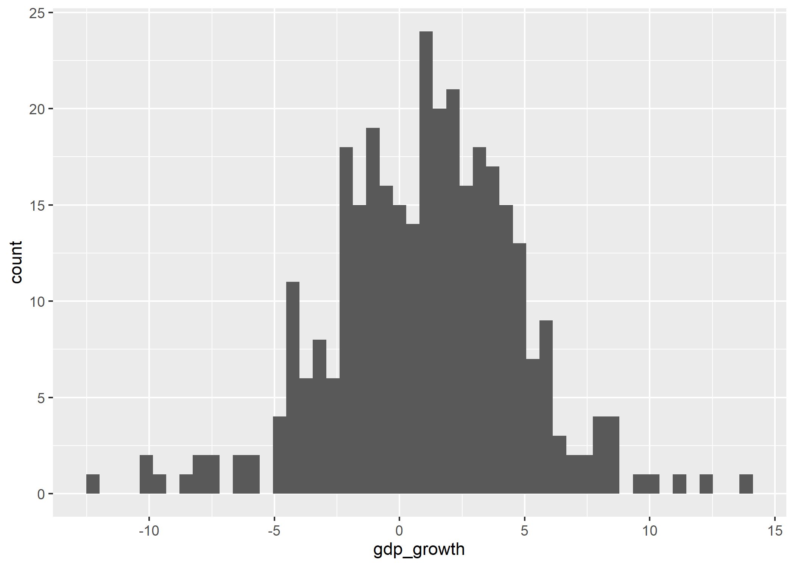
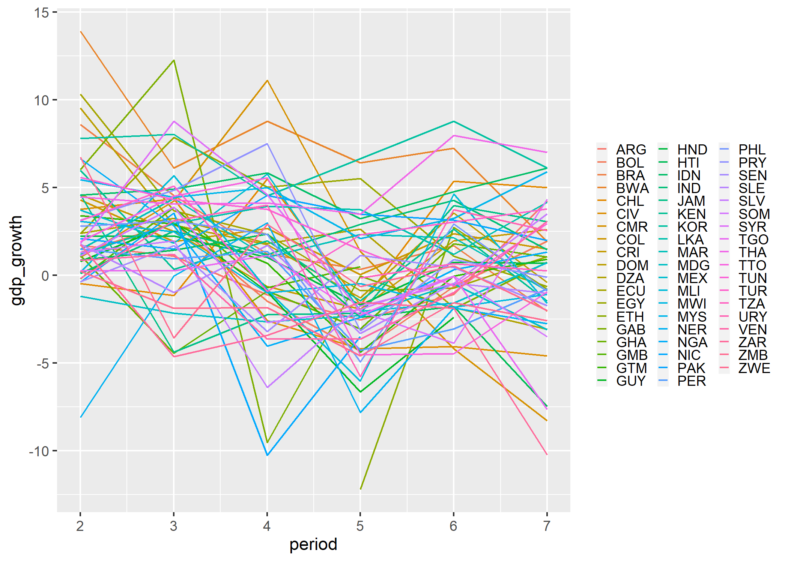
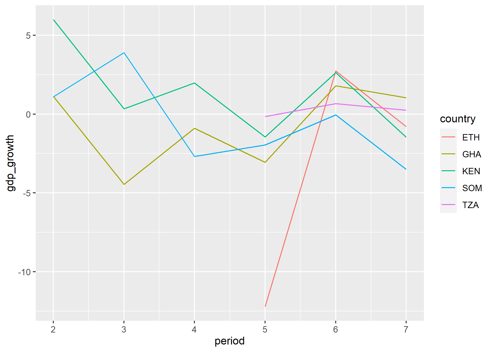
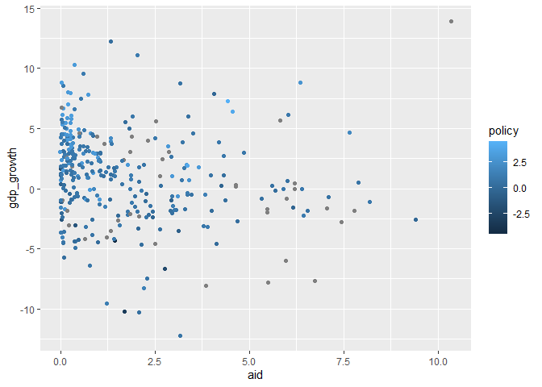

Seminar 2
================

## Dagens seminar: En første dataanalyse med R

I dagens seminar skal vi øve på å forberede og utforske data. Dette er
som regel første del av enhver dataanalyse - også hjemmeoppgaven. Vi
skal også øve på å forstå hjelpefiler til funksjoner og kjøre vår første
ols-modell.

Men først, var det noe dere synes var krevende i oppgavene etter
seminaret i går? Dersom dere sliter med å forstå indeksering,
funksjoner, objekter e.l., kan dere kikke på seminar 1, eller lese i
boken til **Lær deg R** eller [**R for Data
Science**](https://r4ds.had.co.nz/). Vi kommer til å fortsette med å
trene litt på basisferdigheter også i neste seminar.

### Laste inn data - read\_funksjoner()

Vi skal starte med å laste inn data som et objekt i R. Funksjoner for å
laste inn ulike datatyper har stort sett ganske lik syntaks (det kan
være små variasjoner og ulike tilleggalternativ - dette finner du raskt
ut av i hjelpefilen!)

``` r
library(tidyverse) # read_funksjoner fra readr i tidyvsere
datasett <- read_filtype("filnavn.filtype")
read_csv("filnavn.csv") # for .csv, sjekk også read.table
load("") # For filer i R-format.

library(haven) # filformat fra andre statistiske pakker (SAS, SPSS og STATA)
# Fra haven-pakken - dette skal vi se på i senere seminar
read_spss("filnavn.sav")  # for .sav-filer fra spss
read_dta("filnavn.dta") # for .dta-filer fra stata
```

Last ned et av aid-datasettene i [denne
mappen](https://github.com/martigso/stv4020aR21/tree/main/seminar2) på
github og lagre det i datamappen din, eller les inn data direkte fra
denne lenken:
<https://cdn.jsdelivr.net/gh/martigso/stv4020aR21/seminar2/aid.dta>.

``` r
library(tidyverse)
```

    ## -- Attaching packages --------------------------------------- tidyverse 1.3.1 --

    ## v ggplot2 3.3.3     v purrr   0.3.4
    ## v tibble  3.1.2     v dplyr   1.0.6
    ## v tidyr   1.1.3     v stringr 1.4.0
    ## v readr   1.4.0     v forcats 0.5.1

    ## -- Conflicts ------------------------------------------ tidyverse_conflicts() --
    ## x dplyr::filter() masks stats::filter()
    ## x dplyr::lag()    masks stats::lag()

``` r
library(haven)
aid <-  read_dta("aid.dta")
```

# Forberede og manipulere data

Vi lærer R for å kunne gjøre statistiske analyser. Noen ganger er man så
heldig å få et analyseklart datasett som har alle variablene man ønsker,
men dette hører til sjeldenhetene. Veldig ofte må man jobbe litt med å
forberede og manipulere data, f.eks. ved å omkode variabler, eller hente
inn variabler fra andre datakilder. Forberedelse av data er ikke
rutinearbeid - det innbefatter svært ofte viktige metodologiske
beslutninger, som f.eks. hvordan du ønsker å operasjonalisere når en
konflikt ble avsluttet eller hvordan du skal håndtere missing verdier.
Forsøk derfor alltid å tenke på metodologiske implikasjoner når du
forbereder data. Dersom du lager en klar slagplan for hvordan du ønsker
at dataene dine skal se ut på forhånd, blir det lettere å forberede
data.

Datamanipulasjon og dataforberedelser handler derfor om å stille seg
selv følgende spørsmål:

1.  Hva slags data ønsker jeg?
2.  Hva slags data har jeg?
3.  Hva må jeg gjøre for å omarbeide de dataene jeg har til dataene jeg
    ønsker meg?

Når du har svart på disse spørsmålene, har du laget en plan med et sett
av oppgaver, datamanipuleringer du vet at du må gjøre - disse skal vi
lære å løse i R. Dersom du ikke har en slik plan, blir datamanipulering
vanskeligere. Tenk gjennom disse spørsmålene (særlig spm. 1 og 2)
allerede før du åpner R, med utgangspunkt i teori, og det du vet om
dataene dine fra kodebok eller artikkelen du repliserer. Vi skal
imidlertid lære hvordan R også kan være til stor hjelp for å lage
arbeidsplanen din - også for å svare på spm. 1 og 2. Dersom du blir
flink på koder for å manipulere data, blir denne planleggingsprosessen
både lettere og mer kreativ fordi du ser flere muligheter.

I dagens seminar, skal vi jobbe med utgangspunkt i følgende hypotese:
bistand fører til økonomisk vekst, men bare dersom de fører en god
makroøkonomisk politikk. Datasettet `aid` som vi lastet inn i stad, ble
brukt i en forskningsartikkel - *Aid, policies and growth* (**Burnside
og Dollar, 2000**, kan leses på
[Jstor](https://www.jstor.org/stable/117311?seq=1#metadata_info_tab_contents)
for å teste denne hypotesen. Disse dataene har observasjoner av en rekke
land over flere tidsperioder. Dersom dere hadde lest denne artikkelen og
kodeboken på nett - slik vi har gjort for dere - ville dere også visst
at vi har data som blant annet inneholder:

-   `gdp_growth`: økonomisk vekst i prosent av BNP
-   `gdp_pr_capita`: BNP per innbygger
-   `aid`: økonomisk bistand som prosentandel av landets BNP
-   `economic_open`: økonomisk åpenhet
-   `budget_balance`: budsjettbalanse
-   `inflation`: inflasjon
-   `ethnic_frac`: etnisk fraksjonalisering
-   `assasinations`: mål på indre uro i landet
-   `policy`: en index basert på økonomisk åpenhet, budsjettbalanse og
    inflasjon
-   `m2_gdp_lagged`: proxyvariabel for hvor velutviklet finanssektoren
    er
-   `institutional_quality`: kvalitet på institusjoner
-   En rekke potensielle kontrollvariabler

Dersom vi har lyst til å kjøre den samme testen av hypotesen som det
**Burnside og Dollar** gjorde - dette bør man alltid gjøre som første
del av en replikasjon - er vi nødt til å sjekke at vi datasettet
inneholder de nødvendige variablene og eventuelt opprette de som
mangler.

### Sjekke strukturen til data

Nå som vi har laget en tentativ plan for hva som må gjøre, og lastet inn
et datasett, er det tid for å skaffe seg en enda bedre forståelse av hva
slags data vi har ved hjelp av R. Husk at du i tillegg til å bruke R,
**alltid** bør se på kodeboken/beskrivelsen av data i artikkelen du
repliserer i denne fasen av analysen din. R og kodebok komplementerer
hverandre.

For å skaffe deg en forståelse av datasettet ditt i R, vil du som regel
stille spørsmål av følgende type:

1.  Hva er observasjonene i datasettet? Ønsker jeg å omarbeide
    informasjonen slik at jeg får andre typer enheter?
2.  Hva heter variablene mine?
3.  Hva slags klasse har variablene mine? Hva slags informasjon
    inneholder variablene mine?
4.  Er det mange observasjoner som har manglende informasjon på noen av
    variablene jeg er interessert i (missing)?

Spørsmål 1-3. bør du kunne svare på delvis ut fra kodeboken. Spørsmål 4.
kan ofte bare besvares ved hjelp av et statistikkprogram som R. Uansett
er det nyttig å bruke følgende koder i R for å svare på disse
spørsmålene. Under viser jeg hvordan:

1.  Hva er enhetene i datasettet? Ønsker jeg å omarbeide informasjonen
    slik at jeg får andre enheter?

**Klikk** på datasettet i Environment - da åpnes det i et nytt vindu.
Legg merke til at koden `View(aid)` blir evaluert i Console. Les
informasjonen langs en rad, og forsøk å tenke gjennom hvilke sentrale
karakteristikker som skiller en enhet fra en annen - Nordmenn kan f.eks.
skilles med utgangspunkt i fødselsnummer, eller med utgangspunkt i navn.
Du kan også kjøre følgende koder:

2.  Hva heter variablene mine?

``` r
names(aid) # Printer variabelnavnene
```

    ##  [1] "country"                "period"                 "periodstart"           
    ##  [4] "periodend"              "code"                   "gdp_growth"            
    ##  [7] "gdp_pr_capita"          "economic_open"          "budget_balance"        
    ## [10] "inflation"              "ethnic_frac"            "assasinations"         
    ## [13] "aid"                    "fast_growing_east_asia" "sub_saharan_africa"    
    ## [16] "central_america"        "policy"                 "m2_gdp_lagged"         
    ## [19] "institutional_quality"

3.  Hva slags klasse har variablene mine? Hva slags informasjon
    inneholder variablene mine?

På forrige seminar gikk vi gjennom mange funksjoner som er fine for å få
en rask oversikt over data. Disse funksjonene for univariat statistikk
er fine for å få en forståelse av fordelingen til kontinuerlige
variabler vi er særlige interessert i. Vi kommer ikke til å gjenta disse
i dag, men se gjerne over disse igjen og bruk dem aktivt om du skal
skrive en kvantitativ hjemmeoppgave.

4.  Er det mange observasjoner som har manglende informasjon på noen av
    variablene jeg er interessert i?

Manglende informasjon/missing data kan ha store implikasjoner, og kan
håndteres på forskjellige måter - mer om dette senere. I første runde
konsentrerer vi oss om å avdekke missing. I R er verdier som er missing
merket NA. Her er noen funksjoner vi kan bruke for å se på omfanget av
missing:

``` r
table(complete.cases(aid)) # tester hvor mange observasjoner(rader) som ikke har noen missing på noen variabler
```

    ## 
    ## FALSE  TRUE 
    ##    61   270

``` r
table(is.na(aid$gdp_growth))  # tester hvor mange observasjoner som har missing på variabelen gdp_growth
```

    ## 
    ## FALSE  TRUE 
    ##   325     6

Legg merke til at disse funksjonene er logiske tester - de tester om noe
er sant eller galt.

**Hvordan kan vi teste hvor mange observasjomer som *ikke* har missing
på variabelen gdp\_growth?**

I noen datasett vil imidlertid missingverdier ha en fiktiv verdi som
f.eks. -999, 888 o.l. Dette må avdekkes og disse verdiene må omkodes før
du kan kjøre analysen din. Her er kodeboken gull verdt.

### Noen omkodingsfunksjoner:

Etter at vi har kartlagt datastrukturen og hvilke variabler vi har, er
det på tide å svare på følgende spørsmål: Hvilke endringer i data er det
nødvendig å gjøre?

Ofte vil en del av svaret være at det er nødvendig å omkode en eller
flere variabler. Omkoding av variabler betyr at vi tar informasjon som
finnes i en eller flere variabler og omarbeider denne informasjonen,
slik at vi får en ny variabel. Dersom du synes dette høres ut som om noe
du kan bruke en funksjon til, tenker du rett. Før vi gjennomgår noen
funksjoner som er nyttige til å omkode variabler, skal dere få et godt
råd. Ikke gjør en omkoding som overskriver variabler som allerede
finnes. **Opprett alltid nye variabler**, ellers kan det bli veldig
kjedelig å gjøre feil (særlig dersom du har den eneste kopien av
rådata-filen til masteroppgaven din).

Den generelle syntaksen vi skal bruke for å omkode variabler er som
følger:

``` r
data$ny_var <- funksjon(data$gammel_var)
# Vi anvender en funksjon som omarbeider informasjonen i en gammel variabel i datasettet vårt, og legger den til datasettet vårt med et nytt navn
```

Dersom variabelen `policy` ikke allerede fantes, så måtte vi ha
opprettet en ny variabel for å kunne kjøre samme analyse som Burnside og
Dollar (2000). Denne variabelen som vi her kaller `policy2` er en
makroøkonimisk politkk-indeks - med utgangspunkt i variablene for
inflasjon (`aid$inflation`), budsjettbalanse (`aid$budget_balance`) og
økonomisk åpenhet (`aid$economic_open`):

``` r
# oppretter alternativ policy-indeks variabel
aid$policy_index <- aid$inflation + aid$budget_balance + aid$economic_open # Eksempel i tråd med det som er beskrevet i "Lær deg R"
```

I `tidyverse` og `dplyr` pakken bruker man som regel `mutate()`
funksjonen sammen med andre funksjoner for å opprette nye variabler. Ved
hjelp av `mutate()` kan du gjøre mange omkodinger i slengen - dette gir
mer ryddig kode.

``` r
aid %>% # Spesifiserer at vi skal jobbe med datasettet aid - R vil da lete etter variabler vi referer til her, slik at vi slipper aid$var
  mutate(policy_index = economic_open + inflation + budget_balance) # lager variabelen policy ved å summere budsjettbalanse, inflasjon og en indeks for øk. åpenhet
```

    ## # A tibble: 331 x 20
    ##    country period periodstart periodend code  gdp_growth gdp_pr_capita
    ##    <chr>    <dbl>       <dbl>     <dbl> <chr>      <dbl>         <dbl>
    ##  1 ARG          2        1970      1973 ARG2        1.70          5637
    ##  2 ARG          3        1974      1977 ARG3        1.08          6168
    ##  3 ARG          4        1978      1981 ARG4       -1.12          5849
    ##  4 ARG          5        1982      1985 ARG5       -2.55          5487
    ##  5 ARG          6        1986      1989 ARG6       -1.10          5624
    ##  6 ARG          7        1990      1993 ARG7        4.26          4706
    ##  7 BOL          2        1970      1973 BOL2        1.30          1661
    ##  8 BOL          3        1974      1977 BOL3        2.96          1838
    ##  9 BOL          4        1978      1981 BOL4       -1.49          2015
    ## 10 BOL          5        1982      1985 BOL5       -4.32          1864
    ## # ... with 321 more rows, and 13 more variables: economic_open <dbl>,
    ## #   budget_balance <dbl>, inflation <dbl>, ethnic_frac <dbl>,
    ## #   assasinations <dbl>, aid <dbl>, fast_growing_east_asia <dbl>,
    ## #   sub_saharan_africa <dbl>, central_america <dbl>, policy <dbl>,
    ## #   m2_gdp_lagged <dbl>, institutional_quality <dbl>, policy_index <dbl>

``` r
aid <- aid %>% # samme kode som over, men nå overskriver jeg variabelen jeg lagde i stad - gjør dette etter at du har testet at koden fungerte
  mutate(policy_index = economic_open + inflation + budget_balance,
         policy_sent = policy - mean(policy, na.rm = TRUE)) %>% 
  rename(policy2 = policy_index)
# Her lager jeg to versjoner av policyindeksen - først en additiv indeks og en sentrert variant av denne.
# På siste rad endrer vi navn fra policy_index til policy2
# Dette er en ryddig måte å samle alle omkodinger på!
```


Her brukte vi enkle matematiske operasjoner, `+` og `-`, kombinert med
funksjonen `mean()` for å opprette nye variabler. Andre nyttige
matematiske funksjoner til omkoding er funksjoner som `log()`, `exp()`
og `sqrt()`. Så lenge vi jobber med variabler av klassene `integer`
eller `numeric` kan vi utføre omkodinger ved hjelp av alle slags
matematiske operasjoner - bare teoretiske og metodologiske hensyn setter
begrensninger. For variabler som ikke inneholder tall, vil naturlig nok
denne typen omkoding ikke fungere.

En annen type enkel omkoding består i å endre klassen til en variabel
(se til seminar 1 for mer informasjon om klasser). Dette kan gjøres med
utgangspunkt i to begrunnelser:

1.  Endre målenivå til en variabel - variabler av klassene `numeric` og
    `integer` vil stort sett behandles som kontinuerlige variabler.
    Variabler av klassene `factor` vil derimot stort sett håndteres som
    nominal-nivå variabler i statistiske funksjoner (her er det noen
    ganger forskjell mellom funksjoner - se på hjelpefil dersom du er i
    tvil).
2.  Endre klassen til en variabel for at en R-funksjon skal fungere på
    variabelen. Tenk gjennom konsekvensene for målenivå når du gjør
    dette.

For å endre klassen til en variabel, bruk en funksjon av typen
`as.klassenavn(data$variabel)` - her er noen eksempler på hvordan disse
funksjonene brukes (vi gikk gjennom dette i går så bruker ikke tid på
det i dag):

### Omkoding med ifelse()

Den funksjonen jeg bruker mest til omkoding, er `ifelse()`. Funksjonen
kan brukes på numeriske og kategoriske variabler. Syntaksen til denne
funksjonen kan forklares som følger:

``` r
data$nyvar <- ifelse(test = my_data$my.variabel == "some logical condition",
       yes  = "what to return if 'some condition' is TRUE",
       no   = "what to return if 'some condition' is FALSE")
```

Her lager jeg en ny periodevariabel `decade` med utgangspunkt i
variabelen `periodstart` (året perioden starter).

``` r
table(aid$periodstart) # Sjekker mulige verdier
```

    ## 
    ## 1970 1974 1978 1982 1986 1990 
    ##   56   56   56   56   54   53

``` r
aid <- aid %>%  # Jeg vil jobbe med aid datasettet og lagre endringene
  mutate(decade = ifelse(periodstart < 1980, "70s", 
                         ifelse(periodstart > 1980 & periodstart < 1990, "80s", "90s"))) 
```

I `ifelse()` sier jeg at de observasjonene der periodestart er:

-   tidligere enn 1980 skal ha verdien “70s”
-   senere enn 1980 OG tidligere enn 1990 skal ha verdien “80s”
-   resten skal ha verdien “90s”

``` r
# sjekker at det ser fint ut med en tabell der jeg også får opp missing-verdiene
# Når du omkoder en variabel er det spesielt viktig å sjekke missingverdier

table(aid$decade, aid$periodstart, useNA = "always")
```

    ##       
    ##        1970 1974 1978 1982 1986 1990 <NA>
    ##   70s    56   56   56    0    0    0    0
    ##   80s     0    0    0   56   54    0    0
    ##   90s     0    0    0    0    0   53    0
    ##   <NA>    0    0    0    0    0    0    0

**Oppgave:** Opprett en ny variabel som får verdien 1 dersom de har
positiv verdi på variabelen policy, og negativ verdi på variabelen
policy2 - hvor mange slike observasjoner finnes? Hint: Her kan du bruke
`&` for å binde sammen to logiske tester. Du kan også bruke `ifelse()`
inne i `mutate()` - jeg viser et eksempel under.

### Endre datatstruktur ved hjelp av aggregering:

Tenk deg at vi ønsket å opprette en ny variabel, `neigh_growth`, som
viser gjennomsnittsveksten til alle land i samme region over hele
tidsperioden. Dette høres kanskje fryktelig komplisert ut, og mangler en
god teoretisk begrunnelse. Vi kan imidlertid finne informasjonen vi er
på jakt etter ganske enkelt ved hjelp av funksjonene `group_by()` og
`summarise()`. Først må vi imidlertid opprette en region-variabel -
fordi informasjon om hvilken region et land tilhører er spredt ut over
tre variabler - `sub_saharan_africa`, `central_america` og
`fast_growing_east_asia`. La oss bruke `ifelse()` og `mutate()` til
dette:

``` r
# OBS! Her skriver vi over det opprinnelige objektet vårt. Når du skriver hjemmeoppgaven så 
# sjekk først at det blir riktig før du gjør det samme. 

aid <- aid %>% # Forteller at vi skal jobbe med aid-datasettet
       mutate(region = ifelse(sub_saharan_africa == 1, "Sub-Saharan Africa",
                               ifelse(central_america == 1, "Central America",
                                      ifelse(fast_growing_east_asia == 1, "East Asia", "Other"))))
# Her nøster jeg ifelse-funksjoner inne i hverandre, ved å skrive en ifelse() funksjon med det som skal gjøres med observasjoner som får FALSE på at de ligger i Afrika sør for Sahara, osv. La oss sjekke omkodingen med en tabell
table(aid$region, aid$sub_saharan_africa, useNA = "always") # ser at det er like mange land - kunne gjort det samme for resten av kategoriene
```

    ##                     
    ##                        0   1 <NA>
    ##   Central America     28   0    0
    ##   East Asia           30   0    0
    ##   Other              149   0    0
    ##   Sub-Saharan Africa   0 124    0
    ##   <NA>                 0   0    0

La oss se hvordan `group_by()` og `summarise()` fungerer:

``` r
aid %>%
   group_by(region) %>% # grupperer observasjoner basert på verdi på region-variabelen. Alle observasjoner med lik verdi (uavh. av tidsperiode) blir gruppert sammen.
   summarise(neigh_growth = mean(gdp_growth, na.rm = T), # regner gjennomsnitt for økonomisk vekst innad i hver gruppe - for hele tidsperioden data dekker sett under ett
             n_region = n()) # Teller antall observasjoner i hvert gruppe
```

    ## # A tibble: 4 x 3
    ##   region             neigh_growth n_region
    ##   <chr>                     <dbl>    <int>
    ## 1 Central America           0.190       28
    ## 2 East Asia                 4.46        30
    ## 3 Other                     1.46       149
    ## 4 Sub-Saharan Africa       -0.157      124

Resultatet er fire observasjoner heller enn de opprinnelige 331.

I outputen er nivået for observasjonene endret fra land-nivå til
region-nivå. Jeg har brukt summarise mye for å vise data på gruppenivå.
Merk at vi her ikke lagret endringen fordi vi ikke brukte `aid <- aid`.
Ved å bruke `mutate()` i steden for `summarise()` så kan vi legge den ny
variabelen med snitt per region direkte inn i datasettet:

``` r
# Samme kode, men lagrer som et objekt - vi får et nytt datasett der vi har lagt til variablene
# OBS! Her skriver vi over det opprinnelige objektet vårt. Når du skriver hjemmeoppgaven så 
# sjekk først at det blir riktig før du gjør det samme. 
aid <- aid %>%
  group_by(region) %>%
  mutate(neigh_growth = mean(gdp_growth, na.rm = T), # Her bruker jeg mutate for å legge variabelen til
          n_region = n()) %>% 
  ungroup() # Vi bruker ungroup() for å fortelle R at vi nå vil bruke dataene på det opprinnelige nivået igjen (her: land)

# Sjekker resultatet
table(aid$neigh_growth, aid$region, useNA = "always")
```

    ##                     
    ##                      Central America East Asia Other Sub-Saharan Africa <NA>
    ##   -0.156685993801487               0         0     0                124    0
    ##   0.190156751312315               28         0     0                  0    0
    ##   1.45665922813468                 0         0   149                  0    0
    ##   4.46172205209732                 0        30     0                  0    0
    ##   <NA>                             0         0     0                  0    0

## Utforsking av data og deskriptiv statistikk <a name="deskriptiv"></a>

Disse funksjonene gir unviariat statistikk for kontinuerlige variabler
(vi gjennomgikk disse på seminar 1 så vi bruker ikke noe særlig tid på
det nå):

``` r
min(aid$gdp_growth, na.rm = TRUE)  # minimumsverdi, na.rm = T spesifiserer at missing skal droppes i beregning.
```

    ## [1] -12.20386

``` r
max(aid$gdp_growth, na.rm = TRUE)  # maksimumsverdi
```

    ## [1] 13.89921

``` r
mean(aid$gdp_growth, na.rm = TRUE) # gjennomsnitt
```

    ## [1] 1.039167

``` r
median(aid$gdp_growth, na.rm = T)  # median
```

    ## [1] 1.186194

``` r
sd(aid$gdp_growth, na.rm = T)      # standardavvik
```

    ## [1] 3.753341

``` r
var(aid$gdp_growth, na.rm = T)     # varians
```

    ## [1] 14.08757

``` r
#install.packages("moments")
library(moments)
skewness(aid$gdp_growth, na.rm = T) # skjevhet - fra moments
```

    ## [1] -0.1485518

``` r
kurtosis(aid$gdp_growth, na.rm = T) # kurtose - fra moments
```

    ## [1] 3.938884

``` r
summary(aid$gdp_growth) # forskjellig deskriptiv statistikk for en variabel
```

    ##    Min. 1st Qu.  Median    Mean 3rd Qu.    Max.    NA's 
    ## -12.204  -1.292   1.186   1.039   3.392  13.899       6

``` r
summary(aid)            # deskriptiv statistikk for alle variabler i datasettet
```

    ##    country              period       periodstart     periodend   
    ##  Length:331         Min.   :2.000   Min.   :1970   Min.   :1973  
    ##  Class :character   1st Qu.:3.000   1st Qu.:1974   1st Qu.:1977  
    ##  Mode  :character   Median :4.000   Median :1978   Median :1981  
    ##                     Mean   :4.468   Mean   :1980   Mean   :1983  
    ##                     3rd Qu.:6.000   3rd Qu.:1986   3rd Qu.:1989  
    ##                     Max.   :7.000   Max.   :1990   Max.   :1993  
    ##                                                                  
    ##      code             gdp_growth      gdp_pr_capita     economic_open   
    ##  Length:331         Min.   :-12.204   Min.   :  296.0   Min.   :0.0000  
    ##  Class :character   1st Qu.: -1.292   1st Qu.:  972.8   1st Qu.:0.0000  
    ##  Mode  :character   Median :  1.186   Median : 1753.5   Median :0.0000  
    ##                     Mean   :  1.039   Mean   : 2224.2   Mean   :0.2168  
    ##                     3rd Qu.:  3.392   3rd Qu.: 2872.2   3rd Qu.:0.2500  
    ##                     Max.   : 13.899   Max.   :11368.0   Max.   :1.0000  
    ##                     NA's   :6         NA's   :7                         
    ##  budget_balance       inflation         ethnic_frac     assasinations    
    ##  Min.   :-0.47505   Min.   :-0.03682   Min.   :0.0000   Min.   : 0.0000  
    ##  1st Qu.:-0.06913   1st Qu.: 0.07675   1st Qu.:0.1600   1st Qu.: 0.0000  
    ##  Median :-0.03269   Median : 0.12443   Median :0.5400   Median : 0.0000  
    ##  Mean   :-0.04496   Mean   : 0.21975   Mean   :0.4738   Mean   : 0.3974  
    ##  3rd Qu.:-0.01293   3rd Qu.: 0.20994   3rd Qu.:0.7200   3rd Qu.: 0.2500  
    ##  Max.   : 0.17857   Max.   : 2.65510   Max.   :0.9300   Max.   :11.5000  
    ##  NA's   :36         NA's   :11                          NA's   :2        
    ##       aid            fast_growing_east_asia sub_saharan_africa
    ##  Min.   :-0.007973   Min.   :0.00000        Min.   :0.0000    
    ##  1st Qu.: 0.269372   1st Qu.:0.00000        1st Qu.:0.0000    
    ##  Median : 0.998407   Median :0.00000        Median :0.0000    
    ##  Mean   : 1.757570   Mean   :0.09063        Mean   :0.3746    
    ##  3rd Qu.: 2.628056   3rd Qu.:0.00000        3rd Qu.:1.0000    
    ##  Max.   :10.359500   Max.   :1.00000        Max.   :1.0000    
    ##                                                               
    ##  central_america       policy        m2_gdp_lagged    institutional_quality
    ##  Min.   :0.00000   Min.   :-4.5035   Min.   : 7.235   Min.   :2.271        
    ##  1st Qu.:0.00000   1st Qu.: 0.5197   1st Qu.:20.274   1st Qu.:3.695        
    ##  Median :0.00000   Median : 0.9357   Median :24.948   Median :4.516        
    ##  Mean   :0.08459   Mean   : 1.1605   Mean   :28.415   Mean   :4.607        
    ##  3rd Qu.:0.00000   3rd Qu.: 1.4042   3rd Qu.:33.356   3rd Qu.:5.471        
    ##  Max.   :1.00000   Max.   : 4.5245   Max.   :92.971   Max.   :7.000        
    ##                    NA's   :45        NA's   :12                            
    ##     policy2          policy_sent      period_fac  country_num   
    ##  Min.   :-0.30130   Min.   :-5.6641   2:56       Min.   : 1.00  
    ##  1st Qu.: 0.04837   1st Qu.:-0.6408   3:56       1st Qu.:14.00  
    ##  Median : 0.15098   Median :-0.2249   4:56       Median :29.00  
    ##  Mean   : 0.42945   Mean   : 0.0000   5:56       Mean   :28.55  
    ##  3rd Qu.: 0.89457   3rd Qu.: 0.2436   6:54       3rd Qu.:43.00  
    ##  Max.   : 3.37164   Max.   : 3.3640   7:53       Max.   :56.00  
    ##  NA's   :45         NA's   :45                                  
    ##  gdp_growth_chr        decade             region           neigh_growth    
    ##  Length:331         Length:331         Length:331         Min.   :-0.1567  
    ##  Class :character   Class :character   Class :character   1st Qu.:-0.1567  
    ##  Mode  :character   Mode  :character   Mode  :character   Median : 1.4567  
    ##                                                           Mean   : 1.0175  
    ##                                                           3rd Qu.: 1.4567  
    ##                                                           Max.   : 4.4617  
    ##                                                                            
    ##     n_region    
    ##  Min.   : 28.0  
    ##  1st Qu.:124.0  
    ##  Median :124.0  
    ##  Mean   :118.6  
    ##  3rd Qu.:149.0  
    ##  Max.   :149.0  
    ## 

For bivariat eller multivariat deskriptiv statistikk, ser vi gjerne på
korrelasjon (pearsons R). Med funksjonen `cor()` kan vi få bivariat
korrelasjon mellom to variabler, eller lage bivariate korrelasjoner
mellom alle numeriske variabler i datasettet vårt:

``` r
cor(aid$gdp_growth, aid$aid, use = "pairwise.complete.obs") # argumentet use bestemmer missing-håndtering
```

    ## [1] -0.1587284

``` r
cor.test(aid$gdp_growth, aid$gdp_pr_capita) # Denne gir deg også signifikans og konfidensintervaller
```

    ## 
    ##  Pearson's product-moment correlation
    ## 
    ## data:  aid$gdp_growth and aid$gdp_pr_capita
    ## t = 0.77599, df = 316, p-value = 0.4383
    ## alternative hypothesis: true correlation is not equal to 0
    ## 95 percent confidence interval:
    ##  -0.06669321  0.15286293
    ## sample estimates:
    ##        cor 
    ## 0.04361142

Hva forteller denne oss om sammenhengen mellom økonomisk bistand og
endring i BNP?

<!--fixme: hmmm Kommentaren etter komma på første kodelinje i neste avsnitt gir ikke helt mening for meg. Kan den slettes?-->

``` r
str(aid)         # sjekker hvilke variabler som er numeriske, str(aid hvis du ikke har en tibble)
```

    ## tibble [331 x 28] (S3: tbl_df/tbl/data.frame)
    ##  $ country               : chr [1:331] "ARG" "ARG" "ARG" "ARG" ...
    ##   ..- attr(*, "format.stata")= chr "%-9s"
    ##  $ period                : num [1:331] 2 3 4 5 6 7 2 3 4 5 ...
    ##   ..- attr(*, "format.stata")= chr "%10.0g"
    ##  $ periodstart           : num [1:331] 1970 1974 1978 1982 1986 ...
    ##   ..- attr(*, "format.stata")= chr "%10.0g"
    ##  $ periodend             : num [1:331] 1973 1977 1981 1985 1989 ...
    ##   ..- attr(*, "format.stata")= chr "%10.0g"
    ##  $ code                  : chr [1:331] "ARG2" "ARG3" "ARG4" "ARG5" ...
    ##   ..- attr(*, "format.stata")= chr "%-9s"
    ##  $ gdp_growth            : num [1:331] 1.7 1.08 -1.12 -2.55 -1.1 ...
    ##   ..- attr(*, "format.stata")= chr "%10.0g"
    ##  $ gdp_pr_capita         : num [1:331] 5637 6168 5849 5487 5624 ...
    ##   ..- attr(*, "format.stata")= chr "%10.0g"
    ##  $ economic_open         : num [1:331] 0 0 0 0 0 0.75 1 1 0.5 0 ...
    ##   ..- attr(*, "format.stata")= chr "%10.0g"
    ##  $ budget_balance        : num [1:331] -0.0211 -0.0691 -0.034 -0.0522 -0.0177 ...
    ##   ..- attr(*, "format.stata")= chr "%10.0g"
    ##  $ inflation             : num [1:331] 0.341 0.99 0.845 1.623 1.607 ...
    ##   ..- attr(*, "format.stata")= chr "%10.0g"
    ##  $ ethnic_frac           : num [1:331] 0.31 0.31 0.31 0.31 0.31 ...
    ##   ..- attr(*, "format.stata")= chr "%10.0g"
    ##  $ assasinations         : num [1:331] 2.75 9.75 1 0 0.25 0 0.75 0 0.25 0 ...
    ##   ..- attr(*, "format.stata")= chr "%10.0g"
    ##  $ aid                   : num [1:331] 0.0182 0.0172 0.024 0.03 0.0157 ...
    ##   ..- attr(*, "format.stata")= chr "%10.0g"
    ##  $ fast_growing_east_asia: num [1:331] 0 0 0 0 0 0 0 0 0 0 ...
    ##   ..- attr(*, "format.stata")= chr "%10.0g"
    ##  $ sub_saharan_africa    : num [1:331] 0 0 0 0 0 0 0 0 0 0 ...
    ##   ..- attr(*, "format.stata")= chr "%10.0g"
    ##  $ central_america       : num [1:331] 0 0 0 0 0 0 0 0 0 0 ...
    ##   ..- attr(*, "format.stata")= chr "%10.0g"
    ##  $ policy                : num [1:331] 0.657 -0.579 -0.136 -1.348 -1.09 ...
    ##   ..- attr(*, "format.stata")= chr "%10.0g"
    ##  $ m2_gdp_lagged         : num [1:331] 24.8 28.8 30.2 29.7 20.3 ...
    ##   ..- attr(*, "format.stata")= chr "%10.0g"
    ##  $ institutional_quality : num [1:331] 4.28 4.28 4.28 4.28 4.28 ...
    ##   ..- attr(*, "format.stata")= chr "%10.0g"
    ##  $ policy2               : num [1:331] 0.32 0.921 0.811 1.571 1.589 ...
    ##   ..- attr(*, "format.stata")= chr "%10.0g"
    ##  $ policy_sent           : num [1:331] -0.504 -1.74 -1.296 -2.509 -2.251 ...
    ##   ..- attr(*, "format.stata")= chr "%10.0g"
    ##  $ period_fac            : Factor w/ 6 levels "2","3","4","5",..: 1 2 3 4 5 6 1 2 3 4 ...
    ##  $ country_num           : num [1:331] 1 1 1 1 1 1 2 2 2 2 ...
    ##  $ gdp_growth_chr        : chr [1:331] "1.70029997825623" "1.0776150226593" "-1.11528503894806" "-2.55138492584229" ...
    ##  $ decade                : chr [1:331] "70s" "70s" "70s" "80s" ...
    ##  $ region                : chr [1:331] "Other" "Other" "Other" "Other" ...
    ##  $ neigh_growth          : num [1:331] 1.46 1.46 1.46 1.46 1.46 ...
    ##  $ n_region              : int [1:331] 149 149 149 149 149 149 149 149 149 149 ...

``` r
aid %>%
select(6:13) %>% # Her tar vi med variablene fra gdp_growth (nr 6) til aid (nr 13)
  cor(, use = "pairwise.complete.obs")  # korrelasjonsmatrise basert på numeriske variabler
```

    ##                 gdp_growth gdp_pr_capita economic_open budget_balance
    ## gdp_growth      1.00000000    0.04361142   0.324102753     0.23945935
    ## gdp_pr_capita   0.04361142    1.00000000   0.137232761     0.18274679
    ## economic_open   0.32410275    0.13723276   1.000000000     0.22540793
    ## budget_balance  0.23945935    0.18274679   0.225407935     1.00000000
    ## inflation      -0.22955138    0.20542684  -0.001801949    -0.17161874
    ## ethnic_frac    -0.12464188   -0.36354396  -0.060005984    -0.16190889
    ## assasinations  -0.06381011    0.10118860   0.051248081     0.04088283
    ## aid            -0.15872840   -0.48927369  -0.181890743    -0.19869238
    ##                   inflation ethnic_frac assasinations        aid
    ## gdp_growth     -0.229551379 -0.12464188   -0.06381011 -0.1587284
    ## gdp_pr_capita   0.205426837 -0.36354396    0.10118860 -0.4892737
    ## economic_open  -0.001801949 -0.06000598    0.05124808 -0.1818907
    ## budget_balance -0.171618740 -0.16190889    0.04088283 -0.1986924
    ## inflation       1.000000000 -0.08218597    0.14009391 -0.1219123
    ## ethnic_frac    -0.082185968  1.00000000   -0.08658713  0.2857391
    ## assasinations   0.140093913 -0.08658713    1.00000000 -0.1537210
    ## aid            -0.121912270  0.28573905   -0.15372098  1.0000000

``` r
# Sjekk hva use = argumentet styrer i hjelpefilen
```

Noen av variablene i datasettet vårt, bl.a. `aid$country` og `code`, er
ikke kontinuerlig. Det er heller ikke den nyopprettet `aid$region`
variebelen vår. Ved å ta `str(aid)`, ser vi at denne variabelen er kodet
som en character. Dette innebærer at den vil behandles som en
nominalnivå-variabel i statistisk analyse. For kategoriske variabler, er
tabeller nyttig:

``` r
table(aid$region)      # frekvenstabell
```

    ## 
    ##    Central America          East Asia              Other Sub-Saharan Africa 
    ##                 28                 30                149                124

``` r
prop.table(table(aid$region)) # prosentfordeling basert på frekvenstabell
```

    ## 
    ##    Central America          East Asia              Other Sub-Saharan Africa 
    ##         0.08459215         0.09063444         0.45015106         0.37462236

Vi kan også lage tabeller med flere variabler. Under viser jeg hvordan
du lager en tabell med fordelingen av observasjoner som har høyere vekst
enn medianveksten i utvalget, ved hjelp av en logisk test:

``` r
table(aid$gdp_growth > median(aid$gdp_growth, na.rm = TRUE))
```

    ## 
    ## FALSE  TRUE 
    ##   163   162

``` r
table(aid$gdp_growth > median(aid$gdp_growth, na.rm = TRUE), aid$country)
```

    ##        
    ##         ARG BOL BRA BWA CHL CIV CMR COL CRI DOM DZA ECU EGY ETH GAB GHA GMB GTM
    ##   FALSE   4   3   2   0   3   4   3   1   2   2   2   3   2   2   4   5   3   4
    ##   TRUE    2   3   4   6   3   2   3   5   4   4   4   3   4   1   2   1   1   2
    ##        
    ##         GUY HND HTI IDN IND JAM KEN KOR LKA MAR MDG MEX MLI MWI MYS NER NGA NIC
    ##   FALSE   4   4   4   0   2   3   3   0   0   2   6   3   4   4   0   5   3   3
    ##   TRUE    1   2   2   6   4   3   3   6   6   4   0   3   2   2   6   1   3   1
    ##        
    ##         PAK PER PHL PRY SEN SLE SLV SOM SYR TGO THA TTO TUN TUR TZA URY VEN ZAR
    ##   FALSE   0   4   2   3   5   4   3   5   2   6   0   3   1   1   3   2   5   5
    ##   TRUE    6   2   4   3   1   2   3   1   4   0   6   3   5   5   0   4   1   1
    ##        
    ##         ZMB ZWE
    ##   FALSE   6   4
    ##   TRUE    0   2

De fleste land har vekst både over og under medianen. Dersom det hadde
vært svært lite variasjon i veksten til land, ville kontrollvariabler
for land (country fixed effects) kunne ha fjernet effekten av de fleste
variabler - vi ville ikke hatt veldig godt datagrunnlag for å si så mye
om effekten av bistand i samspill med policy (jeg sier ikke dermed
nødvendigvis at dataene er gode generelt).

**Oppgave:** Lag et nytt datasett ved hjelp av `group_by()` og
`summarise()`, der du oppretter variabler som viser korrelasjon
(Pearsons r) mellom:

*`aid`, og `gdp_growth` * `aid` og `policy` \* `policy` og `gdp_growth`

separat for hver region. Er det store forskjeller i korrelasjonene
mellom regionene?

Lag deretter to nye variabler, `good_policy` og `good_policy2`, slik at
observasjoner som har positive verdier på henholdsvis variablene
`policy` og `policy2` får verdien 1, mens andre observasjoner får
verdien 0. Bruk disse nye variablene som grupperingsvariabler, og lag et
nytt datasett der du inkluderer en variabel som beregner korrelasjon
mellom `aid` og `policy` for hver gruppe.

## Plotte-funksjonen `ggplot` <a name="ggplot"></a>

Hadley Wickham fra R studio skriver mange veldig gode tilleggspakker til
R (i tillegg til gratis innføringsbøker på nett), blant annet pakken
`ggplot2` (det kan være forvirrende at pakken heter `ggplot2`, mens
funksjonen heter `ggplot()`). Jeg foretrekker å lage plot med `ggplot()`
funksjonen fra ggplot2 over `plot()` fra *base* R (plot er også brukt i
*Lær deg R* s. 49-58). Grunnen til dette er først og fremst fordi jeg
liker syntaksen bedre, og at jeg har brukt `ggplot()` mest, det er
ingenting galt med `plot()`. Det er også helt uproblematisk om dere
bruker `plot()` på prøven.

Med det sagt, her er de nødvendige elementene man må spesifisere i
syntaksen til `ggplot()`:

``` r
ggplot(data = my_data, aes(x = x-axis_var_name, y = y-axis_var_name, col = my.var3)) +
  geom_point()
```

Vi starter med å fortelle ggplot hvilket datasett vi bruker. Deretter
bruker vi en `geom_...()`-funksjon, her `geom_point()` (det er en lang
rekke alternativer), for å fortelle hvordan vi vil plotte data. Her har
vi valgt å plotte data som punkter, dvs. lage et scatterplot. Vi må også
spesifisere hvilke variabler fra datasettet vi vil plotte, etter `aes()`
for aesthetics. Vi må minst velge å plotte en akse, som regel vil vi
plotte minst to akser. Vi kan også velge å legge til argumentet `col`
for å visualisere enda en variabel. Dette argumentet gir ulike farger
til observasjonen avhengig av verdien de har på variabelen vi
spesifiserte. Det finnes også alternative måter å visualisere mer enn to
variabler, som f.eks. `size = my.var3`, eller `shape = my.var3`.

Filosofien til ggplot baserer seg på at et plot egentlig er en mengde
lag av spesifikasjoner oppå hverandre. Derfor legger vi til nye
argumenter (eller “lag”) til plottet med `+`. Etter at vi har
spesifisert datasett, geom og aesthetics må vi ikke legge til flere
argumenter, men det er mulig å legge til flere elementer (som en
regresjonslinje) eller finjustere plottet i det uendelige (f.eks. angi
fargekoder for alle farger i plottet manuelt). Man får imidlertid som
regel et godt resultat med et par linjer kode. Vi skal se raskt på 4
`geom()`

1.  `geom_histogram` - histogram (et godt alternativ kan være å bruke
    `geom_bar()`)
2.  `geom_boxplot()` - box-whiskers plot
3.  `geom_line()` - linje, fin for tidsserier
4.  `geom_point()` - scatterplot

``` r
# install.packages("ggplot2")
library(ggplot2)
ggplot(aid, aes(x = gdp_growth)) + 
  geom_histogram(bins = 50) # lager histogram
```



Med et boxplot får du raskt oversikt over fordelingen til variabler
innenfor ulike grupper.

``` r
ggplot(aid, aes(x = as.factor(region), y = aid)) + 
  geom_boxplot()
```

 **Oppgave:** Lag
boxplot som viser fordelingen til variablene `policy` og `gdp_growth`
innenfor hver region.
<!--fixme: har endret elrdgdpg til gdp_growth ettersom denne variabelen ikke finnes-->

Med `geom_line()` kan vi plotte tidsserier:

``` r
ggplot(aid, aes(x = period, y = gdp_growth, col = country)) + 
  geom_line() +
  theme(legend.key.size = unit(0.5,"line")) # Her justerer jeg størrelsen på legend for å få plass til alt
```



Et problem med dette plottet, er at det blir vanskelig å se veksten til
forskjellige land klart, det er for mye informasjon. Dersom vi har lyst
til å sammenligne et par land om gangen, kan vi bruke `%in%` til å
indeksere. Denne operatorene lar deg velge alt innholdet i en vektor -
f.eks. variabelnavn eller ulike verdier på en variabel. Her viser jeg
hvordan du kan kombinere `dplyr`, `%in%` og `ggplot()` for å sammenligne
et par land om gangen:

``` r
# Hvilke land finnes i Sub-Saharan Africa? Velger land kun herfra:
aid %>% 
  filter(region == "Sub-Saharan Africa") %>%
  ggplot() + geom_line(aes(x = period, y = gdp_growth, col = country))

# Fortsatt litt mye informasjon til å være enkelt å lese - La oss sammenligne 5 land med %in%
```


``` r
# Velger land med %in%, fint for mindre sammenligninger
aid %>% 
  filter(country %in% c("KEN", "ETH", "GHA", "SOM", "TZA")) %>%
  ggplot() + geom_line(aes(x = period, y = gdp_growth, col = country))
```



I tillegg til indekseringsmetodene for datasett fra første seminar, er
det nyttig å lære seg `%in%`.

Her viser jeg fordelingen til vekst (`gdp_growth`) opp mot bistand
(`aid`) og makroøkonomisk politikk (`policy`) ved hjelp av et
spredningsplot (scatterplot). Sammenlign gjerne med korrelasjonsmatrisen
du lagde mellom disse tre variablene.

``` r
ggplot(aid, aes(x = aid, y = gdp_growth, col = policy)) + 
  geom_point()
```

    ## Warning: Removed 6 rows containing missing values (geom_point).

<!-- -->

Her er et overlesset eksempel på et scatterplot (poenget er å illustrere
muligheter, ikke å lage et pent plot):

``` r
ggplot(aid, aes(x=aid, y=gdp_growth, col=policy, shape=as.factor(region))) +
  geom_point() +
  geom_smooth(method="lm") +  # merk: geom_smooth gir bivariat regresjon
  ggtitle("Visualization of relationship between aid and growth to showcase ggplot") +
  xlab("aid") +
  ylab("growth") +
  theme_minimal()
```


Dersom du lager et plot du er fornøyd med, kan du lagre det med
`ggsave()`, som lagrer ditt siste ggplot.

``` r
ggsave("testplot.png", width = 8, height = 5) # lagrer ditt siste ggplot i det formatet du vil på working directory
```

Mulighetene er endeløse, jeg har bare vist dere noen få muligheter her.
Ved hjelp av [cheatsheet til
ggplot2](https://www.rstudio.com/wp-content/uploads/2015/03/ggplot2-cheatsheet.pdf)
og [annen
dokumentasjon](http://zevross.com/blog/2014/08/04/beautiful-plotting-in-r-a-ggplot2-cheatsheet-3/)
som dere kan google dere frem til, burde dere finne metoder for å lage
akkurat det plottet dere ønsker. Her er det også muligheter for å bruke
R i oppgaver som ikke bruker kvantiativ metode, men der en for eksempel
ønsker å vise frem en utvikling over tid eller ulike gjennomsnitt blant
grupper av enheter.

**Oppgave:** Forsøk å legge til `facet_wrap(~region)`, hva gjør dette
argumentet? Forsøk å fjerne ett og ett argument i plottet over for å se
hva argumentene gjør.

For å lagre datasettet til neste seminar kan vi kjøre følgende kode:

``` r
save(aid, file = "aid.Rdata")
```

## Takk for i dag!
