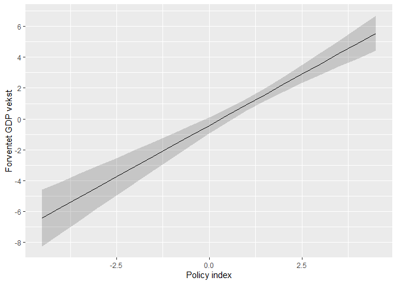

Seminar 3
================

I dag skal vi fortsette med databehandling og jobbe med OLS:

1.  Hvordan kjører vi OLS-modeller i R?
2.  Hvordan plotter vi resultater fra OLS?
3.  Hvordan slår vi sammen flere datasett?

Det første vi skal gjøre er å laste inn pakken `tidyverse`, laste inn
data og gjøre noen nødvendige omkodinger:

``` r
library(tidyverse)
```

    ## Warning: package 'tidyverse' was built under R version 4.1.1

    ## -- Attaching packages --------------------------------------- tidyverse 1.3.1 --

    ## v ggplot2 3.3.5     v purrr   0.3.4
    ## v tibble  3.1.3     v dplyr   1.0.7
    ## v tidyr   1.1.3     v stringr 1.4.0
    ## v readr   2.0.0     v forcats 0.5.1

    ## -- Conflicts ------------------------------------------ tidyverse_conflicts() --
    ## x dplyr::filter() masks stats::filter()
    ## x dplyr::lag()    masks stats::lag()

``` r
# Laster inn data
load("./aid.RData")

# Omkoder regionvariabelen:
aid <- aid %>% 
  mutate(region = ifelse(fast_growing_east_asia == 1, "East Asia",
                         ifelse(sub_saharan_africa == 1, "Sub-Saharan Africa", "Other")),
         region = factor(region, levels = c("Other", "Sub-Saharan Africa", "East Asia")))
```

Før vi setter i gang, er det noen spørsmål til det vi gikk gjennom i
går? Dersom du synes manipulering av data er vanskelig så kan det hjelpe
å ta en titt på kapittel seks i **Lær deg R**. Dersom du er nysgjerrig
på flere måter å omkode variabler på så kan du kikke på kapittel 5 i
[**R for Data
Science**](https://r4ds.had.co.nz/transform.html#add-new-variables-with-mutate).
Og ikke glem: internett er din venn når du skal lære R.

Dersom dere vil skrive en kvantitativ hjemmeoppgave er det **veldig
viktig** å sjekke om forutsetningene for OLS og/eller logistisk modell
er oppfylt. Dette går vi gjennom på [fordypningsseminar
1](https://github.com/martigso/stv4020aR21/blob/main/fordypningsseminar%201/Fordypningsseminar-1-Forutsetninger.md).

## Lineær regresjon (OLS) <a name="ols"></a>

### Syntaks

For å kjøre en lineær regresjon i R, bruker vi funksjonen `lm()`, som
har følgende syntaks:

``` r
lm(avhengig.variabel ~ uavhengig.variabel, data=mitt_datasett)
# på mac får du ~ med alt + k + space
```

La oss se på et eksempel med `aid` datasettet vi har brukt så langt:

``` r
m1 <- lm(gdp_growth ~ aid, data = aid) # lagrer m1 som objekt
summary(m1) # ser på resultatene med summary()
```

    ## 
    ## Call:
    ## lm(formula = gdp_growth ~ aid, data = aid)
    ## 
    ## Residuals:
    ##     Min      1Q  Median      3Q     Max 
    ## -12.813  -2.181   0.144   2.153  15.443 
    ## 
    ## Coefficients:
    ##             Estimate Std. Error t value Pr(>|t|)    
    ## (Intercept)   1.5570     0.2730   5.704 2.64e-08 ***
    ## aid          -0.2993     0.1036  -2.889  0.00412 ** 
    ## ---
    ## Signif. codes:  0 '***' 0.001 '**' 0.01 '*' 0.05 '.' 0.1 ' ' 1
    ## 
    ## Residual standard error: 3.711 on 323 degrees of freedom
    ##   (6 observations deleted due to missingness)
    ## Multiple R-squared:  0.02519,    Adjusted R-squared:  0.02218 
    ## F-statistic: 8.348 on 1 and 323 DF,  p-value: 0.004122

``` r
class(m1) # Legg merke til at vi har et objekt av en ny klasse!
```

    ## [1] "lm"

``` r
str(m1) # Gir oss informasjon om hva objektet inneholder.
```

    ## List of 13
    ##  $ coefficients : Named num [1:2] 1.557 -0.299
    ##   ..- attr(*, "names")= chr [1:2] "(Intercept)" "aid"
    ##  $ residuals    : Named num [1:325] 0.149 -0.474 -2.665 -4.099 -2.652 ...
    ##   ..- attr(*, "format.stata")= chr "%10.0g"
    ##   ..- attr(*, "names")= chr [1:325] "1" "2" "3" "4" ...
    ##  $ effects      : Named num [1:325] -18.73 -10.72 -2.65 -4.09 -2.64 ...
    ##   ..- attr(*, "format.stata")= chr "%10.0g"
    ##   ..- attr(*, "names")= chr [1:325] "(Intercept)" "aid" "" "" ...
    ##  $ rank         : int 2
    ##  $ fitted.values: Named num [1:325] 1.55 1.55 1.55 1.55 1.55 ...
    ##   ..- attr(*, "format.stata")= chr "%10.0g"
    ##   ..- attr(*, "names")= chr [1:325] "1" "2" "3" "4" ...
    ##  $ assign       : int [1:2] 0 1
    ##  $ qr           :List of 5
    ##   ..$ qr   : num [1:325, 1:2] -18.0278 0.0555 0.0555 0.0555 0.0555 ...
    ##   .. ..- attr(*, "dimnames")=List of 2
    ##   .. .. ..$ : chr [1:325] "1" "2" "3" "4" ...
    ##   .. .. ..$ : chr [1:2] "(Intercept)" "aid"
    ##   .. ..- attr(*, "assign")= int [1:2] 0 1
    ##   ..$ qraux: num [1:2] 1.06 1.05
    ##   ..$ pivot: int [1:2] 1 2
    ##   ..$ tol  : num 1e-07
    ##   ..$ rank : int 2
    ##   ..- attr(*, "class")= chr "qr"
    ##  $ df.residual  : int 323
    ##  $ na.action    : 'omit' Named int [1:6] 79 80 81 296 297 298
    ##   ..- attr(*, "names")= chr [1:6] "79" "80" "81" "296" ...
    ##  $ xlevels      : Named list()
    ##  $ call         : language lm(formula = gdp_growth ~ aid, data = aid)
    ##  $ terms        :Classes 'terms', 'formula'  language gdp_growth ~ aid
    ##   .. ..- attr(*, "variables")= language list(gdp_growth, aid)
    ##   .. ..- attr(*, "factors")= int [1:2, 1] 0 1
    ##   .. .. ..- attr(*, "dimnames")=List of 2
    ##   .. .. .. ..$ : chr [1:2] "gdp_growth" "aid"
    ##   .. .. .. ..$ : chr "aid"
    ##   .. ..- attr(*, "term.labels")= chr "aid"
    ##   .. ..- attr(*, "order")= int 1
    ##   .. ..- attr(*, "intercept")= int 1
    ##   .. ..- attr(*, "response")= int 1
    ##   .. ..- attr(*, ".Environment")=<environment: R_GlobalEnv> 
    ##   .. ..- attr(*, "predvars")= language list(gdp_growth, aid)
    ##   .. ..- attr(*, "dataClasses")= Named chr [1:2] "numeric" "numeric"
    ##   .. .. ..- attr(*, "names")= chr [1:2] "gdp_growth" "aid"
    ##  $ model        :'data.frame':   325 obs. of  2 variables:
    ##   ..$ gdp_growth: num [1:325] 1.7 1.08 -1.12 -2.55 -1.1 ...
    ##   .. ..- attr(*, "format.stata")= chr "%10.0g"
    ##   ..$ aid       : num [1:325] 0.0182 0.0172 0.024 0.03 0.0157 ...
    ##   .. ..- attr(*, "format.stata")= chr "%10.0g"
    ##   ..- attr(*, "terms")=Classes 'terms', 'formula'  language gdp_growth ~ aid
    ##   .. .. ..- attr(*, "variables")= language list(gdp_growth, aid)
    ##   .. .. ..- attr(*, "factors")= int [1:2, 1] 0 1
    ##   .. .. .. ..- attr(*, "dimnames")=List of 2
    ##   .. .. .. .. ..$ : chr [1:2] "gdp_growth" "aid"
    ##   .. .. .. .. ..$ : chr "aid"
    ##   .. .. ..- attr(*, "term.labels")= chr "aid"
    ##   .. .. ..- attr(*, "order")= int 1
    ##   .. .. ..- attr(*, "intercept")= int 1
    ##   .. .. ..- attr(*, "response")= int 1
    ##   .. .. ..- attr(*, ".Environment")=<environment: R_GlobalEnv> 
    ##   .. .. ..- attr(*, "predvars")= language list(gdp_growth, aid)
    ##   .. .. ..- attr(*, "dataClasses")= Named chr [1:2] "numeric" "numeric"
    ##   .. .. .. ..- attr(*, "names")= chr [1:2] "gdp_growth" "aid"
    ##   ..- attr(*, "na.action")= 'omit' Named int [1:6] 79 80 81 296 297 298
    ##   .. ..- attr(*, "names")= chr [1:6] "79" "80" "81" "296" ...
    ##  - attr(*, "class")= chr "lm"

### Multippel regresjon

Vi legger inn flere uavhengige variabler med `+`.

``` r
m2 <- lm(gdp_growth ~ aid + policy + region, data = aid)
summary(m2)
```

    ## 
    ## Call:
    ## lm(formula = gdp_growth ~ aid + policy + region, data = aid)
    ## 
    ## Residuals:
    ##      Min       1Q   Median       3Q      Max 
    ## -12.0631  -1.6756  -0.0298   1.6239  12.9271 
    ## 
    ## Coefficients:
    ##                           Estimate Std. Error t value Pr(>|t|)    
    ## (Intercept)               0.008186   0.332280   0.025   0.9804    
    ## aid                      -0.004915   0.138609  -0.035   0.9717    
    ## policy                    1.157168   0.179478   6.447 4.99e-10 ***
    ## regionSub-Saharan Africa -0.961814   0.529052  -1.818   0.0701 .  
    ## regionEast Asia           1.239202   0.712964   1.738   0.0833 .  
    ## ---
    ## Signif. codes:  0 '***' 0.001 '**' 0.01 '*' 0.05 '.' 0.1 ' ' 1
    ## 
    ## Residual standard error: 3.204 on 279 degrees of freedom
    ##   (47 observations deleted due to missingness)
    ## Multiple R-squared:  0.2334, Adjusted R-squared:  0.2224 
    ## F-statistic: 21.24 on 4 and 279 DF,  p-value: 2.645e-15

### Samspill

Hypotesen til artikkelforfatterne var følgende: *bistand fører til
økonomisk vekst, men bare dersom de fører en god makroøkonomisk
politikk*. Dette kan vi sjekke ved hjelp av samspill, som undersøker
hvor vidt en effekt av en variabel er avhengig av en annen variabel. Vi
legger inn samspill ved å sette `*` (gangetegn) mellom to variabler. De
individuelle regresjonskoeffisientene til variablene vi spesifisere
samspill mellom blir automatisk lagt til.

``` r
m3 <- lm(gdp_growth ~ aid * policy + region, data = aid)
summary(m3)
```

    ## 
    ## Call:
    ## lm(formula = gdp_growth ~ aid * policy + region, data = aid)
    ## 
    ## Residuals:
    ##      Min       1Q   Median       3Q      Max 
    ## -12.0096  -1.7193  -0.0145   1.6436  12.9254 
    ## 
    ## Coefficients:
    ##                          Estimate Std. Error t value Pr(>|t|)    
    ## (Intercept)                0.2264     0.3718   0.609 0.543033    
    ## aid                       -0.1270     0.1672  -0.760 0.448074    
    ## policy                     0.9362     0.2469   3.792 0.000183 ***
    ## regionSub-Saharan Africa  -1.0056     0.5295  -1.899 0.058552 .  
    ## regionEast Asia            1.5598     0.7535   2.070 0.039359 *  
    ## aid:policy                 0.1399     0.1074   1.302 0.194043    
    ## ---
    ## Signif. codes:  0 '***' 0.001 '**' 0.01 '*' 0.05 '.' 0.1 ' ' 1
    ## 
    ## Residual standard error: 3.2 on 278 degrees of freedom
    ##   (47 observations deleted due to missingness)
    ## Multiple R-squared:  0.2381, Adjusted R-squared:  0.2244 
    ## F-statistic: 17.37 on 5 and 278 DF,  p-value: 5.806e-15

### Andregradsledd og andre omkodinger

Vi kan legge inn andregradsledd eller andre omkodinger av variabler i
regresjonsligningene våre. Annengradsledd er fine hvis vi antar at en
variabels effekt ikke er lineær, men snarere kurvformet. Logaritmiske
transformasjoner brukes gjerne for eksponentiell vekst eller for å
minske skjevhet. Omkoding til kategorisk variabel (faktor) er nyttig
hvis vi antar at variabelen inneholder et sett med distinkte kategorier.

Andregradsledd legger vi inn med `I(uavh.var^2)`, eller via funksjonen
`poly()`. Under har jeg lagt inn en `log()` omkoding, en `as.factor()`
omkoding og et andregradsledd. Merk at dere må legge inn
førstegradsleddet separat når dere legger inn andregradsledd. Dersom en
variabeltransformasjon krever mer enn en enkel funksjon, er det fint å
opprette en ny variabel i datasettet.

``` r
m4 <- lm(gdp_growth ~ log(gdp_pr_capita) + institutional_quality + I(institutional_quality^2) + region + aid * policy +  as_factor(period), 
         data = aid,
         na.action = "na.exclude")
summary(m4)
```

    ## 
    ## Call:
    ## lm(formula = gdp_growth ~ log(gdp_pr_capita) + institutional_quality + 
    ##     I(institutional_quality^2) + region + aid * policy + as_factor(period), 
    ##     data = aid, na.action = "na.exclude")
    ## 
    ## Residuals:
    ##      Min       1Q   Median       3Q      Max 
    ## -10.8607  -1.6481  -0.1053   1.6658  11.9983 
    ## 
    ## Coefficients:
    ##                             Estimate Std. Error t value Pr(>|t|)    
    ## (Intercept)                 1.449521   3.944521   0.367 0.713556    
    ## log(gdp_pr_capita)         -0.608863   0.384003  -1.586 0.114030    
    ## institutional_quality       1.628579   1.158230   1.406 0.160868    
    ## I(institutional_quality^2) -0.096518   0.128099  -0.753 0.451839    
    ## regionSub-Saharan Africa   -2.194598   0.555105  -3.953 9.89e-05 ***
    ## regionEast Asia             1.544393   0.737649   2.094 0.037240 *  
    ## aid                         0.007766   0.167085   0.046 0.962962    
    ## policy                      0.659596   0.240154   2.747 0.006435 ** 
    ## as_factor(period)3         -0.014105   0.598378  -0.024 0.981212    
    ## as_factor(period)4         -1.374148   0.606235  -2.267 0.024215 *  
    ## as_factor(period)5         -3.351240   0.615410  -5.446 1.18e-07 ***
    ## as_factor(period)6         -1.872354   0.618005  -3.030 0.002690 ** 
    ## as_factor(period)7         -2.282958   0.668132  -3.417 0.000733 ***
    ## aid:policy                  0.203765   0.103415   1.970 0.049839 *  
    ## ---
    ## Signif. codes:  0 '***' 0.001 '**' 0.01 '*' 0.05 '.' 0.1 ' ' 1
    ## 
    ## Residual standard error: 2.859 on 265 degrees of freedom
    ##   (52 observations deleted due to missingness)
    ## Multiple R-squared:  0.3855, Adjusted R-squared:  0.3553 
    ## F-statistic: 12.79 on 13 and 265 DF,  p-value: < 2.2e-16

En nyttig pakke for å lage fine tabeller med resultatet fra
regresjonsanalyser er `stargazer`.

``` r
#install.packages("stargazer")
library(stargazer)
```

    ## Warning: package 'stargazer' was built under R version 4.1.1

``` r
stargazer(m2, m3,
          type = "text") 
```

    ## 
    ## ========================================================================
    ##                                        Dependent variable:              
    ##                          -----------------------------------------------
    ##                                            gdp_growth                   
    ##                                    (1)                     (2)          
    ## ------------------------------------------------------------------------
    ## aid                              -0.005                  -0.127         
    ##                                  (0.139)                 (0.167)        
    ##                                                                         
    ## policy                          1.157***                0.936***        
    ##                                  (0.179)                 (0.247)        
    ##                                                                         
    ## regionSub-Saharan Africa         -0.962*                 -1.006*        
    ##                                  (0.529)                 (0.529)        
    ##                                                                         
    ## regionEast Asia                  1.239*                  1.560**        
    ##                                  (0.713)                 (0.753)        
    ##                                                                         
    ## aid:policy                                                0.140         
    ##                                                          (0.107)        
    ##                                                                         
    ## Constant                          0.008                   0.226         
    ##                                  (0.332)                 (0.372)        
    ##                                                                         
    ## ------------------------------------------------------------------------
    ## Observations                       284                     284          
    ## R2                                0.233                   0.238         
    ## Adjusted R2                       0.222                   0.224         
    ## Residual Std. Error         3.204 (df = 279)        3.200 (df = 278)    
    ## F Statistic              21.237*** (df = 4; 279) 17.371*** (df = 5; 278)
    ## ========================================================================
    ## Note:                                        *p<0.1; **p<0.05; ***p<0.01

``` r
# Om du skriver i word så kan du bruke type="html", lagre i en mappe og åpne i word.
# obs. bruk .htm og ikke .html i filnavnet
stargazer(m2, m4,
          type = "html",
          out = "./bilder/regresjonstabell.htm") 

# Om du skriver i Latex så kan du bruker type = "latex" og kopiere inn output direkte, eller lagre i en mappe og hente inn via latex
stargazer(m2, m4,
          type = "latex") 

# Flere tips om tabeller finner dere i dokumentet Eksportere_tabeller_og_figurer. 
```

## Hvordan plotte resutlater fra OLS?

Før vi skal i gang med å plotte effekter så skal vi kjøre en litt
enklere modell. Dette vil forhåpentligvis gjøre de neste stegene litt
lettere å forstå:

``` r
# Kjører en redusert modell
m6 <- lm(data = aid, 
         gdp_growth ~ aid + policy, 
         na.action = "na.exclude")
```

Les gjerne [denne guiden til
regresjonsplot](https://github.com/liserodland/stv4020aR/blob/master/Materiell%20fra%20tidl%20semestre/docs/Regresjonsplot.md)
for en grundig innføring i hva vi skal gjøre nå. For å plotte en
regresjonslinje så oppretter vi først et datasett der vi holder alle
uavhengige variabler, bortsett fra den vi vil plotte effekten til,
konstante. Her velger jeg å la `policy` variere fra minimums- til
maksimumsverdien og setter resten av de uavhengige variablene (her bare
`aid`) til gjennomsnitt eller modusverdi. Neste steg er å predikere
verdier for det nye datasettet basert på modellen vår ved hjelp av
`predict()`. `predict()` tar datasettet vi har laget og gir oss blant
annet predikerte verdier og konfidensintervaller basert på modellen vår.
For å få datasettet vi skal bruke til plotting, så binder vi resultatet
av `predict` sammen med datasettet vi lagde. For at `predict()` skal gi
likt antall observasjoner som vi har i datasettet vårt så er det viktig
å bevare informasjon om de observasjonene som har missing. Dette gjør vi
med argumentet `na.action = "na.exclude` i `lm()`.

``` r
# Lager datasettet
snitt_data <- data.frame(policy = c(seq(min(aid$policy, na.rm = TRUE), 
                                        max(aid$policy, na.rm =TRUE), by = 0.5)),
                         aid = mean(aid$aid, na.rm = TRUE))

# Bruker predict
predict(m6, newdata = snitt_data, se = TRUE)
```

    ## $fit
    ##          1          2          3          4          5          6          7 
    ## -6.4146256 -5.7494886 -5.0843517 -4.4192148 -3.7540779 -3.0889409 -2.4238040 
    ##          8          9         10         11         12         13         14 
    ## -1.7586671 -1.0935302 -0.4283932  0.2367437  0.9018806  1.5670175  2.2321544 
    ##         15         16         17         18         19 
    ##  2.8972914  3.5624283  4.2275652  4.8927021  5.5578391 
    ## 
    ## $se.fit
    ##         1         2         3         4         5         6         7         8 
    ## 0.9321699 0.8533160 0.7748591 0.6969335 0.6197394 0.5435888 0.4689901 0.3968195 
    ##         9        10        11        12        13        14        15        16 
    ## 0.3286804 0.2676696 0.2198052 0.1950199 0.2019957 0.2379557 0.2923946 0.3569558 
    ##        17        18        19 
    ## 0.4270730 0.5004162 0.5757539 
    ## 
    ## $df
    ## [1] 281
    ## 
    ## $residual.scale
    ## [1] 3.231389

``` r
# Legger predikerte verdier inn i snitt_data
snitt_data <- cbind(snitt_data, predict(m6, newdata = snitt_data, se = TRUE, interval = "confidence"))
snitt_data
```

    ##          policy     aid    fit.fit    fit.lwr    fit.upr    se.fit  df
    ## 1  -4.503521919 1.75757 -6.4146256 -8.2495480 -4.5797031 0.9321699 281
    ## 2  -4.003521919 1.75757 -5.7494886 -7.4291917 -4.0697856 0.8533160 281
    ## 3  -3.503521919 1.75757 -5.0843517 -6.6096170 -3.5590864 0.7748591 281
    ## 4  -3.003521919 1.75757 -4.4192148 -5.7910880 -3.0473416 0.6969335 281
    ## 5  -2.503521919 1.75757 -3.7540779 -4.9739990 -2.5341567 0.6197394 281
    ## 6  -2.003521919 1.75757 -3.0889409 -4.1589640 -2.0189179 0.5435888 281
    ## 7  -1.503521919 1.75757 -2.4238040 -3.3469838 -1.5006242 0.4689901 281
    ## 8  -1.003521919 1.75757 -1.7586671 -2.5397833 -0.9775509 0.3968195 281
    ## 9  -0.503521919 1.75757 -1.0935302 -1.7405185 -0.4465418 0.3286804 281
    ## 10 -0.003521919 1.75757 -0.4283932 -0.9552854  0.0984989 0.2676696 281
    ## 11  0.496478081 1.75757  0.2367437 -0.1959302  0.6694176 0.2198052 281
    ## 12  0.996478081 1.75757  0.9018806  0.5179952  1.2857660 0.1950199 281
    ## 13  1.496478081 1.75757  1.5670175  1.1694006  1.9646344 0.2019957 281
    ## 14  1.996478081 1.75757  2.2321544  1.7637525  2.7005564 0.2379557 281
    ## 15  2.496478081 1.75757  2.8972914  2.3217295  3.4728533 0.2923946 281
    ## 16  2.996478081 1.75757  3.5624283  2.8597815  4.2650751 0.3569558 281
    ## 17  3.496478081 1.75757  4.2275652  3.3868967  5.0682337 0.4270730 281
    ## 18  3.996478081 1.75757  4.8927021  3.9076618  5.8777425 0.5004162 281
    ## 19  4.496478081 1.75757  5.5578391  4.4245009  6.6911772 0.5757539 281
    ##    residual.scale
    ## 1        3.231389
    ## 2        3.231389
    ## 3        3.231389
    ## 4        3.231389
    ## 5        3.231389
    ## 6        3.231389
    ## 7        3.231389
    ## 8        3.231389
    ## 9        3.231389
    ## 10       3.231389
    ## 11       3.231389
    ## 12       3.231389
    ## 13       3.231389
    ## 14       3.231389
    ## 15       3.231389
    ## 16       3.231389
    ## 17       3.231389
    ## 18       3.231389
    ## 19       3.231389

Variabelen som heter `fit.fit` er de predikerte verdiene. `fit.lwr` og
`fit.upr` er nedre og øvre grense for et 95 % konfidensintervall.
`se.fit` er standardfeilen.

Lager plot:

``` r
ggplot(snitt_data, aes(x = policy, y = fit.fit)) + # Setter institusjonell kvalitet på x-aksen og predikert verdi på y-aksen
  geom_line() +                                                   # Sier at jeg vil ha et linjediagram
  scale_y_continuous(breaks = seq(-12, 12, 2)) +                  # Bestemmer verdier og mellomrom på y-aksen
  geom_ribbon(aes(ymin = fit.lwr, ymax = fit.upr, color = NULL), alpha = .2) + # Legger til konfidensintervall på plottet
  labs(x = "Policy index", y = "Forventet GDP vekst") # Setter tittel på akser og plot
```

<!-- -->

Dette kan, og bør, også gjøres når det er samspill i modellen. Samspill
er vanskelig å tolke i en tabell og jeg synes derfor det er fint å
plotte disse. Først kjører vi en redusert modell med samspill:

``` r
# Kjører en redusert modell med samspill
m7 <- lm(data = aid, 
         gdp_growth ~ aid * policy, 
         na.action = "na.exclude")
```

Når vi skal plotte samspill så lar vi begge variablene som er en del av
samspillsleddet variere, mens resten er konstante. Vi lar den ene
variabelen være `x`, mens vi bruker den andre til å fylle ut argumentet
`color`. I tilfellet med to kontinuerlige variabler må en gjøre den ene
om til en faktorvariabel slik jeg gjør med policy under.

``` r
# Lager plot data
snitt_data_sam <- data.frame(policy = c(rep(-1, 9), rep(0, 9), rep(1, 9)), 
                             aid = rep(0:8, 3))

# Predikerer verdier (løser likningen for modellen)
predict(m7, newdata = snitt_data_sam, se = TRUE)
```

    ## $fit
    ##            1            2            3            4            5            6 
    ## -1.262768359 -1.559991587 -1.857214815 -2.154438043 -2.451661271 -2.748884499 
    ##            7            8            9           10           11           12 
    ## -3.046107727 -3.343330955 -3.640554183  0.001533281 -0.245391129 -0.492315538 
    ##           13           14           15           16           17           18 
    ## -0.739239948 -0.986164358 -1.233088767 -1.480013177 -1.726937586 -1.973861996 
    ##           19           20           21           22           23           24 
    ##  1.265834921  1.069209330  0.872583738  0.675958147  0.479332556  0.282706964 
    ##           25           26           27 
    ##  0.086081373 -0.110544218 -0.307169809 
    ## 
    ## $se.fit
    ##         1         2         3         4         5         6         7         8 
    ## 0.5386781 0.4200143 0.4119868 0.5197476 0.6911045 0.8900542 1.1017490 1.3200714 
    ##         9        10        11        12        13        14        15        16 
    ## 1.5422093 0.3664806 0.2862456 0.2723141 0.3331114 0.4385900 0.5642243 0.6992330 
    ##        17        18        19        20        21        22        23        24 
    ## 0.8391032 0.9817594 0.2584699 0.2045479 0.2021002 0.2526276 0.3328190 0.4262484 
    ##        25        26        27 
    ## 0.5259073 0.6288409 0.7336720 
    ## 
    ## $df
    ## [1] 280
    ## 
    ## $residual.scale
    ## [1] 3.235758

``` r
# Lagrer predikerte verdier i plot datasettet
snitt_data_sam <- cbind(snitt_data_sam, predict(m7, newdata = snitt_data_sam, se = TRUE, interval = "confidence"))
snitt_data_sam
```

    ##    policy aid      fit.fit    fit.lwr     fit.upr    se.fit  df residual.scale
    ## 1      -1   0 -1.262768359 -2.3231415 -0.20239525 0.5386781 280       3.235758
    ## 2      -1   1 -1.559991587 -2.3867781 -0.73320504 0.4200143 280       3.235758
    ## 3      -1   2 -1.857214815 -2.6681995 -1.04623008 0.4119868 280       3.235758
    ## 4      -1   3 -2.154438043 -3.1775470 -1.13132912 0.5197476 280       3.235758
    ## 5      -1   4 -2.451661271 -3.8120814 -1.09124116 0.6911045 280       3.235758
    ## 6      -1   5 -2.748884499 -4.5009317 -0.99683733 0.8900542 280       3.235758
    ## 7      -1   6 -3.046107727 -5.2148703 -0.87734516 1.1017490 280       3.235758
    ## 8      -1   7 -3.343330955 -5.9418552 -0.74480670 1.3200714 280       3.235758
    ## 9      -1   8 -3.640554183 -6.6763508 -0.60475761 1.5422093 280       3.235758
    ## 10      0   0  0.001533281 -0.7198736  0.72294018 0.3664806 280       3.235758
    ## 11      0   1 -0.245391129 -0.8088578  0.31807556 0.2862456 280       3.235758
    ## 12      0   2 -0.492315538 -1.0283583  0.04372726 0.2723141 280       3.235758
    ## 13      0   3 -0.739239948 -1.3949605 -0.08351941 0.3331114 280       3.235758
    ## 14      0   4 -0.986164358 -1.8495167 -0.12281197 0.4385900 280       3.235758
    ## 15      0   5 -1.233088767 -2.3437488 -0.12242876 0.5642243 280       3.235758
    ## 16      0   6 -1.480013177 -2.8564340 -0.10359234 0.6992330 280       3.235758
    ## 17      0   7 -1.726937586 -3.3786892 -0.07518598 0.8391032 280       3.235758
    ## 18      0   8 -1.973861996 -3.9064284 -0.04129562 0.9817594 280       3.235758
    ## 19      1   0  1.265834921  0.7570441  1.77462572 0.2584699 280       3.235758
    ## 20      1   1  1.069209330  0.6665625  1.47185616 0.2045479 280       3.235758
    ## 21      1   2  0.872583738  0.4747550  1.27041251 0.2021002 280       3.235758
    ## 22      1   3  0.675958147  0.1786676  1.17324869 0.2526276 280       3.235758
    ## 23      1   4  0.479332556 -0.1758124  1.13447752 0.3328190 280       3.235758
    ## 24      1   5  0.282706964 -0.5563513  1.12176527 0.4262484 280       3.235758
    ## 25      1   6  0.086081373 -0.9491527  1.12131547 0.5259073 280       3.235758
    ## 26      1   7 -0.110544218 -1.3484002  1.12731172 0.6288409 280       3.235758
    ## 27      1   8 -0.307169809 -1.7513830  1.13704343 0.7336720 280       3.235758

``` r
# Plotter
ggplot(snitt_data_sam, aes(x = aid, y = fit.fit, 
                       group = factor(policy), 
                       color = factor(policy), 
                       fill = factor(policy))) +
  geom_line() +
  scale_y_continuous(breaks = seq(-12, 12, 2)) +
  geom_ribbon(aes(ymin = fit.lwr, ymax = fit.upr, color = NULL), alpha = .2) +
  labs(x = "Bistandsnivå", y = "Forventet GDP vekst", color = "Policy", fill = "Policy")
```

<!-- -->

Vi skal ikke bruke snitt\_data mer så jeg fjerner objektene fra
environment:

``` r
rm(snitt_data, snitt_data_sam)
```

## Hvordan slår vi sammen flere datasett?

Når vi skal slå sammen ulike datasett må vi først tenke gjennom hvordan
vi kan få en felles nøkkel som lar oss knytte sammen informasjon om
observasjonene fra de to datasettene. Dette kan gjøres på flere nivåer.
Vi jobber videre med aid-datasettet.

``` r
aid
```

    ## # A tibble: 331 x 20
    ##    country period periodstart periodend code  gdp_growth gdp_pr_capita
    ##    <chr>    <dbl>       <dbl>     <dbl> <chr>      <dbl>         <dbl>
    ##  1 ARG          2        1970      1973 ARG2        1.70          5637
    ##  2 ARG          3        1974      1977 ARG3        1.08          6168
    ##  3 ARG          4        1978      1981 ARG4       -1.12          5849
    ##  4 ARG          5        1982      1985 ARG5       -2.55          5487
    ##  5 ARG          6        1986      1989 ARG6       -1.10          5624
    ##  6 ARG          7        1990      1993 ARG7        4.26          4706
    ##  7 BOL          2        1970      1973 BOL2        1.30          1661
    ##  8 BOL          3        1974      1977 BOL3        2.96          1838
    ##  9 BOL          4        1978      1981 BOL4       -1.49          2015
    ## 10 BOL          5        1982      1985 BOL5       -4.32          1864
    ## # ... with 321 more rows, and 13 more variables: economic_open <dbl>,
    ## #   budget_balance <dbl>, inflation <dbl>, ethnic_frac <dbl>,
    ## #   assasinations <dbl>, aid <dbl>, fast_growing_east_asia <dbl>,
    ## #   sub_saharan_africa <dbl>, central_america <dbl>, policy <dbl>,
    ## #   m2_gdp_lagged <dbl>, institutional_quality <dbl>, region <fct>

Ser dere noen variabler her vi kunne brukt som felles nøkkel?

Hvilken variabel vi bruker som nøkkel vil avhenge av variablene i det
andre datasettet. Er variablene på landnivå, årnivå, land-år-nivå,
region eller noe helt annet? Vi skal nå se på hvordan vi kan slå sammen
aid-datasettet med et datasett om konflikt.

Jeg har lastet ned versjon ti av Varieties of democracy datasettet fra
V-den sin [nettside](https://www.v-dem.net/en/data/data-version-10/). I
V-dem er det en variabel som heter `v2pepwrsoc`. Denne variabelen måler
hvor jevnt makt er fordelt mellom sosiale grupper. Jeg har lastet opp en
redusert versjon av V-dem datasettet på github. Det kan du lese inn
direkte fra [denne
lenken](https://raw.githubusercontent.com/liserodland/stv4020aR/master/H20-seminarer/Innf%C3%B8ringsseminarer/data/Vdem_10_redusert.csv).

``` r
# Laster inn datasett med maktfordelingsvariabel:
equality <- read_csv("https://raw.githubusercontent.com/liserodland/stv4020aR/master/H20-seminarer/Innf%C3%B8ringsseminarer/data/Vdem_10_redusert.csv")
```

    ## Rows: 5163 Columns: 5

    ## -- Column specification --------------------------------------------------------
    ## Delimiter: ","
    ## chr (2): country_name, country_text_id
    ## dbl (3): country_id, year, v2pepwrsoc

    ## 
    ## i Use `spec()` to retrieve the full column specification for this data.
    ## i Specify the column types or set `show_col_types = FALSE` to quiet this message.

``` r
summary(equality$v2pepwrsoc)
```

    ##    Min. 1st Qu.  Median    Mean 3rd Qu.    Max. 
    ## -2.9150 -0.6210  0.2460  0.3182  1.2780  3.2060

``` r
equality
```

    ## # A tibble: 5,163 x 5
    ##    country_name country_text_id country_id  year v2pepwrsoc
    ##    <chr>        <chr>                <dbl> <dbl>      <dbl>
    ##  1 Mexico       MEX                      3  1966     -0.028
    ##  2 Mexico       MEX                      3  1967     -0.028
    ##  3 Mexico       MEX                      3  1968     -0.028
    ##  4 Mexico       MEX                      3  1969     -0.028
    ##  5 Mexico       MEX                      3  1970     -0.028
    ##  6 Mexico       MEX                      3  1971     -0.028
    ##  7 Mexico       MEX                      3  1972     -0.028
    ##  8 Mexico       MEX                      3  1973     -0.028
    ##  9 Mexico       MEX                      3  1974     -0.028
    ## 10 Mexico       MEX                      3  1975     -0.028
    ## # ... with 5,153 more rows

``` r
# Vi ser at V-dem har en variabel som heter country_text_id og year
# Kanskje vi kan bruke disse?

# Bruker en logisk test og %in% for å sjekke om det finnes en match for alle land i aid-datasettet:
table(aid$country %in% equality$country_text_id)
```

    ## 
    ## FALSE  TRUE 
    ##     6   325

``` r
# Ikke alle matcher. 
```

Når ikke alle observasjonen har en match så kan dette kan enten løses
manuelt eller ved hjelp av andre datasett eller R-pakker.

``` r
# For å løse det manuelt så kan du bruke denne koden til å identifisere de som ikke matcher:
aid %>% 
  select(country) %>%  # Velger country variabelen i aid
  anti_join(equality, by = c("country" = "country_text_id")) %>% # Bevarer de verdiene i equality som ikke er aid. 
  unique()
```

    ## # A tibble: 1 x 1
    ##   country
    ##   <chr>  
    ## 1 ZAR

``` r
# En nyttig pakke dersom dere kommer over dette problemet kan være countrycode
```

Vi kommer ikke til å bruke tid i seminar på å rette opp i dette, men i
fordypningsseminaret skal vi se nærmere på pakken `countrycode` som kan
være nyttig i slike tilfeller. Vi går derfor videre vel vitende om at vi
ikke klarte å matche alle observasjonen (dette anbefaler jeg **ikke** å
gjøre i hjemmeoppgaven). I tillegg er det sånn at datasettet fra V-dem
inneholder land-år-observasjoner, mens aid-datasettet inneholder
land-periode-observasjoner.

Vi skal nå se på to måter å slå sammen datasettet på. Først skal vi
bruke variabelen `periodstart` i `aid` og matche den med variabelen
`year` fra Vdem. I dette eksempelet bruker vi altså maktfordelingen ved
periodens start. Et annet alternativ er å regne gjennomsnittet for den
aktuelle perioden, men da må vi legge til en periode-variabel i
datasettet `equality` og det er litt mer jobb. Dette ser vi på som
løsning nummer to. Hvilken løsning som passer best kommer an på hva
teorien din sier. Er det maktfordelingen ved periodens start eller et
snitt over perioden som harer viktigst?

### Slå sammen datasett uten å regne periode-gjennomsnitt

Før vi slår sammen med utgangspunkt i variabelen `periodstart` så kan vi
bruke samme kode som over for å sjekke om V-dem har informasjon for alle
år i `aid` datasettet:

``` r
# Bruker en logisk test og %in% for å sjekke om alle år er med:
table(aid$periodstart %in% equality$year)
```

    ## 
    ## TRUE 
    ##  331

Vi kombinerer informasjonen i de to datasettene ved hjelp av funksjonen
`left_join`:

``` r
# husk: ?left_join for å forstå funksjonen
aid2 <- aid %>% 
  left_join(equality, by = c("country" = "country_text_id", "periodstart" = "year"))
```

For å se om sammenslåingen har gått fint kan vi sjekke hvor mange
missing vi har på variabelen `v2pepwrsoc` som vi la til i datasettet:

``` r
# Sjekker antall missingverdier
table(is.na(aid2$v2pepwrsoc))
```

    ## 
    ## FALSE  TRUE 
    ##   325     6

``` r
# Det er seks missingverdier
# Sjekker hvilke land som har missing med base
table(aid2$country[which(is.na(aid2$v2pepwrsoc))])
```

    ## 
    ## ZAR 
    ##   6

``` r
# Sjekker hvilke land som har missing med tidyverse
aid2 %>% 
  filter(is.na(v2pepwrsoc)) %>% 
  select(country) 
```

    ## # A tibble: 6 x 1
    ##   country
    ##   <chr>  
    ## 1 ZAR    
    ## 2 ZAR    
    ## 3 ZAR    
    ## 4 ZAR    
    ## 5 ZAR    
    ## 6 ZAR

``` r
# Henter ut informasjon om variabelen i det nye datasettet
summary(aid2$v2pepwrsoc)
```

    ##     Min.  1st Qu.   Median     Mean  3rd Qu.     Max.     NA's 
    ## -2.21600 -0.68700  0.03600  0.08288  0.89200  2.38900        6

### Slå sammen datasett med periode-gjennomsnitt

Et alternativ til å ta utgangspunkt i maktfordelingen ved periodens
start er å regne ut et gjennomsnitt basert på årene i perioden. Her
viser jeg hvordan du kan gå frem for å matche år og

``` r
# Oppretter periode-variabel i V-dem datasettet, slik at jeg er klar til å merge. Verdiene til period-variabelen går fra 1-8, jeg vil gi de samme periodene (datasettet inneholder imidlertid bare data for periode 2-7). Her bruker jeg et en egenskap ved `as.numeric` på en faktor som ofte fører til feil i kode for å gjøre dette raskt:
table(aid$periodstart, aid$period)
```

    ##       
    ##         2  3  4  5  6  7
    ##   1970 56  0  0  0  0  0
    ##   1974  0 56  0  0  0  0
    ##   1978  0  0 56  0  0  0
    ##   1982  0  0  0 56  0  0
    ##   1986  0  0  0  0 54  0
    ##   1990  0  0  0  0  0 53

``` r
table(aid$periodend, aid$period)
```

    ##       
    ##         2  3  4  5  6  7
    ##   1973 56  0  0  0  0  0
    ##   1977  0 56  0  0  0  0
    ##   1981  0  0 56  0  0  0
    ##   1985  0  0  0 56  0  0
    ##   1989  0  0  0  0 54  0
    ##   1993  0  0  0  0  0 53

``` r
# Det kommer ikke tydelig frem her, men datasettet gikk opprinnelig fra 1966-1998
# Dersom jeg bruker 1966, 1970, 1974, 1978, 1982, 1986, 1990 og 1994 som kuttpunkt,
# bør jeg få de samme gruppene i V-dem-datasettet som i aid

periodcutpoints <-  unique(c(aid$periodstart)) # henter ut ovennevnt årtsall med unique()
# Her buker jeg funksjonen cut(), jeg kunne også brukt ifelse(), men cut() er raskere her.
equality$period <- cut(equality$year, periodcutpoints)
table(equality$year, equality$period)
```

    ##       
    ##        (1970,1974] (1974,1978] (1978,1982] (1982,1986] (1986,1990]
    ##   1966           0           0           0           0           0
    ##   1967           0           0           0           0           0
    ##   1968           0           0           0           0           0
    ##   1969           0           0           0           0           0
    ##   1970           0           0           0           0           0
    ##   1971         158           0           0           0           0
    ##   1972         158           0           0           0           0
    ##   1973         158           0           0           0           0
    ##   1974         158           0           0           0           0
    ##   1975           0         158           0           0           0
    ##   1976           0         157           0           0           0
    ##   1977           0         157           0           0           0
    ##   1978           0         157           0           0           0
    ##   1979           0           0         157           0           0
    ##   1980           0           0         157           0           0
    ##   1981           0           0         157           0           0
    ##   1982           0           0         157           0           0
    ##   1983           0           0           0         157           0
    ##   1984           0           0           0         157           0
    ##   1985           0           0           0         157           0
    ##   1986           0           0           0         157           0
    ##   1987           0           0           0           0         157
    ##   1988           0           0           0           0         157
    ##   1989           0           0           0           0         158
    ##   1990           0           0           0           0         172
    ##   1991           0           0           0           0           0
    ##   1992           0           0           0           0           0
    ##   1993           0           0           0           0           0
    ##   1994           0           0           0           0           0
    ##   1995           0           0           0           0           0
    ##   1996           0           0           0           0           0
    ##   1997           0           0           0           0           0

``` r
# Tabellen viser at jeg må justere periodcutpoints for å få rett

periodcutpoints <- periodcutpoints - 1
table(periodcutpoints)
```

    ## periodcutpoints
    ## 1969 1973 1977 1981 1985 1989 
    ##    1    1    1    1    1    1

``` r
periodcutpoints <- c(1965, periodcutpoints, 1993, 1997) # legger til tre kuttpunkt for å få med periode 1, 7 og 8

# Forsøker på nytt:
equality$period <- cut(equality$year, periodcutpoints)
table(equality$year,equality$period)
```

    ##       
    ##        (1965,1969] (1969,1973] (1973,1977] (1977,1981] (1981,1985] (1985,1989]
    ##   1966         156           0           0           0           0           0
    ##   1967         156           0           0           0           0           0
    ##   1968         156           0           0           0           0           0
    ##   1969         156           0           0           0           0           0
    ##   1970           0         156           0           0           0           0
    ##   1971           0         158           0           0           0           0
    ##   1972           0         158           0           0           0           0
    ##   1973           0         158           0           0           0           0
    ##   1974           0           0         158           0           0           0
    ##   1975           0           0         158           0           0           0
    ##   1976           0           0         157           0           0           0
    ##   1977           0           0         157           0           0           0
    ##   1978           0           0           0         157           0           0
    ##   1979           0           0           0         157           0           0
    ##   1980           0           0           0         157           0           0
    ##   1981           0           0           0         157           0           0
    ##   1982           0           0           0           0         157           0
    ##   1983           0           0           0           0         157           0
    ##   1984           0           0           0           0         157           0
    ##   1985           0           0           0           0         157           0
    ##   1986           0           0           0           0           0         157
    ##   1987           0           0           0           0           0         157
    ##   1988           0           0           0           0           0         157
    ##   1989           0           0           0           0           0         158
    ##   1990           0           0           0           0           0           0
    ##   1991           0           0           0           0           0           0
    ##   1992           0           0           0           0           0           0
    ##   1993           0           0           0           0           0           0
    ##   1994           0           0           0           0           0           0
    ##   1995           0           0           0           0           0           0
    ##   1996           0           0           0           0           0           0
    ##   1997           0           0           0           0           0           0
    ##       
    ##        (1989,1993] (1993,1997]
    ##   1966           0           0
    ##   1967           0           0
    ##   1968           0           0
    ##   1969           0           0
    ##   1970           0           0
    ##   1971           0           0
    ##   1972           0           0
    ##   1973           0           0
    ##   1974           0           0
    ##   1975           0           0
    ##   1976           0           0
    ##   1977           0           0
    ##   1978           0           0
    ##   1979           0           0
    ##   1980           0           0
    ##   1981           0           0
    ##   1982           0           0
    ##   1983           0           0
    ##   1984           0           0
    ##   1985           0           0
    ##   1986           0           0
    ##   1987           0           0
    ##   1988           0           0
    ##   1989           0           0
    ##   1990         172           0
    ##   1991         173           0
    ##   1992         174           0
    ##   1993         175           0
    ##   1994           0         175
    ##   1995           0         175
    ##   1996           0         175
    ##   1997           0         175

``` r
equality$period <- as.numeric(as_factor(equality$period))

table(equality$year,equality$period)
```

    ##       
    ##          1   2   3   4   5   6   7   8
    ##   1966 156   0   0   0   0   0   0   0
    ##   1967 156   0   0   0   0   0   0   0
    ##   1968 156   0   0   0   0   0   0   0
    ##   1969 156   0   0   0   0   0   0   0
    ##   1970   0 156   0   0   0   0   0   0
    ##   1971   0 158   0   0   0   0   0   0
    ##   1972   0 158   0   0   0   0   0   0
    ##   1973   0 158   0   0   0   0   0   0
    ##   1974   0   0 158   0   0   0   0   0
    ##   1975   0   0 158   0   0   0   0   0
    ##   1976   0   0 157   0   0   0   0   0
    ##   1977   0   0 157   0   0   0   0   0
    ##   1978   0   0   0 157   0   0   0   0
    ##   1979   0   0   0 157   0   0   0   0
    ##   1980   0   0   0 157   0   0   0   0
    ##   1981   0   0   0 157   0   0   0   0
    ##   1982   0   0   0   0 157   0   0   0
    ##   1983   0   0   0   0 157   0   0   0
    ##   1984   0   0   0   0 157   0   0   0
    ##   1985   0   0   0   0 157   0   0   0
    ##   1986   0   0   0   0   0 157   0   0
    ##   1987   0   0   0   0   0 157   0   0
    ##   1988   0   0   0   0   0 157   0   0
    ##   1989   0   0   0   0   0 158   0   0
    ##   1990   0   0   0   0   0   0 172   0
    ##   1991   0   0   0   0   0   0 173   0
    ##   1992   0   0   0   0   0   0 174   0
    ##   1993   0   0   0   0   0   0 175   0
    ##   1994   0   0   0   0   0   0   0 175
    ##   1995   0   0   0   0   0   0   0 175
    ##   1996   0   0   0   0   0   0   0 175
    ##   1997   0   0   0   0   0   0   0 175

``` r
# Ser fint ut
```

Da har vi forhåpentligvis variabler som kan fungere som nøkler i begge
datasettene. Neste steg er å endre på datastrukturen i datasettet
`equality`, slik at den blir lik som i `aid`. For å få til dette, må vi
endre observasjonene i `equality` til land-perioder. Dette kan vi gjøre
med `group_by` og `summarise()`. På dette stadiet, må vi tenke
datastruktur, og gjøre metodologiske valg om hvordan vi skal
operasjonalisere informasjonen om konflikter. Under viser jeg to
muligheter. I hjemmeoppgaven er dette et punkt der jeg vil anbefale at
du tenker grundig gjennom de metodologiske implikasjonene av valgene du
tar - tenk gjennom hva som er best og skriv koden din etterpå - ikke
fall i fellen kode først, metode etterpå.

``` r
agg_equality <- equality %>%
  group_by(country_text_id, period) %>%
  summarise(avg_eq = mean(v2pepwrsoc, na.rm = TRUE)) %>% # regner ut gjennomsnittet for perioden
  mutate(period_num = as.numeric(period))
```

    ## `summarise()` has grouped output by 'country_text_id'. You can override using the `.groups` argument.

``` r
table(agg_equality$period, agg_equality$period_num)
```

    ##    
    ##       1   2   3   4   5   6   7   8
    ##   1 157   0   0   0   0   0   0   0
    ##   2   0 158   0   0   0   0   0   0
    ##   3   0   0 158   0   0   0   0   0
    ##   4   0   0   0 157   0   0   0   0
    ##   5   0   0   0   0 157   0   0   0
    ##   6   0   0   0   0   0 158   0   0
    ##   7   0   0   0   0   0   0 177   0
    ##   8   0   0   0   0   0   0   0 175

``` r
agg_equality
```

    ## # A tibble: 1,297 x 4
    ## # Groups:   country_text_id [179]
    ##    country_text_id period avg_eq period_num
    ##    <chr>            <dbl>  <dbl>      <dbl>
    ##  1 AFG                  1  1.02           1
    ##  2 AFG                  2  1.02           2
    ##  3 AFG                  3  1.01           3
    ##  4 AFG                  4  0.845          4
    ##  5 AFG                  5  0.845          5
    ##  6 AFG                  6  0.845          6
    ##  7 AFG                  7  0.587          7
    ##  8 AFG                  8 -0.133          8
    ##  9 AGO                  1 -2.52           1
    ## 10 AGO                  2 -2.52           2
    ## # ... with 1,287 more rows

Nå som data fra `equality` er i samme format som i `aid`, er vi klare
til å kombinere informasjonen med `left_join`:

``` r
# husk: ?left_join for å forstå funksjonen
aid3 <- left_join(aid, agg_equality,
                  by = c("country" = "country_text_id", "period" = "period_num")) # Spesifiserer nøkkelvariablene
# Sjekker missing:
table(is.na(aid3$avg_eq))
```

    ## 
    ## FALSE  TRUE 
    ##   325     6

``` r
# 6 missing pga observasjonen som mangler


# Sjekker hvilke land som har missing med base
table(aid3$country[which(is.na(aid3$avg_eq))])
```

    ## 
    ## ZAR 
    ##   6

``` r
# Sjekker hvilke land som har missing med tidyverse
aid3 %>% 
  filter(is.na(avg_eq)) %>% 
  select(country) 
```

    ## # A tibble: 6 x 1
    ##   country
    ##   <chr>  
    ## 1 ZAR    
    ## 2 ZAR    
    ## 3 ZAR    
    ## 4 ZAR    
    ## 5 ZAR    
    ## 6 ZAR

``` r
# Henter ut informasjon om variabelen i det nye datasettet
summary(aid3$avg_eq)
```

    ##    Min. 1st Qu.  Median    Mean 3rd Qu.    Max.    NA's 
    ## -2.2160 -0.6338  0.0530  0.1102  0.8920  2.3890       6
