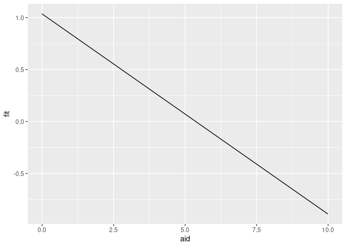
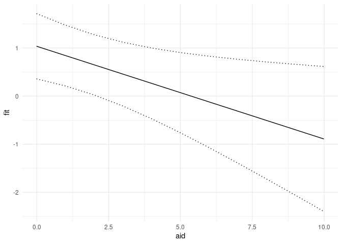
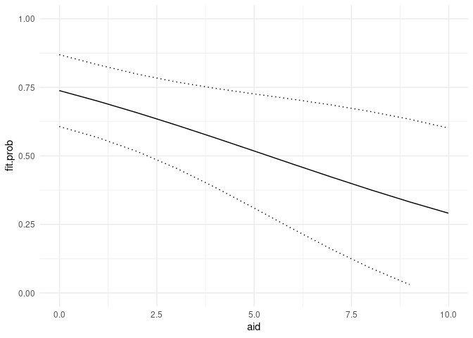
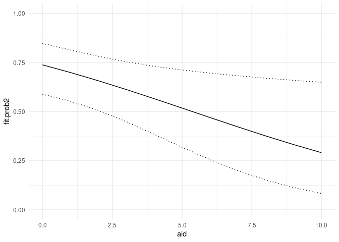
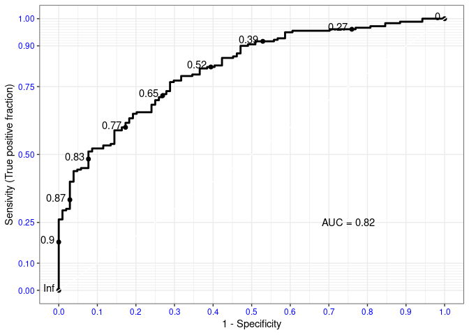

Seminar 4: Binomisk logistisk regresjon
================

## Logistisk regresjon

I dette dokumentet får du en rask innføring i hvordan du kan gjøre
logistisk regresjon med R. Jeg inkluderer en svært enkel forklaring av
logistisk regresjon på starten av dokumentet - men ta utgangspunkt i
pensum/forelesning dersom du skal bruke metoden/lese til eksamen.

**Teori:** Vi gjør basically det samme som med *OLS*, vi bruker en
matematisk metode for å finne den linjen som beskriver sammenhengen vi
spesifiserer mellom uavhengig og avhengig variabel best. Siden den
avhengige variabelen er dikotom, må den imidlertid transformeres for at
regresjonen vår skal fungere. Dette er tankegangen bak logistisk
regresjon, og beslektede metoder som *probit*. Det er også en vanlig
begrunnelse for andre alternative regresjonsmodeller som *multinomisk
logistisk regresjon* (ikke på pensum i år).


**Konsekvenser i praksis:**

-   Den største praktiske forskjellen er at substansiell tolkning blir
    vanskeligere. OLS gir oss en rett linje (eller polynom) som
    beskriver en sammenheng i substansielt meningsfulle enheter, som
    f.eks. antall kroner til kommunene over statsbudsjett som en
    funksjon av hvor venstre/høyre-vridd regjeringen er. Logistisk
    regresjon gir oss en rett linje (eller polynom) på logits skalaen,
    som vi ikke kan tolke substansielt uten videre. Odds-ratio er heller
    ikke uten videre lett å forstå. Dersom alle var supersmarte
    matematikere, ville det vært mulig å se på logits, og regne om til
    sannsynlighet i hodet, for å deretter visualisere sammenhengen
    mellom uavhengige variabler og sannsynlighet for utfall grafisk.
    Dessverre er vi ikke så smarte, formen på sammenhengen er
    ikke-lineær, og sterkt avhengig av verdiene til kontrollvariabler.
    Derfor anbefaler jeg plotting av regresjonslinjen til logistisk
    regresjon på det **aller sterkeste**, da dette gjør substansiell
    tolkning av logistisk regresjon **mye** lettere. Vi kan også regne
    ut predikerte sannsynligheter “for hånd” ved å plugge inn
    koeffisienter og variabelverdier i formelen for å regne ut
    predikerte sannsynligheter. Predikerte sannsynligheter er greie å
    tolke, det er meningsfullt å snakke om hvor mye en uavhengig
    variabel endrer sannsynligheten for et positivt utfall relativt til
    referansekategorien.

-   I R må vi bytte ut `lm()` med `glm()` og spesifisere alternativet
    `family = binomial`. De resterende argumentene er like.

**Oppvarmings-oppgave i plenum:** Les hjelpefil
<!-- fixme: hjelpefilen til glm()? --> , hva må vi spesifisere for å
kjøre en logistisk regresjon? Forklar til sidemannen.

Last inn datasettet `aid` under navnet `aid`, du finner data
[her](https://github.com/liserodland/stv4020aR/tree/master/H20-seminarer/Innf%C3%B8ringsseminarer/data).
Lagre i en mappe, sett working directory (dette steget er ikke nødvendig
om du bruker prosjekt), og last inn datasettet i R med
`read_dataformat()`.

Opprett en ny variabel `gdp_growth_d`, slik at observasjoner vekst
mindre eller lik 0, og andre observasjoner får verdien 1.

Kjør deretter følgende logistiske regresjon:

``` r
# Kjører en binomisk logistisk modell ved hjelp av glm
m1 <- glm(gdp_growth_d ~ aid + policy + as.factor(period), data = aid, 
          family = binomial(link = "logit"),
          na.action = "na.exclude")
summary(m1)
```

    ## 
    ## Call:
    ## glm(formula = gdp_growth_d ~ aid + policy + as.factor(period), 
    ##     family = binomial(link = "logit"), data = aid, na.action = "na.exclude")
    ## 
    ## Deviance Residuals: 
    ##     Min       1Q   Median       3Q      Max  
    ## -2.0477  -0.8535   0.4885   0.7348   2.1329  
    ## 
    ## Coefficients:
    ##                    Estimate Std. Error z value Pr(>|z|)    
    ## (Intercept)         1.08401    0.48449   2.237  0.02526 *  
    ## aid                -0.19280    0.08362  -2.306  0.02113 *  
    ## policy              0.87109    0.16765   5.196 2.04e-07 ***
    ## as.factor(period)3  0.00360    0.59162   0.006  0.99514    
    ## as.factor(period)4 -1.05938    0.54837  -1.932  0.05338 .  
    ## as.factor(period)5 -2.18798    0.55978  -3.909 9.28e-05 ***
    ## as.factor(period)6 -1.45382    0.56282  -2.583  0.00979 ** 
    ## as.factor(period)7 -1.77018    0.59915  -2.954  0.00313 ** 
    ## ---
    ## Signif. codes:  0 '***' 0.001 '**' 0.01 '*' 0.05 '.' 0.1 ' ' 1
    ## 
    ## (Dispersion parameter for binomial family taken to be 1)
    ## 
    ##     Null deviance: 373.12  on 283  degrees of freedom
    ## Residual deviance: 286.56  on 276  degrees of freedom
    ##   (47 observations deleted due to missingness)
    ## AIC: 302.56
    ## 
    ## Number of Fisher Scoring iterations: 5

``` r
library(stargazer)
```

    ## 
    ## Please cite as:

    ##  Hlavac, Marek (2018). stargazer: Well-Formatted Regression and Summary Statistics Tables.

    ##  R package version 5.2.2. https://CRAN.R-project.org/package=stargazer

``` r
# Viser resultatene i en tabell
stargazer(m1, type = "text")
```

    ## 
    ## ==============================================
    ##                        Dependent variable:    
    ##                    ---------------------------
    ##                           gdp_growth_d        
    ## ----------------------------------------------
    ## aid                         -0.193**          
    ##                              (0.084)          
    ##                                               
    ## policy                      0.871***          
    ##                              (0.168)          
    ##                                               
    ## as.factor(period)3            0.004           
    ##                              (0.592)          
    ##                                               
    ## as.factor(period)4           -1.059*          
    ##                              (0.548)          
    ##                                               
    ## as.factor(period)5          -2.188***         
    ##                              (0.560)          
    ##                                               
    ## as.factor(period)6          -1.454***         
    ##                              (0.563)          
    ##                                               
    ## as.factor(period)7          -1.770***         
    ##                              (0.599)          
    ##                                               
    ## Constant                     1.084**          
    ##                              (0.484)          
    ##                                               
    ## ----------------------------------------------
    ## Observations                   284            
    ## Log Likelihood              -143.278          
    ## Akaike Inf. Crit.            302.556          
    ## ==============================================
    ## Note:              *p<0.1; **p<0.05; ***p<0.01

Diskuter raskt med sidemannen hva slags informasjon du får fra
regresjons-output. Husk at koeffisientene her er logits.

For å regne om til predikert sannsynlighet for hånd, bruker vi følgende
formel:
`exp(b0 + b1X1 + b2X2 + ... + bnXn)/(1 + exp(b0 + b1X1 + b2X2 + ... + bnXn))`
, der b0 er konstantledd.

1.  Regn ut den predikerte sannsynligheten for positiv vekst for et land
    med `aid` lik `-3` i periode 4, med resterende variabler satt til
    sin medianverdi (ikke legg inn koeffisienter for andre perioder enn
    periode 8!).

2.  Regn ut den predikerte sannsynligheten for positiv vekst for et land
    med `aid` lik `3` i periode 4, med resterende variabler satt til sin
    medianverdi (ikke legg inn koeffisienter for andre perioder enn
    periode 8!).

Jeg har satt opp noe dere kan copy-paste under til hjelp, men dere må
sørge for at formelen blir riktig selv:

``` r
# Her henter jeg ut koeffisientene fra modellobjektet ved hjelp av indeksering
# og setter inn verdien på uavhengig variabel inn i likningen: 
exp(m1$coefficients["(Intercept)"] + 
      m1$coefficients["as.factor(period)4"]*1 + 
      m1$coefficients["aid"]*(-3) + 
      m1$coefficients["policy"]*median(aid$policy, na.rm = TRUE))/
  (1 + exp(m1$coefficients["(Intercept)"] + 
      m1$coefficients["as.factor(period)4"]*1 + 
      m1$coefficients["aid"]*(-3) + 
      m1$coefficients["policy"]*median(aid$policy, na.rm = TRUE)))
```

    ## (Intercept) 
    ##   0.8050392

*Er effekten av aid substansiell?*

Dette er ganske mye arbeid for få predikerte sannsynligheter, derfor
skal vi øve på plotting av effekter.

### Plotte effekter

For å plotte en binomisk logisitisk regresjon så går vi gjennom seks
trinn:

1.  Kjøre modellen.

2.  Lage et nytt fiktivt datasett med den uavhengige variabelen og
    kontrollvariabelene. Du lar variabelen du er interessert i effekten
    av variere i datasettet, mens de andre variablene settes til
    gjennomsnitt, median e.l. (bortsett fra avhengig variabel).

3.  Predikerer verdier.

4.  Lagrer predikerte verdier i det fiktive datasettet.

5.  Gjør eventuelle omregninger og regner ut konfidensintervall.

6.  Plotter predikerte verdier og konfidensintervaller.

Vi bruker modellen vi predikerte over og går rett på trinn 2.

``` r
# Trinn 2: Vi lager et datasett med plotdata der vi lar aid variere
plotdata <- data.frame(aid = seq(min(aid$aid, na.rm = TRUE), 
                                    max(aid$aid, na.rm = TRUE), 1),
                       policy = mean(aid$policy, na.rm = TRUE),
                       period = "4")
```

Plotter logits:

``` r
# Trinn 3: Bruker først predict til å predikere logits
preds <- predict(m1, 
                 se.fit = TRUE,
                 newdata = plotdata,
                 type = "link") # Dette gir oss logits


# Trinn 4: Lagrer predikert verdi og standardfeil i plotdata
plotdata$fit <- preds$fit
plotdata$se <- preds$se.fit

# Eksempel på plot uten konfidensintervall:
ggplot(plotdata) + 
  geom_line(aes(x = aid, y = fit))
```

<!-- -->

``` r
# Trinn 5: Regner ut 95 % konfidensintervaller
plotdata <- plotdata %>% 
  mutate(ki.lav = fit - 1.96*se,
         ki.hoy = fit + 1.96*se)

# Trinn 6: Legger KI til i plottet
ggplot(plotdata) + 
  geom_line(aes(x = aid, y = fit)) + 
  geom_line(aes(x = aid, y = ki.lav), linetype = "dotted") + 
  geom_line(aes(x = aid, y = ki.hoy), linetype = "dotted") +
  theme_minimal()
```

<!-- -->

Plotter sannsynligheter:

``` r
# Snarvei for å plotte sannsynlighet:
# Brukt i Lær deg R, men kan gi konfidensintervaller som går utenfor referanseområdet
# Her gjenbruker vi trinn 1 og 2 fra tidligere og går rett på trinn 3
# Trinn 3: Bruker predict med type = response for å få sannsynligheter
preds <- predict(m1, 
                 se.fit = TRUE,
                 newdata = plotdata,
                 type = "response") # Velger respons for å få sannsynlighet


# Trinn 4: Lagrer informasjon om predikerte verdier og standardfeil fra predict i plotdata
plotdata$fit.prob <- preds$fit
plotdata$se.prob <- preds$se.fit

# Trinn 5: Lager 95 % konfidensintervaller
plotdata <- plotdata %>% 
  mutate(ki.lav.prob = fit.prob - (1.96*se.prob),
         ki.hoy.prob = fit.prob + (1.96*se.prob))


# Trinn 6: Plotter med konfidensintervaller
ggplot(plotdata) + 
  geom_line(aes(x = aid, y = fit.prob)) + 
  geom_line(aes(x = aid, y = ki.lav.prob), linetype = "dotted") + 
  geom_line(aes(x = aid, y = ki.hoy.prob), linetype = "dotted") +
  theme_minimal() +
  scale_y_continuous(limits = c(0:1))
```

    ## Warning: Removed 1 row(s) containing missing values (geom_path).

<!-- -->

En ulempe ved å bruke `predict(type = "response")` til å predikere
sannsynligheter er at du kan få verdier utenfor referanseområdet. Vi kan
bruke `summary()` på grenseverdiene til konfidensintervallene:

``` r
summary(plotdata$ki.lav.prob)
```

    ##     Min.  1st Qu.   Median     Mean  3rd Qu.     Max. 
    ## -0.01995  0.12508  0.31026  0.30323  0.48582  0.60723

``` r
summary(plotdata$ki.hoy.prob)
```

    ##    Min. 1st Qu.  Median    Mean 3rd Qu.    Max. 
    ##  0.6018  0.6737  0.7263  0.7303  0.7842  0.8694

Her ser vi at minimumsverdien til konfidensintervallet for sannsynlighet
er negativ. En sannsynlighet kan ikke være negativ. En mer presis måte å
gjøre det på er å omregne direkte fra logits:

``` r
# Her gjenbruker vi trinn 1 - 4 fra når vi predikerte logits og går rett på trinn 5
# Trinn 5: regner om sannsynligheter fra logits-prediksjonene og lagrer i plotdata
plotdata$ki.lav.prob2  <- exp(plotdata$fit - 1.96*plotdata$se)/(1 + exp(plotdata$fit - 1.96*plotdata$se))
plotdata$ki.hoy.prob2 <- exp(plotdata$fit + 1.96*plotdata$se)/(1 + exp(plotdata$fit + 1.96*plotdata$se))
plotdata$fit.prob2 <- exp(plotdata$fit)/(1+ exp(plotdata$fit))

# Trinn 6: plotter
ggplot(plotdata) + 
  geom_line(aes(x = aid, y = fit.prob2)) + 
  geom_line(aes(x = aid, y = ki.lav.prob2), linetype = "dotted") + 
  geom_line(aes(x = aid, y = ki.hoy.prob2), linetype = "dotted") +
  theme_minimal() +
  scale_y_continuous(limits = c(0:1))
```

<!-- -->

Vi bruker `summary()` igjen:

``` r
summary(plotdata$ki.lav.prob2)
```

    ##    Min. 1st Qu.  Median    Mean 3rd Qu.    Max. 
    ## 0.08333 0.17544 0.31864 0.32759 0.47769 0.58874

``` r
summary(plotdata$ki.hoy.prob2)
```

    ##    Min. 1st Qu.  Median    Mean 3rd Qu.    Max. 
    ##  0.6493  0.6767  0.7122  0.7273  0.7682  0.8475

``` r
# Nå ligger alle verdiene til konfidensintervallene innenfor mulighetsområdet 0-1. 

# NB! Legg merke til at den predikerte verdien fortsatt er den samme. Her bruker
# jeg table() og en logisk test til å teste dette og alle er like. 
table(plotdata$fit.prob == plotdata$fit.prob2)
```

    ## 
    ## TRUE 
    ##   11

Dette plottet gir oss en bedre forståelse av den predikerte
sannsynligheten enn utregningen over, derfor oppfordrer jeg til bruk av
plot ved tolkning av effekten av kontinuerlige uavhengige variabler i
logistisk regresjon. For å legge inn samspill/flere nyanser i plottet,
går du frem som med lineær regresjon. Når du plotter effekten av
logistisk regresjon er det lurt å gjøre en rask test av at alt er gått
rett ved å sjekke at alle verdier på `plot_data$low` og `plot_data$high`
ligger mellom 0 og 1.

### Forventet verdi vs. faktisk verdi - residualer

Ut fra regresjonskoeffisientene fra en regresjonsmodell, kan vi beregne
den forventede verdien til hver enkelt observasjon på den avhengige
variabelen. Vi kan sammenligne denne verdien med den observerte verdien
på avhengig variabel for observasjonene våre, for å få et inntrykk av
hvor godt modellen passer til data, eller se på differansen mellom
forventet og faktisk verdi for en observasjon, dvs. residualen til en
observasjon. Residualer, forventet verdi og faktisk verdi brukes også i
ulike typer regresjonsdiagnostikk. Under viser jeg hvordan du enkelt kan
hente ut residualer fra modellobjektet ved hjelp av `residuals`. For å
hente ut forventet verdi kan du bruke `predict()` (se over).

``` r
# Henter ut residualer og lagrer dem i datasettet
aid$resid <- residuals(m1)
# Henter ut predikerte sannsynligheter og lagrer dem i datasettet
aid$predict <- predict(m1, type = "response")

summary(aid$predict)
```

    ##    Min. 1st Qu.  Median    Mean 3rd Qu.    Max.    NA's 
    ## 0.00494 0.42118 0.71128 0.63380 0.86057 0.97816      47

I logistisk regresjon tar man gjerne utgangspunkt i at utfallet enten er
`1` eller `0`. Så sammenligner man om modellen predikerer `0` eller `1`
med om observasjonene faktisk har den predikerte verdien. Andelen
observasjoner som korrekt predikeres som `1`, delt på alle observasjoner
som faktisk har verdien 1 (dvs. observasjoner som korrekt predikeres som
`1` summert med andelen som feilaktig predikeres som `0`) kalles
sensivitet. Andelen observasjoner som korrekt predikeres som `0`, delt
på alle observasjoner som faktisk har verdien `0` (dvs. observasjoner
som korrekt klassifiseres som `0` summert med observasjoner som
feilaktig klassifiseres som `1`), kalles spesifisitet. Legg merke til at
i en ROC-kurve, plottes *1 - spesifisitet*. Dette kan tolkes som andelen
observasjoner som galt predikeres til verdien 1 (som faktisk har verdien
0), delt på det totale antallet observasjoner som faktisk har verdien 0.

Ved hjelp av `predict()` har vi nå lagret den predikerte sannsynligheter
for at land har BNP vekst i variabelen `aid$predict`. Denne
sannsynligheten varierer mellom 0 og 1. For å komme frem til predikerte
verdier må vi bestemme oss for et kuttpunkt. Alle observasjoner med
predikert sannsynlighet høyere enn kuttpunktet kan vi gi predikert verdi
1, og resten får predikert verdi 0.

Det er ikke gitt hva vi skal velge som kuttpunkt. I *Lær deg R* settes
kuttpunktet til andelen med verdi lik 1. Dette kan vi tenke på som en
nullmodell. Vi følger samme eksempel her. Et annet alternativ er å
klassifisere alle observasjoner med predikert sannsynlighet for `1`
høyere enn `0.5` som `1`, og de resterende observasjonene som `0`.

``` r
kuttpunkt <- mean(aid$gdp_growth_d, na.rm = TRUE)
kuttpunkt
```

    ## [1] 0.6153846

``` r
# I nullmodellen predikerer vi 62 prosent riktig om vi gjetter at alle land har vekst

# Lager en variabel der de med predikert sannsynlighet høyere enn kuttpunktet får verdien 1
aid$growth.pred <- as.numeric(aid$predict>kuttpunkt)

# Bruker en logisk test til å sjekke om predikert verdi er lik faktisk verdi
aid$riktig <- aid$growth.pred == aid$gdp_growth_d
mean(aid$riktig, na.rm = TRUE)
```

    ## [1] 0.7288732

*Predikerer modellen større andel riktig enn om vi bare hadde antatt at
alle land hadde vekst?*

*Bruk indeksering til å finne ut om modellen predikerer best vekst eller
ikke vekst.*

Dette kan vi også presentere i en tabell som i **Lær deg R**:

``` r
krysstabell <- table(aid$growth.pred, aid$gdp_growth_d)
krysstabell
```

    ##    
    ##       0   1
    ##   0  74  47
    ##   1  30 133

``` r
prop.table(krysstabell, margin = 2)
```

    ##    
    ##             0         1
    ##   0 0.7115385 0.2611111
    ##   1 0.2884615 0.7388889

Vi kan også bruke en ROC-kurve til å fremstille hvor korrekt en
logistisk regresjon klassifiserer observasjoner for alle slike
kuttpunkt. Siden en ROC-kurve er ganske greit å lage med R, viser jeg
hvordan dette gjøres under, ved hjelp av funksjoner fra pakkene
`plotROC` og `ggplot2` ([les mer om dette
her](https://cran.r-project.org/web/packages/plotROC/vignettes/examples.html)).

``` r
#install.packages("plotROC")
library(plotROC)

# Basic ROC:
basicplot <- ggplot(aid, aes(d = gdp_growth_d, m = predict)) + geom_roc(labelround = 2) 

# Pyntet ROC med AUC.
basicplot + 
    style_roc(ylab = "Sensivity (True positive fraction)") +
  theme(axis.text = element_text(colour = "blue")) +
  annotate("text", x = .75, y = .25, 
           label = paste("AUC =", round(calc_auc(basicplot)$AUC, 2))) +
  scale_x_continuous("1 - Specificity", breaks = seq(0, 1, by = .1))
```

    ## Scale for 'x' is already present. Adding another scale for 'x', which will
    ## replace the existing scale.

<!-- -->
